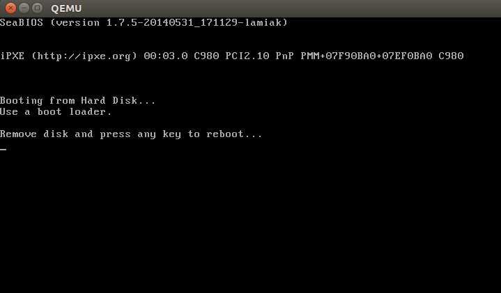
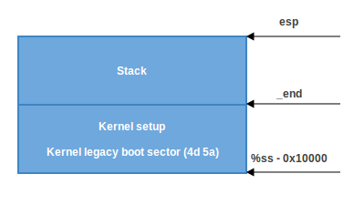
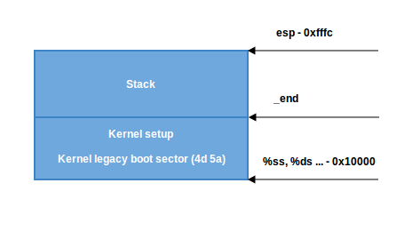
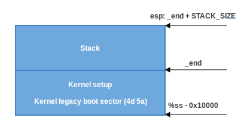
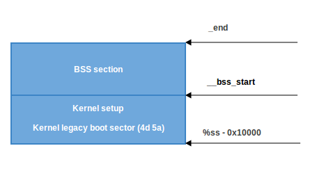

Kernel booting process. Part 1.
================================================================================

From the bootloader to the kernel
--------------------------------------------------------------------------------

If you read my previous [blog posts](https://0xax.github.io/categories/assembler/), you might have noticed that I  have been involved with low-level programming for some time. I wrote some posts about assembly programming for `x86_64` Linux and, at the same time, started to dive into the Linux kernel source code.

I have a great interest in understanding how low-level things work, how programs run on my computer, how they are located in memory, how the kernel manages processes and memory, how the network stack works at a low level, and many many other things. So, I decided to write yet another series of posts about the Linux kernel for the **x86_64** architecture.

Note that I'm not a professional kernel hacker and I don't write code for the kernel at work. It's just a hobby. I just like low-level stuff, and it is interesting for me to see how these things work. So if you notice anything confusing, or if you have any questions/remarks, ping me on Twitter [0xAX](https://twitter.com/0xAX), drop me an [email](mailto:anotherworldofworld@gmail.com) or just create an [issue](https://github.com/0xAX/linux-insides/issues/new). I appreciate it.

All posts will also be accessible at [github repo](https://github.com/0xAX/linux-insides) and, if you find something wrong with my English or the post content, feel free to send a pull request.

*Note that this isn't official documentation, just learning and sharing knowledge.*

**Required knowledge**

* Understanding C code
* Understanding assembly code (AT&T syntax)

Anyway, if you're just starting to learn such tools, I will try to explain some parts during this and the following posts. Alright, this is the end of the simple introduction. Let's start to dive into the Linux kernel and low-level stuff!

I started writing these posts at the time of the `3.18` Linux kernel, and many things have changed since that time. If there are changes, I will update the posts accordingly.

The Magical Power Button, What happens next?
--------------------------------------------------------------------------------

Although this is a series of posts about the Linux kernel, we won't start directly from the kernel code. As soon as you press the magical power button on your laptop or desktop computer, it starts working. The motherboard sends a signal to the [power supply](https://en.wikipedia.org/wiki/Power_supply) device. After receiving the signal, the power supply provides the proper amount of electricity to the computer. Once the motherboard receives the [power good signal](https://en.wikipedia.org/wiki/Power_good_signal), it tries to start the CPU. The CPU resets all leftover data in its registers and sets predefined values for each of them.

The [80386](https://en.wikipedia.org/wiki/Intel_80386) and later CPUs define the following predefined data in CPU registers after the computer resets:

```
IP          0xfff0
CS selector 0xf000
CS base     0xffff0000
```

The processor starts working in [real mode](https://en.wikipedia.org/wiki/Real_mode). Let's back up a little and try to understand [memory segmentation](https://en.wikipedia.org/wiki/Memory_segmentation) in this mode. Real mode is supported on all x86-compatible processors, from the [8086](https://en.wikipedia.org/wiki/Intel_8086) CPU all the way to the modern Intel 64-bit CPUs. The `8086` processor has a 20-bit address bus, which means that it could work with a `0-0xFFFFF` or `1 megabyte` address space. But it only has `16-bit` registers, which have a maximum address of `2^16 - 1` or `0xffff` (64 kilobytes).

[Memory segmentation](https://en.wikipedia.org/wiki/Memory_segmentation) is used to make use of all the address space available. All memory is divided into small, fixed-size segments of `65536` bytes (64 KB). Since we cannot address memory above `64 KB` with 16-bit registers, an alternate method was devised.

An address consists of two parts: a segment selector, which has a base address; and an offset from this base address. In real mode, the associated base address of a segment selector is `Segment Selector * 16`. Thus, to get a physical address in memory, we need to multiply the segment selector part by `16` and add the offset to it:

```
PhysicalAddress = Segment Selector * 16 + Offset
```

For example, if `CS:IP` is `0x2000:0x0010`, then the corresponding physical address will be:

```python
>>> hex((0x2000 << 4) + 0x0010)
'0x20010'
```

But, if we take the largest segment selector and offset, `0xffff:0xffff`, then the resulting address will be:

```python
>>> hex((0xffff << 4) + 0xffff)
'0x10ffef'
```

which is `65520` bytes past the first megabyte. Since only one megabyte is accessible in real mode, `0x10ffef` becomes `0x00ffef` with the [A20 line](https://en.wikipedia.org/wiki/A20_line) disabled.

Ok, now we know a little bit about real mode and its memory addressing. Let's get back to discussing register values after reset.

The `CS` register consists of two parts: the visible segment selector and the hidden base address.  In real-address mode, the base address is normally formed by shifting the 16-bit segment selector value 4 bits to the left to produce a 20-bit base address. However, during a hardware reset the segment selector in the CS register is loaded with `0xf000` and the base address is loaded with `0xffff0000`. The processor uses this special base address until `CS` changes.

The starting address is formed by adding the base address to the value in the EIP register:

```python
>>> 0xffff0000 + 0xfff0
'0xfffffff0'
```

We get `0xfffffff0`, which is 16 bytes below 4GB. This point is called the [reset vector](https://en.wikipedia.org/wiki/Reset_vector). It's the memory location at which the CPU expects to find the first instruction to execute after reset. It contains a [jump](https://en.wikipedia.org/wiki/JMP_%28x86_instruction%29) (`jmp`) instruction that usually points to the [BIOS](https://en.wikipedia.org/wiki/BIOS) (Basic Input/Output System) entry point. For example, if we look in the [coreboot](https://www.coreboot.org/) source code (`src/cpu/x86/16bit/reset16.inc`), we see:

```assembly
    .section ".reset", "ax", %progbits
    .code16
.globl	_start
_start:
    .byte  0xe9
    .int   _start16bit - ( . + 2 )
    ...
```

Here we can see the `jmp` instruction [opcode](http://ref.x86asm.net/coder32.html#xE9), which is `0xe9`, and its destination address at `_start16bit - ( . + 2)`.

We also see that the `reset` section is `16` bytes and is compiled to start from the address `0xfffffff0` (`src/cpu/x86/16bit/reset16.ld`):

```
SECTIONS {
    /* Trigger an error if I have an unuseable start address */
    _bogus = ASSERT(_start16bit >= 0xffff0000, "_start16bit too low. Please report.");
    _ROMTOP = 0xfffffff0;
    . = _ROMTOP;
    .reset . : {
        *(.reset);
        . = 15;
        BYTE(0x00);
    }
}
```

Now the BIOS starts. After initializing and checking the hardware, the BIOS needs to find a bootable device. A boot order is stored in the BIOS configuration, controlling which devices the BIOS attempts to boot from. When attempting to boot from a hard drive, the BIOS tries to find a boot sector. On hard drives partitioned with an [MBR partition layout](https://en.wikipedia.org/wiki/Master_boot_record), the boot sector is stored in the first `446` bytes of the first sector, where each sector is `512` bytes. The final two bytes of the first sector are `0x55` and `0xaa`, which designates to the BIOS that this device is bootable. Once the BIOS finds the boot sector, it copies it into a fixed memory location at 0x7c00, jumps to there and start executing it.

For example:

```assembly
;
; Note: this example is written in Intel Assembly syntax
;
[BITS 16]

boot:
    mov al, '!'
    mov ah, 0x0e
    mov bh, 0x00
    mov bl, 0x07

    int 0x10
    jmp $

times 510-($-$$) db 0

db 0x55
db 0xaa
```

Build and run this with:

```
nasm -f bin boot.nasm && qemu-system-x86_64 boot
```

This will instruct [QEMU](https://www.qemu.org/) to use the `boot` binary that we just built as a disk image. Since the binary generated by the assembly code above fulfills the requirements of the boot sector (we end it with the magic sequence), QEMU will treat the binary as the master boot record (MBR) of a disk image. Note that when providing a boot binary image to QEMU, setting the origin to 0x7c00 (using `[ORG  0x7c00]`)
is unneeded.

You will see:


In this example, we can see that the code will be executed in `16-bit` real mode. After starting, it calls the [0x10](http://www.ctyme.com/intr/rb-0106.htm) interrupt, which just prints the `!` symbol. The times directive will pad that number of bytes up to 510th byte with zeros and finishes with the two magic bytes `0xaa` and `0x55`.

You can see a binary dump of this using the `objdump` utility:

```
nasm -f bin boot.nasm
objdump -D -b binary -mi386 -Maddr16,data16,intel boot
```

A real-world boot sector has code for continuing the boot process and a partition table instead of a bunch of 0's and an exclamation mark. :) From this point onwards, the BIOS hands control over to the bootloader.

**NOTE**: As explained above, the CPU is in real mode. In real mode, calculating the physical address in memory is done as follows:

```
PhysicalAddress = Segment Selector * 16 + Offset
```

just as explained above. We have only 16-bit general purpose registers, which has a maximum value of `0xffff`, so if we take the largest values the result will be:

```python
>>> hex((0xffff * 16) + 0xffff)
'0x10ffef'
```

where `0x10ffef` is equal to `(1MB + 64KB - 16B) - 1`. An [8086](https://en.wikipedia.org/wiki/Intel_8086) processor (which was the first processor with real mode), in contrast, has a 20-bit address line. Since `2^20 = 1048576` is 1MB and `2^20 - 1` is the maximum address that could be used, this means that the actual available memory is 1MB.

In general, real mode's memory map is as follows:

```
0x00000000 - 0x000003FF - Real Mode Interrupt Vector Table
0x00000400 - 0x000004FF - BIOS Data Area
0x00000500 - 0x00007BFF - Unused
0x00007C00 - 0x00007DFF - Our Bootloader
0x00007E00 - 0x0009FFFF - Unused
0x000A0000 - 0x000BFFFF - Video RAM (VRAM) Memory
0x000B0000 - 0x000B7777 - Monochrome Video Memory
0x000B8000 - 0x000BFFFF - Color Video Memory
0x000C0000 - 0x000C7FFF - Video ROM BIOS
0x000C8000 - 0x000EFFFF - BIOS Shadow Area
0x000F0000 - 0x000FFFFF - System BIOS
```

At the beginning of this post, I wrote that the first instruction executed by the CPU is located at address `0xFFFFFFF0`, which is much larger than `0xFFFFF` (1MB). How can the CPU access this address in real mode? The answer is in the [coreboot](https://www.coreboot.org/Developer_Manual/Memory_map) documentation:

```
0xFFFE_0000 - 0xFFFF_FFFF: 128 kilobyte ROM mapped into address space
```

At the start of execution, the BIOS is not in RAM, but in ROM.

Bootloader
--------------------------------------------------------------------------------

There are a number of bootloaders that can boot Linux, such as [GRUB 2](https://www.gnu.org/software/grub/) and [syslinux](http://www.syslinux.org/wiki/index.php/The_Syslinux_Project). The Linux kernel has a [Boot protocol](https://github.com/torvalds/linux/blob/v4.16/Documentation/x86/boot.txt) which specifies the requirements for a bootloader to implement Linux support. This example will describe GRUB 2.

Continuing from before, now that the BIOS has chosen a boot device and transferred control to the boot sector code, execution starts from [boot.img](http://git.savannah.gnu.org/gitweb/?p=grub.git;a=blob;f=grub-core/boot/i386/pc/boot.S;hb=HEAD). Its code is very simple, due to the limited amount of space available. It contains a pointer which is used to jump to the location of GRUB 2's core image. The core image begins with [diskboot.img](http://git.savannah.gnu.org/gitweb/?p=grub.git;a=blob;f=grub-core/boot/i386/pc/diskboot.S;hb=HEAD), which is usually stored immediately after the first sector in the unused space before the first partition. The above code loads the rest of the core image, which contains GRUB 2's kernel and drivers for handling filesystems, into memory. After loading the rest of the core image, it executes the [grub_main](http://git.savannah.gnu.org/gitweb/?p=grub.git;a=blob;f=grub-core/kern/main.c) function.

The `grub_main` function initializes the console, gets the base address for modules, sets the root device, loads/parses the grub configuration file, loads modules, etc. At the end of execution, the `grub_main` function moves grub to normal mode. The `grub_normal_execute` function (from the `grub-core/normal/main.c` source code file) completes the final preparations and shows a menu to select an operating system. When we select one of the grub menu entries, the `grub_menu_execute_entry` function runs, executing the grub `boot` command and booting the selected operating system.

As we can read in the kernel boot protocol, the bootloader must read and fill some fields of the kernel setup header, which starts at offset `0x01f1` from the kernel setup code. You may look at the boot [linker script](https://github.com/torvalds/linux/blob/v4.16/arch/x86/boot/setup.ld) to confirm the value of this offset. The kernel header [arch/x86/boot/header.S](https://github.com/torvalds/linux/blob/v4.16/arch/x86/boot/header.S) starts from:

```assembly
    .globl hdr
hdr:
    setup_sects: .byte 0
    root_flags:  .word ROOT_RDONLY
    syssize:     .long 0
    ram_size:    .word 0
    vid_mode:    .word SVGA_MODE
    root_dev:    .word 0
    boot_flag:   .word 0xAA55
```

The bootloader must fill this and the rest of the headers (which are only marked as being type `write` in the Linux boot protocol, such as in [this example](https://github.com/torvalds/linux/blob/v4.16/Documentation/x86/boot.txt#L354)) with values either received from the command line or calculated during booting. (We will not go over full descriptions and explanations for all fields of the kernel setup header for now, but we shall do so when discussing how the kernel uses them. You can find a description of all fields in the [boot protocol](https://github.com/torvalds/linux/blob/v4.16/Documentation/x86/boot.txt#L156).)

As we can see in the kernel boot protocol, memory will be mapped as follows after loading the kernel:

```shell
         | Protected-mode kernel  |
100000   +------------------------+
         | I/O memory hole        |
0A0000   +------------------------+
         | Reserved for BIOS      | Leave as much as possible unused
         ~                        ~
         | Command line           | (Can also be below the X+10000 mark)
X+10000  +------------------------+
         | Stack/heap             | For use by the kernel real-mode code.
X+08000  +------------------------+
         | Kernel setup           | The kernel real-mode code.
         | Kernel boot sector     | The kernel legacy boot sector.
       X +------------------------+
         | Boot loader            | <- Boot sector entry point 0x7C00
001000   +------------------------+
         | Reserved for MBR/BIOS  |
000800   +------------------------+
         | Typically used by MBR  |
000600   +------------------------+
         | BIOS use only          |
000000   +------------------------+

```

When the bootloader transfers control to the kernel, it starts at:

```
X + sizeof(KernelBootSector) + 1
```

where `X` is the address of the kernel boot sector being loaded. In my case, `X` is `0x10000`, as we can see in a memory dump:


How to get this memory dump in real mode?
--------------------------------------------------------------------------------
```
root@parallels-vm:/usr/src/linux# more arch/x86/kernel/vmlinux.lds
...
SECTIONS
{
 . = (0xffffffff80000000 + ALIGN(0x1000000, 0x200000));
 phys_startup_64 = ABSOLUTE(startup_64 - 0xffffffff80000000);
 .text : AT(ADDR(.text) - 0xffffffff80000000) {
  _text = .;
  _stext = .;
....
```

```
root@parallels-vm:/usr/src/linux# nm vmlinux|grep startup_64
0000000001000000 A phys_startup_64
ffffffff81000030 T secondary_startup_64
ffffffff810001f0 T __startup_64
ffffffff81000000 T startup_64
```

Here we can see the memory address of the entry point, which is `0x0000000001000000`. Let's go ahead.

Before trying to debug the kernel, please see [Booting a Custom Linux Kernel in QEMU and Debugging It With GDB](http://nickdesaulniers.github.io/blog/2018/10/24/booting-a-custom-linux-kernel-in-qemu-and-debugging-it-with-gdb/)

#### Step 1
Booting in QEMU
```
qemu-system-x86_64 -kernel /usr/src/linux-4.14.207/arch/x86_64/boot/bzImage -nographic -append "console=ttyS0 nokaslr" -initrd /data/busybox/busybox-1.28.0/initramfs.cpio.gz -S -s
```
#### Step 2
Attaching GDB to QEMU
```
gdb vmlinux
(gdb) target remote :1234
(gdb) hbreak *0x0000000001000000
(gdb) c
(gdb) dump binary memory /tmp/dump 0x0000 0x20000
```
#### Step 3
```
root@parallels-vm:/# hd /tmp/dump |grep -A 31 MZ
00010000  4d 5a ea 07 00 c0 07 8c  c8 8e d8 8e c0 8e d0 31  |MZ.............1|
00010010  e4 fb fc be 40 00 ac 20  c0 74 09 b4 0e bb 07 00  |....@.. .t......|
00010020  cd 10 eb f2 31 c0 cd 16  cd 19 ea f0 ff 00 f0 00  |....1...........|
00010030  00 00 00 00 00 00 00 00  00 00 00 00 82 00 00 00  |................|
00010040  55 73 65 20 61 20 62 6f  6f 74 20 6c 6f 61 64 65  |Use a boot loade|
00010050  72 2e 0d 0a 0a 52 65 6d  6f 76 65 20 64 69 73 6b  |r....Remove disk|
00010060  20 61 6e 64 20 70 72 65  73 73 20 61 6e 79 20 6b  | and press any k|
00010070  65 79 20 74 6f 20 72 65  62 6f 6f 74 2e 2e 2e 0d  |ey to reboot....|
00010080  0a 00 50 45 00 00 64 86  04 00 00 00 00 00 00 00  |..PE..d.........|
00010090  00 00 01 00 00 00 a0 00  06 02 0b 02 02 14 20 d5  |.............. .|
000100a0  80 00 00 00 00 00 e0 b8  79 01 80 46 00 00 00 02  |........y..F....|
000100b0  00 00 00 00 00 00 00 00  00 00 20 00 00 00 20 00  |.......... ... .|
000100c0  00 00 00 00 00 00 00 00  00 00 00 00 00 00 00 00  |................|
000100d0  00 00 00 90 fa 01 00 02  00 00 00 00 00 00 0a 00  |................|
000100e0  00 00 00 00 00 00 00 00  00 00 00 00 00 00 00 00  |................|
*
00010100  00 00 00 00 00 00 06 00  00 00 00 00 00 00 00 00  |................|
00010110  00 00 00 00 00 00 00 00  00 00 00 00 00 00 00 00  |................|
*
00010130  00 00 00 00 00 00 00 00  00 00 2e 73 65 74 75 70  |...........setup|
00010140  00 00 e0 41 00 00 00 02  00 00 e0 41 00 00 00 02  |...A.......A....|
00010150  00 00 00 00 00 00 00 00  00 00 00 00 00 00 20 00  |.............. .|
00010160  50 60 2e 72 65 6c 6f 63  00 00 20 00 00 00 e0 43  |P`.reloc.. ....C|
00010170  00 00 20 00 00 00 e0 43  00 00 00 00 00 00 00 00  |.. ....C........|
00010180  00 00 00 00 00 00 40 00  10 42 2e 74 65 78 74 00  |......@..B.text.|
00010190  00 00 20 93 80 00 00 44  00 00 20 93 80 00 00 44  |.. ....D.. ....D|
000101a0  00 00 00 00 00 00 00 00  00 00 00 00 00 00 20 00  |.............. .|
000101b0  50 60 2e 62 73 73 00 00  00 00 e0 b8 79 01 20 d7  |P`.bss......y. .|
000101c0  80 00 00 00 00 00 00 00  00 00 00 00 00 00 00 00  |................|
000101d0  00 00 00 00 00 00 80 00  00 c8 00 00 00 00 00 00  |................|
000101e0  00 00 00 00 00 00 00 00  00 00 00 00 00 00 00 ff  |................|
000101f0  ff 21 01 00 32 09 08 00  00 00 ff ff 00 00 55 aa  |.!..2.........U.|
```

The bootloader has now loaded the Linux kernel into memory, filled the header fields, and then jumped to the corresponding memory address. We now move directly to the kernel setup code.

The Beginning of the Kernel Setup Stage
--------------------------------------------------------------------------------

Finally, we are in the kernel! Technically, the kernel hasn't run yet. First, the kernel setup part must configure stuff such as the decompressor and some memory management related things, to name a few. After all these things are done, the kernel setup part will decompress the actual kernel and jump to it. Execution of the setup part starts from [arch/x86/boot/header.S](https://github.com/torvalds/linux/blob/v4.16/arch/x86/boot/header.S) at the [_start](https://github.com/torvalds/linux/blob/v4.16/arch/x86/boot/header.S#L292) symbol.

It may look a bit strange at first sight, as there are several instructions before it. A long time ago, the Linux kernel had its own bootloader. Now, however, if you run, for example,

```
qemu-system-x86_64 vmlinuz-3.18-generic
```

then you will see:



Actually, the file `header.S` starts with the magic number [MZ](https://en.wikipedia.org/wiki/DOS_MZ_executable) (see image above), the error message that displays and, following that, the [PE](https://en.wikipedia.org/wiki/Portable_Executable) header:

```assembly
#ifdef CONFIG_EFI_STUB
# "MZ", MS-DOS header
.byte 0x4d
.byte 0x5a
#endif
...
...
...
pe_header:
    .ascii "PE"
    .word 0
```

It needs this to load an operating system with [UEFI](https://en.wikipedia.org/wiki/Unified_Extensible_Firmware_Interface) support. We won't be looking into its inner workings right now but will cover it in upcoming chapters.

The actual kernel setup entry point is:

```assembly
// header.S line 292
.globl _start
_start:
```

The bootloader (GRUB 2 and others) knows about this point (at an offset of `0x200` from `MZ`) and jumps directly to it, despite the fact that `header.S` starts from the `.bstext` section, which prints an error message:

```
//
// arch/x86/boot/setup.ld
//
. = 0;                    // current position
.bstext : { *(.bstext) }  // put .bstext section to position 0
.bsdata : { *(.bsdata) }
```

The kernel setup entry point is:

```assembly
    .globl _start
_start:
    .byte  0xeb
    .byte  start_of_setup-1f
1:
    //
    // rest of the header
    //
```

Here we can see a `jmp` instruction opcode (`0xeb`) that jumps to the `start_of_setup-1f` point. In `Nf` notation, `2f`, for example, refers to the local label `2:`. In our case, it's label `1:` that is present right after the jump, and contains the rest of the setup [header](https://github.com/torvalds/linux/blob/v4.16/Documentation/x86/boot.txt#L156). Right after the setup header, we see the `.entrytext` section, which starts at the `start_of_setup` label.

This is the first code that actually runs (aside from the previous jump instructions, of course). After the kernel setup part receives control from the bootloader, the first `jmp` instruction is located at the `0x200` offset from the start of the kernel real mode, i.e., after the first 512 bytes. This can be seen in both the Linux kernel boot protocol and the GRUB 2 source code:

```C
segment = grub_linux_real_target >> 4;
state.gs = state.fs = state.es = state.ds = state.ss = segment;
state.cs = segment + 0x20;
```

In my case, the kernel is loaded at the physical address `0x10000`. This means that segment registers have the following values after kernel setup starts:

```
gs = fs = es = ds = ss = 0x1000
cs = 0x1020
```

After the jump to `start_of_setup`, the kernel needs to do the following:

* Make sure that all segment register values are equal
* Set up a correct stack, if needed
* Set up [bss](https://en.wikipedia.org/wiki/.bss)
* Jump to the C code in [arch/x86/boot/main.c](https://github.com/torvalds/linux/blob/v4.16/arch/x86/boot/main.c)

Let's look at the implementation.

Aligning the Segment Registers 
--------------------------------------------------------------------------------

First of all, the kernel ensures that the `ds` and `es` segment registers point to the same address. Next, it clears the direction flag using the `cld` instruction:

```assembly
    movw    %ds, %ax
    movw    %ax, %es
    cld
```

As I wrote earlier, `grub2` loads kernel setup code at address `0x10000` by default and `cs` at `0x1020` because execution doesn't start from the start of the file, but from the jump here:

```assembly
_start:
    .byte 0xeb
    .byte start_of_setup-1f
```

which is at a `512` byte offset from [4d 5a](https://github.com/torvalds/linux/blob/v4.16/arch/x86/boot/header.S#L46). We also need to align `cs` from `0x1020` to `0x1000`, as well as all other segment registers. After that, we set up the stack:

```assembly
    pushw   %ds
    pushw   $6f
    lretw
```

which pushes the value of `ds` to the stack, followed by the address of the [6](https://github.com/torvalds/linux/blob/v4.16/arch/x86/boot/header.S#L602) label and executes the `lretw` instruction. When the `lretw` instruction is called, it loads the address of label `6` into the [instruction pointer](https://en.wikipedia.org/wiki/Program_counter) register and loads `cs` with the value of `ds`. Afterward, `ds` and `cs` will have the same values.

Stack Setup
--------------------------------------------------------------------------------

Almost all of the setup code is for preparing the C language environment in real mode. The next [step](https://github.com/torvalds/linux/blob/v4.16/arch/x86/boot/header.S#L575) is checking the `ss` register's value and setting up a correct stack if `ss` is wrong:

```assembly
    movw    %ss, %dx
    cmpw    %ax, %dx
    movw    %sp, %dx
    je      2f
```

This can lead to 3 different scenarios:

* `ss` has a valid value `0x1000` (as do all the other segment registers besides `cs`)
* `ss` is invalid and the `CAN_USE_HEAP` flag is set     (see below)
* `ss` is invalid and the `CAN_USE_HEAP` flag is not set (see below)

Let's look at all three of these scenarios in turn:

* `ss` has a correct address (`0x1000`). In this case, we go to label [2](https://github.com/torvalds/linux/blob/v4.16/arch/x86/boot/header.S#L589):

```assembly
2:  andw    $~3, %dx
    jnz     3f
    movw    $0xfffc, %dx
3:  movw    %ax, %ss
    movzwl  %dx, %esp
    sti
```

Here we set the alignment of `dx` (which contains the value of `sp` as given by the bootloader) to `4` bytes and check if it is zero. If it is, we set `dx` to `0xfffc` (The last 4-byte aligned address in a 64KB segment). If it is not zero, we continue to use the value of `sp` given by the bootloader (`0xf7f4` in my case). Afterwards, we put the value of `ax` (`0x1000`) into `ss`. We now have a correct stack:



* The second scenario, (`ss` != `ds`). First, we put the value of [_end](https://github.com/torvalds/linux/blob/v4.16/arch/x86/boot/setup.ld) (the address of the end of the setup code) into `dx` and check the `loadflags` header field using the `testb` instruction to see whether we can use the heap. [loadflags](https://github.com/torvalds/linux/blob/v4.16/arch/x86/boot/header.S#L320) is a bitmask header defined as:

```C
#define LOADED_HIGH     (1<<0)
#define QUIET_FLAG      (1<<5)
#define KEEP_SEGMENTS   (1<<6)
#define CAN_USE_HEAP    (1<<7)
```

and as we can read in the boot protocol:

```
Field name: loadflags

  This field is a bitmask.

  Bit 7 (write): CAN_USE_HEAP
    Set this bit to 1 to indicate that the value entered in the
    heap_end_ptr is valid.  If this field is clear, some setup code
    functionality will be disabled.
```

If the `CAN_USE_HEAP` bit is set, we put `heap_end_ptr` into `dx` (which points to `_end`) and add `STACK_SIZE` (the minimum stack size, `1024` bytes) to it. After this, if `dx` is not carried (it will not be carried, `dx = _end + 1024`), jump to label `2` (as in the previous case) and make a correct stack.



* When `CAN_USE_HEAP` is not set, we just use a minimal stack from `_end` to `_end + STACK_SIZE`:



BSS Setup
--------------------------------------------------------------------------------

The last two steps that need to happen before we can jump to the main C code are setting up the [BSS](https://en.wikipedia.org/wiki/.bss) area and checking the "magic" signature. First, signature checking:

```assembly
    cmpl    $0x5a5aaa55, setup_sig
    jne     setup_bad
```

This simply compares the [setup_sig](https://github.com/torvalds/linux/blob/v4.16/arch/x86/boot/setup.ld) with the magic number `0x5a5aaa55`. If they are not equal, a fatal error is reported.

If the magic number matches, knowing we have a set of correct segment registers and a stack, we only need to set up the BSS section before jumping into the C code.

The BSS section is used to store statically allocated, uninitialized data. Linux carefully ensures this area of memory is first zeroed using the following code:

```assembly
    movw    $__bss_start, %di
    movw    $_end+3, %cx
    xorl    %eax, %eax
    subw    %di, %cx
    shrw    $2, %cx
    rep; stosl
```

First, the [__bss_start](https://github.com/torvalds/linux/blob/v4.16/arch/x86/boot/setup.ld) address is moved into `di`. Next, the `_end + 3` address (+3 - aligns to 4 bytes) is moved into `cx`. The `eax` register is cleared (using the `xor` instruction), and the bss section size (`cx - di`) is calculated and put into `cx`. Then, `cx` is divided by four (the size of a 'word'), and the `stosl` instruction is used repeatedly, storing the value of `eax` (zero) into the address pointed to by `di`, automatically increasing `di` by four, repeating until `cx` reaches zero. The net effect of this code is that zeros are written through all words in memory from `__bss_start` to `_end`:



Jump to main
--------------------------------------------------------------------------------

That's all! We have the stack and BSS, so we can jump to the `main()` C function:

```assembly
    calll main
```

The `main()` function is located in [arch/x86/boot/main.c](https://github.com/torvalds/linux/blob/v4.16/arch/x86/boot/main.c). You can read about what this does in the next part.

Conclusion
--------------------------------------------------------------------------------

This is the end of the first part about Linux kernel insides. If you have questions or suggestions, ping me on Twitter [0xAX](https://twitter.com/0xAX), drop me an [email](mailto:anotherworldofworld@gmail.com), or just create an [issue](https://github.com/0xAX/linux-internals/issues/new). In the next part, we will see the first C code that executes in the Linux kernel setup, the implementation of memory routines such as `memset`, `memcpy`, `earlyprintk`, early console implementation and initialization, and much more.

**Please note that English is not my first language and I am really sorry for any inconvenience. If you find any mistakes please send me PR to [linux-insides](https://github.com/0xAX/linux-internals).**

Links
--------------------------------------------------------------------------------

  * [Intel 80386 programmer's reference manual 1986](http://css.csail.mit.edu/6.858/2014/readings/i386.pdf)
  * [Minimal Boot Loader for Intel® Architecture](https://www.cs.cmu.edu/~410/doc/minimal_boot.pdf)
  * [Minimal Boot Loader in Assembler with comments](https://github.com/Stefan20162016/linux-insides-code/blob/master/bootloader.asm)
  * [8086](https://en.wikipedia.org/wiki/Intel_8086)
  * [80386](https://en.wikipedia.org/wiki/Intel_80386)
  * [Reset vector](https://en.wikipedia.org/wiki/Reset_vector)
  * [Real mode](https://en.wikipedia.org/wiki/Real_mode)
  * [Linux kernel boot protocol](https://www.kernel.org/doc/Documentation/x86/boot.txt)
  * [coreboot developer manual](https://www.coreboot.org/Developer_Manual)
  * [Ralf Brown's Interrupt List](http://www.ctyme.com/intr/int.htm)
  * [Power supply](https://en.wikipedia.org/wiki/Power_supply)
  * [Power good signal](https://en.wikipedia.org/wiki/Power_good_signal)
