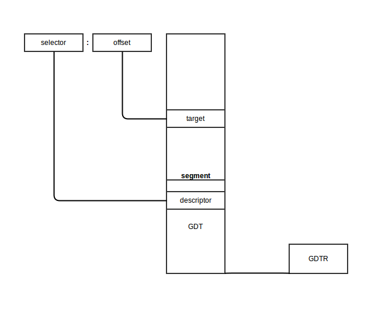

# Kernel booting process - Part 2.

We have already started our journey into the Linux kernel in the previous [part](./linux-bootstrap-1.md), where we have walked through the very early stages of the booting process and first assembly instructions of the Linux kernel code. Besides different mechanisms, this code was responsible to prepare environment for [C](https://en.wikipedia.org/wiki/C_(programming_language)) programming langauge. At the end of chapter we reached a symbolic milestone - the very first call of a C function. This function has classical name - `main` and defined in the [arch/x86/boot/main.c](https://github.com/torvalds/linux/blob/v4.16/arch/x86/boot/main.c) source code file.

From here on, we will start to see assembler code more and more rare, but it is not the end 🤓 We still will meet some assembly code on our way, but it will be more rare and rare. But now it is time for more "high level" logic!

In this part, we’ll keep digging through the kernel’s setup code and cover:

- What [protected mode](https://en.wikipedia.org/wiki/Protected_mode) is on x86 processors
- Setup of early [heap](https://en.wikipedia.org/wiki/Memory_management#HEAP) and console
- Detection of avialable memory
- Validation of a CPU 
- Initialization of a keyboard 

Time to explore these steps in detail!

## Protected mode

The Linux kernel for x86_64 operates in a special mode so-called - [long mode](http://en.wikipedia.org/wiki/Long_mode). One of the main goal of all the setup kernel code is to switch to this mode. But before we can move to this mode, the kernel must switch the CPU into [protected mode](https://en.wikipedia.org/wiki/Protected_mode).

What is [protected mode](https://en.wikipedia.org/wiki/Protected_mode)? From the previous chpater we already know that currently CPU operates in [real mode](https://en.wikipedia.org/wiki/Real_mode). For us it is mostly means - memory segmentation. As a short reminder - to access a memory location, the combination of two CPU [registers](https://en.wikipedia.org/wiki/Processor_register) is used:

- A segment register - `cs`, `ds`, `ss` and `es` which defines segment selector.
- A general purpose register which specifies offset within the segment.

The main motivation for switching from real mode is its memory limitation. As we saw in the previous part, real mode can address only 2<sup>20</sup> bytes. This is just 1 MB of RAM. Obviosuly modern software including an operating system kernel need more. To break this constraints, the new processor mode was introduced - protected mode.

Protected mode was instroduced to the x86 architecture in 1982 and became the primary operating mode of Intel processors, starting with the [80286](http://en.wikipedia.org/wiki/Intel_80286) until the introduction of x86_64 and long mode. This mode brought many changes and improvements, but one of the most crucial was in memory managment. The 20-bit address bus was replaced with a 32-bit address bus. It allowed access to 4 Gigabytes of memory vs the 1 Megabyte in real mode.

Memory management in protected mode is divided into two, mostly independent mechanisms:

- `Segmentation`
- `Paging`

For now, our attention stays on segmentation. We’ll return to paging later, once we enter 64-bit long mode.

### Memory segmentation in protected mode

In protected mode, memory segmentation was completely redesigned. Fixed 64 KB real mode segments are gone. Instead, each segment is now defined by a special data structure called a `Segment Descriptor` which specifies the properties of a segment. The segment descriptors are stored in another special structure called `Gloabal Descrptor Table` or `GDT`. Whenever a CPU needs to find an actual physical memory address, it consults GDT. The GDT itself is just a block of memory with address stored in the special CPU register called `gdtr`.  This is a 48-bit register and consists of two parts:

- The size of the global descriptor table
- The address of the global descriptor table

Later, we will see exactly how the Linux kernel builds and loads its GDT. For now, it’s enough to know that the CPU provides a dedicated instruction to load the table’s address into the GDTR register:

```assembly
lgdt gdt
```

Now let's see how segment descripotrs look like. As mentioned above, the GDT contains `segment descriptors` which describe memory segments. Each descriptor is 64-bits in size. The general scheme of a descriptor is:

```
 63         56         51   48    45           39        32 
------------------------------------------------------------
|             | |B| |A|       | |   | |0|E|W|A|            |
| BASE 31:24  |G|/|L|V| LIMIT |P|DPL|S|  TYPE | BASE 23:16 |
|             | |D| |L| 19:16 | |   | |1|C|R|A|            |
------------------------------------------------------------

 31                         16 15                         0 
------------------------------------------------------------
|                             |                            |
|        BASE 15:0            |       LIMIT 15:0           |
|                             |                            |
------------------------------------------------------------
```

Do not worry! I know it may look a little bit intimidating at the first glance, especially in comparison to the relatively simple addressing in real mode, but we will go through it in details. We will start from the bottom, from right to left. 

The first field is `LIMIT 15:0`. It represents the first 16 bits of the segment limit. The second part is located at the bits `51:48`. This field provides information about the size of a segment. Having 20-bit size of the limit field, it may seem that the max size of a memory segment can be 1 MB, but it is not like that. In addition, the max size of a segment depends on the 55th `G` bit:

- If `G=0` - the value of the `LIMIT` field is interpreted in bytes.
- if `G=1` - the value of the `LIMIT` field is interpreted in 4 KB units called pages.

Based on this, we can easily calculate that the max size of a segment is 4 GB.

The next field is `BASE`. We may see that it is split on three parts. The first part occupies bits from 16 to 31, the second part occupies bits from 32 to 39, and the last third part occupies bits from 56 to 63. The main goal of this field is to store the base address of a segment.

The remaining of the fields in a segment descriptor represent flags which control different aspects of a segment, like for example access to a segment:

- `Type` - describes the kind of segment.
- `S` - distinguishes system segments from code and data segments.
- `DPL` - provides information about the priviledge level of a segment. It can be 0-3 where 0 is the most privileged level.
- `P` - tells the CPU whether a segment presented in memory

A segment can be of one of the following types:

```
--------------------------------------------------------------------------------------
| Type Field                  | Descriptor Type | Description                        |
|-----------------------------|-----------------|------------------------------------|
| Decimal                     |                 |                                    |
|             0    E    W   A |                 |                                    |
| 0           0    0    0   0 | Data            | Read-Only                          |
| 1           0    0    0   1 | Data            | Read-Only, accessed                |
| 2           0    0    1   0 | Data            | Read/Write                         |
| 3           0    0    1   1 | Data            | Read/Write, accessed               |
| 4           0    1    0   0 | Data            | Read-Only, expand-down             |
| 5           0    1    0   1 | Data            | Read-Only, expand-down, accessed   |
| 6           0    1    1   0 | Data            | Read/Write, expand-down            |
| 7           0    1    1   1 | Data            | Read/Write, expand-down, accessed  |
|                  C    R   A |                 |                                    |
| 8           1    0    0   0 | Code            | Execute-Only                       |
| 9           1    0    0   1 | Code            | Execute-Only, accessed             |
| 10          1    0    1   0 | Code            | Execute/Read                       |
| 11          1    0    1   1 | Code            | Execute/Read, accessed             |
| 12          1    1    0   0 | Code            | Execute-Only, conforming           |
| 14          1    1    0   1 | Code            | Execute-Only, conforming, accessed |
| 13          1    1    1   0 | Code            | Execute/Read, conforming           |
| 15          1    1    1   1 | Code            | Execute/Read, conforming, accessed |
--------------------------------------------------------------------------------------
```

TODO

6. AVL flag(bit 52) - Available and reserved bits. It is ignored in Linux.

7. The L flag(bit 53) indicates whether a code segment contains native 64-bit code. If it is set, then the code segment executes in 64-bit mode.

8. The D/B flag(bit 54)  (Default/Big flag) represents the operand size i.e 16/32 bits. If set, operand size is 32 bits. Otherwise, it is 16 bits.

Segment registers contain segment selectors as in real mode. However, in protected mode, a segment selector is handled differently. Each Segment Descriptor has an associated Segment Selector which is a 16-bit structure:

```
 15             3 2  1     0
-----------------------------
|      Index     | TI | RPL |
-----------------------------
```

Where,
* **Index** stores the index number of the descriptor in the GDT.
* **TI**(Table Indicator) indicates where to search for the descriptor. If it is 0 then the descriptor is searched for in the Global Descriptor Table(GDT). Otherwise, it will be searched for in the Local Descriptor Table(LDT).
* And **RPL** contains the Requester's Privilege Level.

Every segment register has a visible and a hidden part.
* Visible - The Segment Selector is stored here.
* Hidden -  The Segment Descriptor (which contains the base, limit, attributes & flags) is stored here.

The following steps are needed to get a physical address in protected mode:

* The segment selector must be loaded in one of the segment registers.
* The CPU tries to find a segment descriptor at the offset `GDT address + Index` from the selector and then loads the descriptor into the *hidden* part of the segment register.
* If paging is disabled, the linear address of the segment, or its physical address, is given by the formula: Base address (found in the descriptor obtained in the previous step) + Offset.

Schematically it will look like this:



The algorithm for the transition from real mode into protected mode is:

* Disable interrupts
* Describe and load the GDT with the `lgdt` instruction
* Set the PE (Protection Enable) bit in CR0 (Control Register 0)
* Jump to protected mode code

We will see the complete transition to protected mode in the Linux kernel in the next part, but before we can move to protected mode, we need to do some more preparations.

Let's look at [arch/x86/boot/main.c](https://github.com/torvalds/linux/blob/v4.16/arch/x86/boot/main.c). We can see some routines there which perform keyboard initialization, heap initialization, etc... Let's take a look.

Copying boot parameters into the "zeropage"
--------------------------------------------------------------------------------

We will start from the `main` routine in "main.c". The first function which is called in `main` is [`copy_boot_params(void)`](https://github.com/torvalds/linux/blob/v4.16/arch/x86/boot/main.c). It copies the kernel setup header into the corresponding field of the `boot_params` structure which is defined in the [arch/x86/include/uapi/asm/bootparam.h](https://github.com/torvalds/linux/blob/v4.16/arch/x86/include/uapi/asm/bootparam.h) header file.

The `boot_params` structure contains the `struct setup_header hdr` field. This structure contains the same fields as defined in the [linux boot protocol](https://www.kernel.org/doc/Documentation/x86/boot.txt) and is filled by the boot loader and also at kernel compile/build time. `copy_boot_params` does two things:

1. It copies `hdr` from [header.S](https://github.com/torvalds/linux/blob/v4.16/arch/x86/boot/header.S#L280) to the `setup_header` field in `boot_params` structure.

2. It updates the pointer to the kernel command line if the kernel was loaded with the old command line protocol.

Note that it copies `hdr` with the `memcpy` function, defined in the [copy.S](https://github.com/torvalds/linux/blob/v4.16/arch/x86/boot/copy.S) source file. Let's have a look inside:

```assembly
GLOBAL(memcpy)
    pushw   %si
    pushw   %di
    movw    %ax, %di
    movw    %dx, %si
    pushw   %cx
    shrw    $2, %cx
    rep; movsl
    popw    %cx
    andw    $3, %cx
    rep; movsb
    popw    %di
    popw    %si
    retl
ENDPROC(memcpy)
```

Yeah, we just moved to C code and now assembly again :) First of all, we can see that `memcpy` and other routines which are defined here, start and end with the two macros: `GLOBAL` and `ENDPROC`. `GLOBAL` is described in [arch/x86/include/asm/linkage.h](https://github.com/torvalds/linux/blob/v4.16/arch/x86/include/asm/linkage.h) which defines the `globl` directive and its label. `ENDPROC` is described in [include/linux/linkage.h](https://github.com/torvalds/linux/blob/v4.16/include/linux/linkage.h) and marks the `name` symbol as a function name and ends with the size of the `name` symbol.

The implementation of `memcpy` is simple. At first, it pushes values from the `si` and `di` registers to the stack to preserve their values because they will change during the `memcpy`. As we can see in the `REALMODE_CFLAGS` in `arch/x86/Makefile`, the kernel build system uses the `-mregparm=3` option of GCC, so functions get the first three parameters from `ax`, `dx` and `cx` registers.  Calling `memcpy` looks like this:

```c
memcpy(&boot_params.hdr, &hdr, sizeof hdr);
```

So,
* `ax` will contain the address of `boot_params.hdr`
* `dx` will contain the address of `hdr`
* `cx` will contain the size of `hdr` in bytes.

`memcpy` puts the address of `boot_params.hdr` into `di` and saves `cx` on the stack. After this it shifts the value right 2 times (or divides it by 4) and copies four bytes from the address at `si` to the address at `di`. After this, we restore the size of `hdr` again, align it by 4 bytes and copy the rest of the bytes from the address at `si` to the address at `di` byte by byte (if there is more). Now the values of `si` and `di` are restored from the stack and the copying operation is finished.

Console initialization
--------------------------------------------------------------------------------

After `hdr` is copied into `boot_params.hdr`, the next step is to initialize the console by calling the `console_init` function,  defined in [arch/x86/boot/early_serial_console.c](https://github.com/torvalds/linux/blob/v4.16/arch/x86/boot/early_serial_console.c).

It tries to find the `earlyprintk` option in the command line and if the search was successful, it parses the port address and baud rate of the serial port and initializes the serial port. The value of the `earlyprintk` command line option can be one of these:

* serial,0x3f8,115200
* serial,ttyS0,115200
* ttyS0,115200

After serial port initialization we can see the first output:

```C
if (cmdline_find_option_bool("debug"))
    puts("early console in setup code\n");
```

The definition of `puts` is in [tty.c](https://github.com/torvalds/linux/blob/v4.16/arch/x86/boot/tty.c). As we can see it prints character by character in a loop by calling the `putchar` function. Let's look into the `putchar` implementation:

```C
void __attribute__((section(".inittext"))) putchar(int ch)
{
    if (ch == '\n')
        putchar('\r');

    bios_putchar(ch);

    if (early_serial_base != 0)
        serial_putchar(ch);
}
```

`__attribute__((section(".inittext")))` means that this code will be in the `.inittext` section. We can find it in the linker file [setup.ld](https://github.com/torvalds/linux/blob/v4.16/arch/x86/boot/setup.ld).

First of all, `putchar` checks for the `\n` symbol and if it is found, prints `\r` before. After that it prints the character on the VGA screen by calling the BIOS with the `0x10` interrupt call:

```C
static void __attribute__((section(".inittext"))) bios_putchar(int ch)
{
    struct biosregs ireg;

    initregs(&ireg);
    ireg.bx = 0x0007;
    ireg.cx = 0x0001;
    ireg.ah = 0x0e;
    ireg.al = ch;
    intcall(0x10, &ireg, NULL);
}
```

Here `initregs` takes the `biosregs` structure and first fills `biosregs` with zeros using the `memset` function and then fills it with register values.

```C
    memset(reg, 0, sizeof *reg);
    reg->eflags |= X86_EFLAGS_CF;
    reg->ds = ds();
    reg->es = ds();
    reg->fs = fs();
    reg->gs = gs();
```

Let's look at the implementation of [memset](https://github.com/torvalds/linux/blob/v4.16/arch/x86/boot/copy.S#L36):

```assembly
GLOBAL(memset)
    pushw   %di
    movw    %ax, %di
    movzbl  %dl, %eax
    imull   $0x01010101,%eax
    pushw   %cx
    shrw    $2, %cx
    rep; stosl
    popw    %cx
    andw    $3, %cx
    rep; stosb
    popw    %di
    retl
ENDPROC(memset)
```

As you can read above, it uses the same calling conventions as the `memcpy` function, which means that the function gets its parameters from the `ax`, `dx` and `cx` registers.

The implementation of `memset` is similar to that of memcpy. It saves the value of the `di` register on the stack and puts the value of`ax`, which stores the address of the `biosregs` structure, into `di` . Next is the `movzbl` instruction, which copies the value of `dl` to the lowermost byte of the `eax` register. The remaining 3 high bytes of `eax` will be filled with zeros.

The next instruction multiplies `eax` with `0x01010101`. It needs to because `memset` will copy 4 bytes at the same time. For example, if we need to fill a structure whose size is 4 bytes with the value `0x7` with memset, `eax` will contain the `0x00000007`. So if we multiply `eax` with `0x01010101`, we will get `0x07070707` and now we can copy these 4 bytes into the structure. `memset` uses the `rep; stosl` instruction to copy `eax` into `es:di`.

The rest of the `memset` function does almost the same thing as `memcpy`.

After the `biosregs` structure is filled with `memset`, `bios_putchar` calls the [0x10](http://www.ctyme.com/intr/rb-0106.htm) interrupt which prints a character. Afterwards it checks if the serial port was initialized or not and writes a character there with [serial_putchar](https://github.com/torvalds/linux/blob/v4.16/arch/x86/boot/tty.c) and `inb/outb` instructions if it was set.

Heap initialization
--------------------------------------------------------------------------------

After the stack and bss section have been prepared in [header.S](https://github.com/torvalds/linux/blob/v4.16/arch/x86/boot/header.S) (see previous [part](linux-bootstrap-1.md)), the kernel needs to initialize the [heap](https://github.com/torvalds/linux/blob/v4.16/arch/x86/boot/main.c) with the [`init_heap`](https://github.com/torvalds/linux/blob/v4.16/arch/x86/boot/main.c) function.

First of all `init_heap` checks the [`CAN_USE_HEAP`](https://github.com/torvalds/linux/blob/v4.16/arch/x86/include/uapi/asm/bootparam.h#L24) flag from the [`loadflags`](https://github.com/torvalds/linux/blob/v4.16/arch/x86/boot/header.S#L320) structure in the kernel setup header and calculates the end of the stack if this flag was set:

```C
    char *stack_end;

    if (boot_params.hdr.loadflags & CAN_USE_HEAP) {
        asm("leal %P1(%%esp),%0"
            : "=r" (stack_end) : "i" (-STACK_SIZE));
```

or in other words `stack_end = esp - STACK_SIZE`.

Then there is the `heap_end` calculation:

```C
     heap_end = (char *)((size_t)boot_params.hdr.heap_end_ptr + 0x200);
```

which means `heap_end_ptr` or `_end` + `512` (`0x200h`). The last check is whether `heap_end` is greater than `stack_end`. If it is then `stack_end` is assigned to `heap_end` to make them equal.

Now the heap is initialized and we can use it using the `GET_HEAP` method. We will see what it is used for, how to use it and how it is implemented in the next posts.

CPU validation
--------------------------------------------------------------------------------

The next step as we can see is cpu validation through the `validate_cpu` function from [arch/x86/boot/cpu.c](https://github.com/torvalds/linux/blob/v4.16/arch/x86/boot/cpu.c) source code file.

It calls the [`check_cpu`](https://github.com/torvalds/linux/blob/v4.16/arch/x86/boot/cpucheck.c) function and passes cpu level and required cpu level to it and checks that the kernel launches on the right cpu level.

```C
check_cpu(&cpu_level, &req_level, &err_flags);
if (cpu_level < req_level) {
    ...
    return -1;
}
```

The `check_cpu` function checks the CPU's flags, the presence of [long mode](http://en.wikipedia.org/wiki/Long_mode) in the case of x86_64(64-bit) CPU, checks the processor's vendor and makes preparations for certain vendors like turning on SSE+SSE2 for AMD if they are missing, etc.

at the next step, we may see a call to the `set_bios_mode` function after setup code found that a CPU is suitable. As we may see, this function is implemented only for the `x86_64` mode:

```C
static void set_bios_mode(void)
{
#ifdef CONFIG_X86_64
	struct biosregs ireg;

	initregs(&ireg);
	ireg.ax = 0xec00;
	ireg.bx = 2;
	intcall(0x15, &ireg, NULL);
#endif
}
```

The `set_bios_mode` function executes the `0x15` BIOS interrupt to tell the BIOS that [long mode](https://en.wikipedia.org/wiki/Long_mode) (if `bx == 2`) will be used.

Memory detection
--------------------------------------------------------------------------------

The next step is memory detection through the `detect_memory` function. `detect_memory` basically provides a map of available RAM to the CPU. It uses different programming interfaces for memory detection like `0xe820`, `0xe801` and `0x88`. We will see only the implementation of the **0xE820** interface here.

Let's look at the implementation of the `detect_memory_e820` function from the [arch/x86/boot/memory.c](https://github.com/torvalds/linux/blob/v4.16/arch/x86/boot/memory.c) source file. First of all, the `detect_memory_e820` function initializes the `biosregs` structure as we saw above and fills registers with special values for the `0xe820` call:

```assembly
    initregs(&ireg);
    ireg.ax  = 0xe820;
    ireg.cx  = sizeof buf;
    ireg.edx = SMAP;
    ireg.di  = (size_t)&buf;
```

* `ax` contains the number of the function (0xe820 in our case)
* `cx` contains the size of the buffer which will contain data about the memory
* `edx` must contain the `SMAP` magic number
* `es:di` must contain the address of the buffer which will contain memory data
* `ebx` has to be zero.

Next is a loop where data about the memory will be collected. It starts with a call to the `0x15` BIOS interrupt, which writes one line from the address allocation table. For getting the next line we need to call this interrupt again (which we do in the loop). Before the next call `ebx` must contain the value returned previously:

```C
    intcall(0x15, &ireg, &oreg);
    ireg.ebx = oreg.ebx;
```

Ultimately, this function collects data from the address allocation table and writes this data into the `e820_entry` array:

* start of memory segment
* size  of memory segment
* type of memory segment (whether the particular segment is usable or reserved)

You can see the result of this in the `dmesg` output, something like:

```
[    0.000000] e820: BIOS-provided physical RAM map:
[    0.000000] BIOS-e820: [mem 0x0000000000000000-0x000000000009fbff] usable
[    0.000000] BIOS-e820: [mem 0x000000000009fc00-0x000000000009ffff] reserved
[    0.000000] BIOS-e820: [mem 0x00000000000f0000-0x00000000000fffff] reserved
[    0.000000] BIOS-e820: [mem 0x0000000000100000-0x000000003ffdffff] usable
[    0.000000] BIOS-e820: [mem 0x000000003ffe0000-0x000000003fffffff] reserved
[    0.000000] BIOS-e820: [mem 0x00000000fffc0000-0x00000000ffffffff] reserved
```

Keyboard initialization
--------------------------------------------------------------------------------

The next step is the initialization of the keyboard with a call to the [`keyboard_init`](https://github.com/torvalds/linux/blob/v4.16/arch/x86/boot/main.c) function. At first `keyboard_init` initializes registers using the `initregs` function. It then calls the [0x16](http://www.ctyme.com/intr/rb-1756.htm) interrupt to query the status of the keyboard.

```c
    initregs(&ireg);
    ireg.ah = 0x02;     /* Get keyboard status */
    intcall(0x16, &ireg, &oreg);
    boot_params.kbd_status = oreg.al;
```

After this it calls [0x16](http://www.ctyme.com/intr/rb-1757.htm) again to set the repeat rate and delay.

```c
    ireg.ax = 0x0305;   /* Set keyboard repeat rate */
    intcall(0x16, &ireg, NULL);
```

Querying
--------------------------------------------------------------------------------

The next couple of steps are queries for different parameters. We will not dive into details about these queries but we will get back to them in later parts. Let's take a short look at these functions:

The first step is getting [Intel SpeedStep](http://en.wikipedia.org/wiki/SpeedStep) information by calling the `query_ist` function. It checks the CPU level and if it is correct, calls `0x15` to get the info and saves the result to `boot_params`.

Next, the [query_apm_bios](https://github.com/torvalds/linux/blob/v4.16/arch/x86/boot/apm.c#L21) function gets [Advanced Power Management](http://en.wikipedia.org/wiki/Advanced_Power_Management) information from the BIOS. `query_apm_bios` calls the `0x15` BIOS interruption too, but with `ah` = `0x53` to check `APM` installation. After `0x15` finishes executing, the `query_apm_bios` functions check the `PM` signature (it must be `0x504d`), the carry flag (it must be 0 if `APM` supported) and the value of the `cx` register (if it's 0x02, the protected mode interface is supported).

Next, it calls `0x15` again, but with `ax = 0x5304` to disconnect the `APM` interface and connect the 32-bit protected mode interface. In the end, it fills `boot_params.apm_bios_info` with values obtained from the BIOS.

Note that `query_apm_bios` will be executed only if the `CONFIG_APM` or `CONFIG_APM_MODULE` compile time flag was set in the configuration file:

```C
#if defined(CONFIG_APM) || defined(CONFIG_APM_MODULE)
    query_apm_bios();
#endif
```

The last is the [`query_edd`](https://github.com/torvalds/linux/blob/v4.16/arch/x86/boot/edd.c#L122) function, which queries `Enhanced Disk Drive` information from the BIOS. Let's look at how `query_edd` is implemented.

First of all, it reads the [edd](https://github.com/torvalds/linux/blob/v4.16/Documentation/admin-guide/kernel-parameters.rst) option from the kernel's command line and if it was set to `off` then `query_edd` just returns.

If EDD is enabled, `query_edd` goes over BIOS-supported hard disks and queries EDD information in the following loop:

```C
for (devno = 0x80; devno < 0x80+EDD_MBR_SIG_MAX; devno++) {
    if (!get_edd_info(devno, &ei) && boot_params.eddbuf_entries < EDDMAXNR) {
        memcpy(edp, &ei, sizeof ei);
        edp++;
        boot_params.eddbuf_entries++;
    }
    ...
    ...
    ...
    }
```

where `0x80` is the first hard drive and the value of the `EDD_MBR_SIG_MAX` macro is 16. It collects data into an array of [edd_info](https://github.com/torvalds/linux/blob/v4.16/include/uapi/linux/edd.h) structures. `get_edd_info` checks that EDD is present by invoking the `0x13` interrupt with `ah` as `0x41` and if EDD is present, `get_edd_info` again calls the `0x13` interrupt, but with `ah` as `0x48` and `si` containing the address of the buffer where EDD information will be stored.

Conclusion
--------------------------------------------------------------------------------

This is the end of the second part about the insides of the Linux kernel. In the next part, we will see video mode setting and the rest of the preparations before the transition to protected mode and directly transitioning into it.

If you have any questions or suggestions write me a comment or ping me at [twitter](https://twitter.com/0xAX).

**Please note that English is not my first language, And I am really sorry for any inconvenience. If you find any mistakes please send me a PR to [linux-insides](https://github.com/0xAX/linux-insides).**

Links
--------------------------------------------------------------------------------

* [Protected mode](http://en.wikipedia.org/wiki/Protected_mode)
* [Protected mode](http://wiki.osdev.org/Protected_Mode)
* [Long mode](http://en.wikipedia.org/wiki/Long_mode)
* [Nice explanation of CPU Modes with code](http://www.codeproject.com/Articles/45788/The-Real-Protected-Long-mode-assembly-tutorial-for)
* [How to Use Expand Down Segments on Intel 386 and Later CPUs](http://www.sudleyplace.com/dpmione/expanddown.html)
* [earlyprintk documentation](https://github.com/torvalds/linux/blob/v4.16/Documentation/x86/earlyprintk.txt)
* [Kernel Parameters](https://github.com/torvalds/linux/blob/v4.16/Documentation/admin-guide/kernel-parameters.rst)
* [Serial console](https://github.com/torvalds/linux/blob/v4.16/Documentation/admin-guide/serial-console.rst)
* [Intel SpeedStep](http://en.wikipedia.org/wiki/SpeedStep)
* [APM](https://en.wikipedia.org/wiki/Advanced_Power_Management)
* [EDD specification](http://www.t13.org/documents/UploadedDocuments/docs2004/d1572r3-EDD3.pdf)
* [TLDP documentation for Linux Boot Process](http://www.tldp.org/HOWTO/Linux-i386-Boot-Code-HOWTO/setup.html) (old)
* [Previous Part](linux-bootstrap-1.md)
