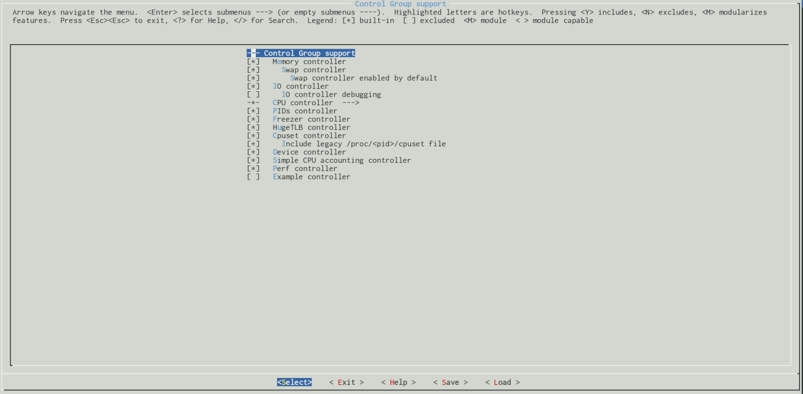

Control Groups
================================================================================

Introduction
--------------------------------------------------------------------------------

This is the first part of the new chapter of the [linux insides](https://github.com/0xAX/linux-insides/blob/master/SUMMARY.md) book and as you may guess by part's name - this part will cover [control groups](https://en.wikipedia.org/wiki/Cgroups) or `cgroups` mechanism in the Linux kernel.

`Cgroups` are special mechanism provided by the Linux kernel which allows us to allocate kind of `resources` like processor time, number of processes per group, amount of memory per control group or combination of such resources for a process or set of processes. `Cgroups` are organized hierarchically and here this mechanism is similar to usual processes as they are hierarchical too and child `cgroups` inherit set of certain parameters from their parents. But actually they are not the same. The main difference between `cgroups` and normal processes is that many different hierarchies of control groups may exist simultaneously in one time while normal process tree is always single. This was not a casual step because each control group hierarchy is attached to set of control group `subsystems`.

One `control group subsystem` represents one kind of resources like a processor time or number of [pids](https://en.wikipedia.org/wiki/Process_identifier) or in other words number of processes for a `control group`. Linux kernel provides support for following twelve `control group subsystems`:

* `cpuset` - assigns individual processor(s) and memory nodes to task(s) in a group;
* `cpu` - uses the scheduler to provide cgroup tasks access to the processor resources;
* `cpuacct` - generates reports about processor usage by a group;
* `io` - sets limit to read/write from/to [block devices](https://en.wikipedia.org/wiki/Device_file);
* `memory` - sets limit on memory usage by a task(s) from a group;
* `devices` - allows access to devices by a task(s) from a group;
* `freezer` - allows to suspend/resume for a task(s) from a group;
* `net_cls` - allows to mark network packets from task(s) from a group;
* `net_prio` - provides a way to dynamically set the priority of network traffic per network interface for a group;
* `perf_event` - provides access to [perf events](https://en.wikipedia.org/wiki/Perf_\(Linux\)) to a group;
* `hugetlb` - activates support for [huge pages](https://www.kernel.org/doc/Documentation/vm/hugetlbpage.txt) for a group;
* `pid` - sets limit to number of processes in a group.

Each of these control group subsystems depends on related configuration option. For example the `cpuset` subsystem should be enabled via `CONFIG_CPUSETS` kernel configuration option, the `io` subsystem via `CONFIG_BLK_CGROUP` kernel configuration option and etc. All of these kernel configuration options may be found in the `General setup → Control Group support` menu:



You may see enabled control groups on your computer via [proc](https://en.wikipedia.org/wiki/Procfs) filesystem:

```
$ cat /proc/cgroups 
#subsys_name	hierarchy	num_cgroups	enabled
cpuset	8	1	1
cpu	7	66	1
cpuacct	7	66	1
blkio	11	66	1
memory	9	94	1
devices	6	66	1
freezer	2	1	1
net_cls	4	1	1
perf_event	3	1	1
net_prio	4	1	1
hugetlb	10	1	1
pids	5	69	1
```

or via [sysfs](https://en.wikipedia.org/wiki/Sysfs):

```
$ ls -l /sys/fs/cgroup/
total 0
dr-xr-xr-x 5 root root  0 Dec  2 22:37 blkio
lrwxrwxrwx 1 root root 11 Dec  2 22:37 cpu -> cpu,cpuacct
lrwxrwxrwx 1 root root 11 Dec  2 22:37 cpuacct -> cpu,cpuacct
dr-xr-xr-x 5 root root  0 Dec  2 22:37 cpu,cpuacct
dr-xr-xr-x 2 root root  0 Dec  2 22:37 cpuset
dr-xr-xr-x 5 root root  0 Dec  2 22:37 devices
dr-xr-xr-x 2 root root  0 Dec  2 22:37 freezer
dr-xr-xr-x 2 root root  0 Dec  2 22:37 hugetlb
dr-xr-xr-x 5 root root  0 Dec  2 22:37 memory
lrwxrwxrwx 1 root root 16 Dec  2 22:37 net_cls -> net_cls,net_prio
dr-xr-xr-x 2 root root  0 Dec  2 22:37 net_cls,net_prio
lrwxrwxrwx 1 root root 16 Dec  2 22:37 net_prio -> net_cls,net_prio
dr-xr-xr-x 2 root root  0 Dec  2 22:37 perf_event
dr-xr-xr-x 5 root root  0 Dec  2 22:37 pids
dr-xr-xr-x 5 root root  0 Dec  2 22:37 systemd
```

As you already may guess that `control groups` mechanism is not such mechanism which was invented only directly to the needs of the Linux kernel, but mostly for userspace needs. To use a `control group`, we should create it at first. We may create a `cgroup` via two ways.

The first way is to create subdirectory in any subsystem from `/sys/fs/cgroup` and add a pid of a task to a `tasks` file which will be created automatically right after we will create the subdirectory.

The second way is to create/destroy/manage `cgroups` with utils from `libcgroup` library (`libcgroup-tools` in Fedora).

Let's consider a simple example. Following [bash](https://www.gnu.org/software/bash/) script will print a line to `/dev/tty` device which represents control terminal for the current process:

```shell
#!/bin/bash

while :
do
    echo "print line" > /dev/tty
    sleep 5
done
```

So, if we will run this script we will see following result:

```
$ sudo chmod +x cgroup_test_script.sh
~$ ./cgroup_test_script.sh 
print line
print line
print line
...
...
...
```

Now let's go to the place where `cgroupfs` is mounted on our computer. As we just saw, this is `/sys/fs/cgroup` directory, but you may mount it everywhere you want.

```
$ cd /sys/fs/cgroup
```

And now let's go to the `devices` subdirectory which represents kind of resources that allows or denies access to devices by tasks in a `cgroup`:

```
# cd devices
```

and create `cgroup_test_group` directory there:

```
# mkdir cgroup_test_group
```

After creation of the `cgroup_test_group` directory, following files will be generated there:

```
/sys/fs/cgroup/devices/cgroup_test_group$ ls -l
total 0
-rw-r--r-- 1 root root 0 Dec  3 22:55 cgroup.clone_children
-rw-r--r-- 1 root root 0 Dec  3 22:55 cgroup.procs
--w------- 1 root root 0 Dec  3 22:55 devices.allow
--w------- 1 root root 0 Dec  3 22:55 devices.deny
-r--r--r-- 1 root root 0 Dec  3 22:55 devices.list
-rw-r--r-- 1 root root 0 Dec  3 22:55 notify_on_release
-rw-r--r-- 1 root root 0 Dec  3 22:55 tasks
```

For this moment we are interested in `tasks` and `devices.deny` files. The first `tasks` files should contain pid(s) of processes which will be attached to the `cgroup_test_group`. The second `devices.deny` file contain list of denied devices. By default a newly created group has no any limits for devices access. To forbid a device (in our case it is `/dev/tty`) we should write to the `devices.deny` following line:

```
# echo "c 5:0 w" > devices.deny
```

Let's go step by step through this line. The first `c` letter represents type of a device. In our case the `/dev/tty` is `char device`. We can verify this from output of `ls` command:

```
~$ ls -l /dev/tty
crw-rw-rw- 1 root tty 5, 0 Dec  3 22:48 /dev/tty
```

see the first `c` letter in a permissions list. The second part is `5:0` is major and minor numbers of the device. You can see these numbers in the output of `ls` too. And the last `w` letter forbids tasks to write to the specified device. So let's start the `cgroup_test_script.sh` script:

```
~$ ./cgroup_test_script.sh 
print line
print line
print line
...
...
```

and add pid of this process to the `devices/tasks` file of our group:

```
# echo $(pidof -x cgroup_test_script.sh) > /sys/fs/cgroup/devices/cgroup_test_group/tasks
```

The result of this action will be as expected:

```
~$ ./cgroup_test_script.sh 
print line
print line
print line
print line
print line
print line
./cgroup_test_script.sh: line 5: /dev/tty: Operation not permitted
```

Similar situation will be when you will run you [docker](https://en.wikipedia.org/wiki/Docker_\(software\)) containers for example:

```
~$ docker ps
CONTAINER ID        IMAGE               COMMAND                  CREATED             STATUS              PORTS                    NAMES
fa2d2085cd1c        mariadb:10          "docker-entrypoint..."   12 days ago         Up 4 minutes        0.0.0.0:3306->3306/tcp   mysql-work

~$ cat /sys/fs/cgroup/devices/docker/fa2d2085cd1c8d797002c77387d2061f56fefb470892f140d0dc511bd4d9bb61/tasks | head -3
5501
5584
5585
...
...
...
```

So, during startup of a `docker` container, `docker` will create a `cgroup` for processes in this container:

```
$ docker exec -it mysql-work /bin/bash
$ top
  PID USER      PR  NI    VIRT    RES    SHR S  %CPU %MEM     TIME+ COMMAND                                                                                   1 mysql     20   0  963996 101268  15744 S   0.0  0.6   0:00.46 mysqld
   71 root      20   0   20248   3028   2732 S   0.0  0.0   0:00.01 bash
   77 root      20   0   21948   2424   2056 R   0.0  0.0   0:00.00 top
```

And we may see this `cgroup` on host machine:

```C
$ systemd-cgls

Control group /:
-.slice
├─docker
│ └─fa2d2085cd1c8d797002c77387d2061f56fefb470892f140d0dc511bd4d9bb61
│   ├─5501 mysqld
│   └─6404 /bin/bash
```

Now we know a little about `control groups` mechanism, how to use it manually and what's purpose of this mechanism. It's time to look inside of the Linux kernel source code and start to dive into implementation of this mechanism.

Early initialization of control groups
--------------------------------------------------------------------------------

Now after we just saw a little theory about `control groups` Linux kernel mechanism, we may start to dive into the source code of Linux kernel to get better acquainted with this mechanism. As always we will start from the initialization of `control groups`. Initialization of `cgroups` is divided into two parts in the Linux kernel: early and late. In this part we will consider only `early` part and `late` part will be considered in next parts.

Early initialization of `cgroups` starts from the call of the:

```C
cgroup_init_early();
```

function in the [init/main.c](https://github.com/torvalds/linux/blob/16f73eb02d7e1765ccab3d2018e0bd98eb93d973/init/main.c) during early initialization of the Linux kernel. This function is defined in the [kernel/cgroup/cgroup.c](https://github.com/torvalds/linux/blob/master/kernel/cgroup/cgroup.c) source code file and starts from the definition of two following local variables:

```C
int __init cgroup_init_early(void)
{
	static struct cgroup_sb_opts __initdata opts;
	struct cgroup_subsys *ss;
    ...
    ...
    ...
}
```

The `cgroup_sb_opts` structure defined in the same source code file and looks:

```C
struct cgroup_sb_opts {
	u16 subsys_mask;
	unsigned int flags;
	char *release_agent;
	bool cpuset_clone_children;
	char *name;
	bool none;
};
```

which represents mount options of `cgroupfs`. For example we may create named cgroup hierarchy (with name `my_cgrp`) with the `name=` option and without any subsystems:

```
$ mount -t cgroup -oname=my_cgrp,none /mnt/cgroups
```

The second variable - `ss` has type - `cgroup_subsys` structure which is defined in the [include/linux/cgroup-defs.h](https://github.com/torvalds/linux/blob/16f73eb02d7e1765ccab3d2018e0bd98eb93d973/include/linux/cgroup-defs.h) header file and as you may guess from the name of the type, it represents a `cgroup` subsystem. This structure contains various fields and callback functions like:

```C
struct cgroup_subsys {
    int (*css_online)(struct cgroup_subsys_state *css);
    void (*css_offline)(struct cgroup_subsys_state *css);
    ...
    ...
    ...
    bool early_init:1;
    int id;
    const char *name;
    struct cgroup_root *root;
    ...
    ...
    ...
}
```

Where for example `css_online` and `css_offline` callbacks are called after a cgroup successfully will complete all allocations and a cgroup will be before releasing respectively. The `early_init` flags marks subsystems which may/should be initialized early. The `id` and `name` fields represents unique identifier in the array of registered subsystems for a cgroup and `name` of a subsystem respectively. The last - `root` fields represents pointer to the root of of a cgroup hierarchy.

Of course the `cgroup_subsys` structure is bigger and has other fields, but it is enough for now. Now as we got to know important structures related to `cgroups` mechanism, let's return to the `cgroup_init_early` function. Main purpose of this function is to do early initialization of some subsystems. As you already may guess, these `early` subsystems should have `cgroup_subsys->early_init = 1`. Let's look what subsystems may be initialized early.

After the definition of the two local variables we may see following lines of code:

```C
init_cgroup_root(&cgrp_dfl_root, &opts);
cgrp_dfl_root.cgrp.self.flags |= CSS_NO_REF;
```

Here we may see call of the `init_cgroup_root` function which will execute initialization of the default unified hierarchy and after this we set `CSS_NO_REF` flag in state of this default `cgroup` to disable reference counting for this css. The `cgrp_dfl_root` is defined in the same source code file:

```C
struct cgroup_root cgrp_dfl_root;
```

Its `cgrp` field represented by the `cgroup` structure which represents a `cgroup` as you already may guess and defined in the [include/linux/cgroup-defs.h](https://github.com/torvalds/linux/blob/16f73eb02d7e1765ccab3d2018e0bd98eb93d973/include/linux/cgroup-defs.h) header file. We already know that a process which is represented by the `task_struct` in the Linux kernel. The `task_struct` does not contain direct link to a `cgroup` where this task is attached. But it may be reached via `css_set` field of the `task_struct`. This `css_set` structure holds pointer to the array of subsystem states:

```C
struct css_set {
    ...
    ...
    ....
    struct cgroup_subsys_state *subsys[CGROUP_SUBSYS_COUNT];
    ...
    ...
    ...
}
```

And via the `cgroup_subsys_state`, a process may get a `cgroup` that this process is attached to:

```C
struct cgroup_subsys_state {
    ...
    ...
    ...
    struct cgroup *cgroup;
    ...
    ...
    ...
}
```

So, the overall picture of `cgroups` related data structure is following:

```                                                 
+-------------+         +---------------------+    +------------->+---------------------+          +----------------+
| task_struct |         |       css_set       |    |              | cgroup_subsys_state |          |     cgroup     |
+-------------+         |                     |    |              +---------------------+          +----------------+
|             |         |                     |    |              |                     |          |     flags      |
|             |         |                     |    |              +---------------------+          |  cgroup.procs  |
|             |         |                     |    |              |        cgroup       |--------->|       id       |
|             |         |                     |    |              +---------------------+          |      ....      | 
|-------------+         |---------------------+----+                                               +----------------+
|   cgroups   | ------> | cgroup_subsys_state | array of cgroup_subsys_state
|-------------+         +---------------------+------------------>+---------------------+          +----------------+
|             |         |                     |                   | cgroup_subsys_state |          |      cgroup    |
+-------------+         +---------------------+                   +---------------------+          +----------------+
                                                                  |                     |          |      flags     |
                                                                  +---------------------+          |   cgroup.procs |
                                                                  |        cgroup       |--------->|        id      |
                                                                  +---------------------+          |       ....     |
                                                                  |    cgroup_subsys    |          +----------------+
                                                                  +---------------------+
                                                                             |
                                                                             |
                                                                             ↓
                                                                  +---------------------+
                                                                  |    cgroup_subsys    |
                                                                  +---------------------+
                                                                  |         id          |
                                                                  |        name         |
                                                                  |      css_online     |
                                                                  |      css_ofline     |
                                                                  |        attach       |
                                                                  |         ....        |
                                                                  +---------------------+
```


So, the `init_cgroup_root` fills the `cgrp_dfl_root` with the default values. The next thing is assigning initial `css_set` to the `init_task` which represents first process in the system:

```C
RCU_INIT_POINTER(init_task.cgroups, &init_css_set);
```

And the last big thing in the `cgroup_init_early` function is initialization of `early cgroups`. Here we go over all registered subsystems and assign unique identity number, name of a subsystem and call the `cgroup_init_subsys` function for subsystems which are marked as early:

```C
for_each_subsys(ss, i) {
		ss->id = i;
		ss->name = cgroup_subsys_name[i];

        if (ss->early_init)
			cgroup_init_subsys(ss, true);
}
```

The `for_each_subsys` here is a macro which is defined in the [kernel/cgroup/cgroup.c](https://github.com/torvalds/linux/blob/master/kernel/cgroup/cgroup.c) source code file and just expands to the `for` loop over `cgroup_subsys` array. Definition of this array may be found in the same source code file and it looks in a little unusual way:

```C
#define SUBSYS(_x) [_x ## _cgrp_id] = &_x ## _cgrp_subsys,
    static struct cgroup_subsys *cgroup_subsys[] = {
        #include <linux/cgroup_subsys.h>
};
#undef SUBSYS
```

It is defined as `SUBSYS` macro which takes one argument (name of a subsystem) and defines `cgroup_subsys` array of cgroup subsystems. Additionally we may see that the array is initialized with content of the [linux/cgroup_subsys.h](https://github.com/torvalds/linux/blob/16f73eb02d7e1765ccab3d2018e0bd98eb93d973/include/linux/cgroup_subsys.h) header file. If we will look inside of this header file we will see again set of the `SUBSYS` macros with the given subsystems names:

```C
#if IS_ENABLED(CONFIG_CPUSETS)
SUBSYS(cpuset)
#endif

#if IS_ENABLED(CONFIG_CGROUP_SCHED)
SUBSYS(cpu)
#endif
...
...
...
```

This works because of `#undef` statement after first definition of the `SUBSYS` macro. Look at the `&_x ## _cgrp_subsys` expression. The `##` operator concatenates right and left expression in a `C` macro. So as we passed `cpuset`, `cpu` and etc., to the `SUBSYS` macro, somewhere `cpuset_cgrp_subsys`, `cpu_cgrp_subsys` should be defined. And that's true. If you will look in the [kernel/cgroup/cpuset.c](https://github.com/torvalds/linux/blob/master/kernel/cgroup/cpuset.c) source code file, you will see this definition:

```C
struct cgroup_subsys cpuset_cgrp_subsys = {
    ...
    ...
    ...
	.early_init	= true,
};
```

So the last step in the `cgroup_init_early` function is initialization of early subsystems with the call of the `cgroup_init_subsys` function. Following early subsystems will be initialized:

* `cpuset`;
* `cpu`;
* `cpuacct`.

The `cgroup_init_subsys` function does initialization of the given subsystem with the default values. For example sets root of hierarchy, allocates space for the given subsystem with the call of the `css_alloc` callback function, link a subsystem with a parent if it exists, add allocated subsystem to the initial process and etc.

That's all. From this moment early subsystems are initialized.

Conclusion
--------------------------------------------------------------------------------

It is the end of the first part which describes introduction into `Control groups` mechanism in the Linux kernel. We covered some theory and the first steps of initialization of stuffs related to `control groups` mechanism. In the next part we will continue to dive into the more practical aspects of `control groups`.

If you have any questions or suggestions write me a comment or ping me at [twitter](https://twitter.com/0xAX).

**Please note that English is not my first language, And I am really sorry for any inconvenience. If you find any mistakes please send me a PR to [linux-insides](https://github.com/0xAX/linux-insides).**

Links
--------------------------------------------------------------------------------

* [control groups](https://en.wikipedia.org/wiki/Cgroups)
* [PID](https://en.wikipedia.org/wiki/Process_identifier)
* [cpuset](http://man7.org/linux/man-pages/man7/cpuset.7.html)
* [block devices](https://en.wikipedia.org/wiki/Device_file)
* [huge pages](https://www.kernel.org/doc/Documentation/vm/hugetlbpage.txt)
* [sysfs](https://en.wikipedia.org/wiki/Sysfs)
* [proc](https://en.wikipedia.org/wiki/Procfs)
* [cgroups kernel documentation](https://www.kernel.org/doc/Documentation/cgroup-v1/cgroups.txt)
* [cgroups v2](https://www.kernel.org/doc/Documentation/cgroup-v2.txt)
* [bash](https://www.gnu.org/software/bash/)
* [docker](https://en.wikipedia.org/wiki/Docker_\(software\))
* [perf events](https://en.wikipedia.org/wiki/Perf_\(Linux\))
* [Previous chapter](https://0xax.gitbook.io/linux-insides/summary/mm/linux-mm-1)
