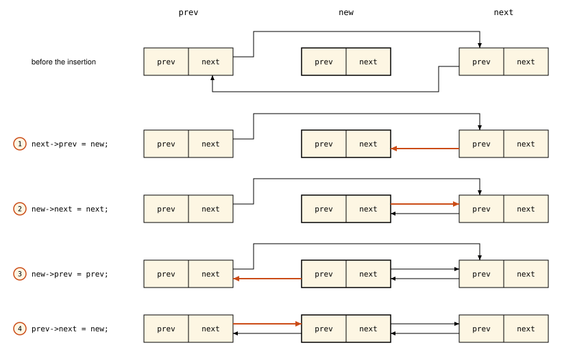

# Kernel Data Structures - Part 1

The Linux kernel is a really huge piece of code. As a modern operating system kernel, it contains schedulers to manage processes and resources, a network stack, a handful of file systems, thousands of device drivers, and much, much more. At the same time, the kernel has to manage all of this as efficiently as possible. Efficiency here is not always only about writing faster instructions or clever algorithms. Very often, as in any userspace application, it starts with a much more fundamental question - how is the data organized?

As Linus Torvalds once [wrote](https://lore.kernel.org/git/Pine.LNX.4.64.0607270936200.4168@g5.osdl.org/):

> Good programmers  worry about data structures and their relationships.

The kernel needs to keep track of processes, memory pages, files, timers, devices, network connections, and countless other objects. Some of them need to be searched quickly, some must always remain ordered, some are frequently traversed, and some need to be inserted or removed with as little overhead as possible. Choosing an appropriate representation for this data may have a direct impact on the performance and memory usage. 

This is especially important for software such as an operating system kernel. Ideally, it should remain almost invisible to the user while introducing as little overhead as possible.

If you have seen the kernel source code, you have probably noticed that linked lists, trees, queues, bitmaps, hash tables, and many other data structures are used in almost every kernel subsystem. Some are familiar from well-known computer science textbooks, while others have been adapted to the particular requirements and programming style of the kernel.

In this chapter, we will look at these building blocks so that they are familiar to us when we explore the main kernel subsystems.

## Linked list

The very first data structure that we will meet in this chapter is the [linked list](https://en.wikipedia.org/wiki/Linked_list).

I think this is a good choice to start with because this data structure is relatively simple on one hand, and quite ubiquitous on the other. Saying that it is ubiquitous is not an exaggeration. We can find linked lists in many different parts of the Linux kernel. To get a rough idea of just how common this data structure is in the kernel:

```bash
rg -w 'struct list_head' | wc -l
17143
```

More than seventeen thousand occurrences! It is definitely worth understanding how the linked list is implemented and used in the kernel.

One of the main purposes of this data structure is to organize different kinds of objects into sequences. But before we dive into the implementation of linked lists in the kernel, let's take a short look at this data structure in general.

According to [wikipedia](https://en.wikipedia.org/wiki/Linked_list):

> In computer science, a linked list is a linear collection of data elements whose order is not given by their physical placement in memory. Instead, each element points to the next. It is a data structure consisting of a collection of nodes which together represent a sequence. In its most basic form, each node contains data, and a reference (in other words, a link) to the next node in the sequence.

In other words, unlike an [array](https://en.wikipedia.org/wiki/Array_(data_structure)), the elements of a linked list do not have to occupy contiguous locations in memory. The relationship between them is represented explicitly by links. In the simplest case, every node contains a single link to the next node. The process can be illustrated as follows:



Such a list is called a **singly linked list**, and it can be walked only in one direction. We start from the `head` and follow the `next` pointer of each node until we reach the end. The definition of this data structure and implementation of its basic operations are pretty simple. If you have read, for example, [Algorithms](https://www.amazon.com/Algorithms-4th-Robert-Sedgewick/dp/032157351X) by Robert Sedgewick and Kevin Wayne, you know the classical representation of the linked list:

```java
private class Node
{
    Item item;
    Node next;
}
```

Each `Node` stores an item and a reference to the next node. For example, if our list contains three elements, the first node points to the second one, and the second node points to the third. The last node points to nothing or its value equal to `null`. that is how the end of a list is determined.

Adding a new element does not require moving the existing elements in memory. We only need to create a new node and adjust the appropriate links. To remove an element from a list, we need to change the link from the preceding node to skip the node being removed.

Very often, this is not enough. For some operations, we may need to move backwards through the list. In such cases, every node gets a second link that points to the previous node. Such a structure is called a **doubly linked list**. Schematically, this structure can be represented like this:



> [!NOTE]
> I will not provide examples of linked-list implementations here. If you have never implemented one yourself, it can be a good exercise for self-training.

## Linked lists in the Linux kernel

Now that we have refreshed the basic idea behind linked lists, we can take a look at their implementation in the Linux kernel.

Before I saw the implementation of linked lists in the Linux kernel, I expected something very similar to what we saw above. A simple structure with a pointer or storage for data and a reference to another node. It turns out to be quite different!

The kernel implements so-called **intrusive linked lists**. In such lists, there is no pointer to the data. Instead, a list's node contains only two pointers. One pointer that points to the next element and one pointer that points to the previous element. Such a node is embedded into the structure that we want to keep in the list. The links connect these embedded nodes:



Yes, this may look very unusual at first. How can such a structure represent a list of processes, devices, files, or any other kernel objects if it does not contain the objects themselves? As described above, the answer is one of the characteristic ideas behind the Linux implementation of linked lists. Instead of storing an object inside a list node, the list node is stored inside the object.

The implementation of the Linux kernel linked lists can be found in [include/linux/list.h](https://github.com/torvalds/linux/blob/master/include/linux/list.h). If we take a look at the structure itself, we will see the idea we described above:

<!-- https://raw.githubusercontent.com/torvalds/linux/refs/heads/master/include/linux/types.h#L206-L208 -->
```C
struct list_head {
	struct list_head *next, *prev;
};
```

The `list_head` structure contains only two pointers to the next and previous nodes. So how can we use it? The answer is to embed a `list_head` directly into the structure whose objects we want to keep in a list. For example, if we take a look at the structure that defines a process, we can see that, among other fields, it has:

```C
struct task_struct { 
    ...
    struct list_head tasks;
    ...
};
```

The `tasks` field is used to link `task_struct` objects together. So, instead of allocating a separate list node that contains a pointer to a `task_struct`, every `task_struct` contains its own list node. What's interesting, the `next` and `prev` pointers do not point directly to another `task_struct`. Instead, they point to the tasks member embedded inside the neighboring `task_struct` objects. Schematically, it looks like this:



This approach gives us a linked list without requiring a separate allocation for every list node and without requiring `list_head` to know anything about the structures it links.

This sounds great, but when you see it for the first time, it raises another question. If all we have while walking the list is a pointer to `list_head`, how can we get back to the `task_struct` which contains it? The answer is based on another very common kernel helper - the `container_of` macro. This macro allows us to get a pointer to the structure we are interested in. In our case, having a pointer to the `tasks` member allows us to get back to the `task_struct` which contains it.

The idea behind it is pretty simple. If we know the address of a list node embedded inside a structure, the type of the structure, and the name of the field that represents the node, we can calculate the address of the structure itself. In our case, we have a pointer to the `tasks` member, which is a `list_head`, and we know that this member belongs to the `task_struct` structure. Using this information, the kernel can obtain the address of the `task_struct`.

This is exactly what allows the linked list implementation to stay generic. `list_head` does not know anything about `task_struct`, while the code which uses the list can always get back to the object that contains the list node.

Now that we understand the basic idea, let's take a look at the implementation of `container_of`. You can find the definition of this macro in [include/linux/container_of.h](https://github.com/torvalds/linux/blob/master/include/linux/container_of.h):

<!-- https://raw.githubusercontent.com/torvalds/linux/refs/heads/master/include/linux/container_of.h#L10-L23 -->
```C
/**
 * container_of - cast a member of a structure out to the containing structure
 * @ptr:	the pointer to the member.
 * @type:	the type of the container struct this is embedded in.
 * @member:	the name of the member within the struct.
 *
 * WARNING: any const qualifier of @ptr is lost.
 * Do not use container_of() in new code.
 */
#define container_of(ptr, type, member) ({				\
	static_assert(__same_type(*(ptr), typeof_member(type, member)) || \
		      __same_type(*(ptr), void),			\
		      "pointer type mismatch in container_of()");	\
	(type *)((void *)(ptr) - offsetof(type, member)); })
```

As we can see, this macro accepts three arguments: 

- the pointer to the list node
- the type of the structure that contains the list node
- the name of the field that represents the list node

In the example above, these arguments would correspond to the:

- pointer to the `tasks` field
- `struct task_struct` as the type that contains the list node
- `tasks` as the name of the field that represents the list node

The first line of the macro's body is not strictly related to the address calculation. It only performs a compile-time type check to make sure that the pointer to the list node has the expected type.

The second line of the macro does the actual job. Using the [offsetof](https://en.cppreference.com/c/types/offsetof) macro, it calculates the offset from the beginning of the structure to the field that defines the list node. Knowing this offset, we can subtract it from the address of the list node and get the address of the structure that contains this node.


And that is basically it! Abstractly, the `container_of` macro allows us to get the address of a structure when we know the address of one of its fields. Putting this logic into the context of linked lists, this is nothing more than obtaining the actual list entry from a pointer to its embedded list node:

<!-- https://raw.githubusercontent.com/torvalds/linux/refs/heads/master/include/linux/list.h#L641-L648 -->
```C
/**
 * list_entry - get the struct for this entry
 * @ptr:	the &struct list_head pointer.
 * @type:	the type of the struct this is embedded in.
 * @member:	the name of the list_head within the struct.
 */
#define list_entry(ptr, type, member) \
	container_of(ptr, type, member)
```

## List operations

In the previous section, we got familiar with the basic structure of linked lists in the Linux kernel. Now it is time to look at the operations that we can use to add, remove, and update elements in a list.

While writing this part, I was thinking that it would be quite boring to simply enumerate the existing API. It would be much more interesting to take a look at a real example of its usage. Some mechanism that you have probably seen while using the Linux operating system, but perhaps never thought about what is happening behind it.

There are a lot of places in the kernel where lists are used. Let's take a look, for example, at the [miscellaneous character devices](https://en.wikipedia.org/wiki/Device_file#Character_devices).

Each character device is identified by a pair of numbers: a major and a minor number. The major number usually identifies the driver or a group of related devices, while the minor number identifies a particular device handled by that driver.

The kernel provides a special API that allows a driver to register a character device without assigning it a separate major number. All such devices share the same major number, while each registered device gets its own minor number. Such a major number is:

<!-- https://raw.githubusercontent.com/torvalds/linux/refs/heads/master/include/uapi/linux/major.h#L26-L26 -->
```C
#define MISC_MAJOR		10
```

We can see the list of registered miscellaneous devices using the following command:

```bash
ls -l /dev | awk '$5 == "10," { print $10 }'

acpi_thermal_rel
autofs
cpu_dma_latency
cuse
fuse
hpet
hwrng
io_uring_mock
kvm
loop-control
mcelog
nvram
rfkill
snapshot
tpm0
udmabuf
uhid
userfaultfd
vga_arbiter
vhost-net
vhost-vsock
```

So, from the userspace point of view, miscellaneous devices look like regular character devices with the same major number and different minor numbers. What is interesting for us is how the kernel keeps track of all these registered devices internally.

Every miscellaneous device is represented by a `miscdevice` structure defined in [include/linux/miscdevice.h](https://github.com/torvalds/linux/blob/master/include/linux/miscdevice.h). Among other fields, this structure contains a field called `list`, which allows the device to become part of the linked list maintained by the misc subsystem:

<!-- https://github.com/torvalds/linux/raw/refs/heads/master/include/linux/miscdevice.h#L84-L94 -->
```C
struct miscdevice {
	int minor;
	const char *name;
	const struct file_operations *fops;
	struct list_head list;
	struct device *parent;
	struct device *this_device;
	const struct attribute_group **groups;
	const char *nodename;
	umode_t mode;
};
```

We already know how the kernel is going to use the `list` field. Each registered device contains its own list node and all of them linked to the single list, so the kernel can keep track of them. Good, at this point it should be clear how the list nodes are handled and linked. But how do we access the list itself? The answer for that question is that we need a reference to the head of the list:

<!-- https://github.com/torvalds/linux/raw/refs/heads/master/drivers/char/misc.c#L57-L57 -->
```C
static LIST_HEAD(misc_list);
```

Following the definitions of the `LIST_HEAD` and `LIST_HEAD_INIT` macros in [include/linux/list.h](https://github.com/torvalds/linux/blob/master/include/linux/list.h), this expands to a regular C structure initialization:

```C
struct list_head misc_list = { &(misc_list), &(misc_list) }
```

The two values inside the initializer are the `prev` and `next` fields of the `list_head` structure. Since the list is initially empty, there are no other nodes for these pointers to reference.

When the kernel registers a device, it initializes the corresponding `miscdevice` structure and adds it to the list with:

<!-- https://github.com/torvalds/linux/raw/refs/heads/master/drivers/char/misc.c#L269-L269 -->
```C
	list_add(&misc->list, &misc_list);
```

This function is defined in [include/linux/list.h](https://github.com/torvalds/linux/blob/master/include/linux/list.h) and looks like this:

<!-- https://raw.githubusercontent.com/torvalds/linux/refs/heads/master/include/linux/list.h#L189-L193 -->
```C
static __always_inline void list_add(struct list_head *new,
				     struct list_head *head)
{
	__list_add(new, head, head->next);
}
```

This function simply delegates the actual work to the internal `__list_add` helper, which is implemented like this:

<!-- https://raw.githubusercontent.com/torvalds/linux/refs/heads/master/include/linux/list.h#L165-L176 -->
```C
static __always_inline void __list_add(struct list_head *new,
				       struct list_head *prev,
				       struct list_head *next)
{
	if (!__list_add_valid(new, prev, next))
		return;

	next->prev = new;
	new->next = next;
	new->prev = prev;
	WRITE_ONCE(prev->next, new);
}
```

This should already be familiar to you if you have ever tried to implement a linked list by yourself. To insert a new node between two existing nodes, the kernel updates four links:



At this point, I think we already know enough to understand the basic idea behind the linked list API in the kernel. We have seen how list nodes are embedded into other structures, how to get the containing structure back with `list_entry`, and how a new node is inserted into a list with `list_add`.

The rest of the basic operations follow the same idea. There are helpers for removing nodes, adding them to the end of a list, moving them between lists, and iterating over the elements.

I will not go through each of them one by one here. With the concepts that we already know, reading their implementation in [include/linux/list.h](https://github.com/torvalds/linux/blob/master/include/linux/list.h) can be a good exercise.

## Conclusion

This is the end of the first part about the data structures used in the Linux kernel. If you have questions or suggestions, feel free to ping me on X - [0xAX](https://twitter.com/0xAX), drop me an [email](mailto:anotherworldofworld@gmail.com), or just create an [issue](https://github.com/0xAX/linux-insides/issues/new).
