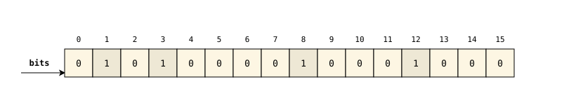
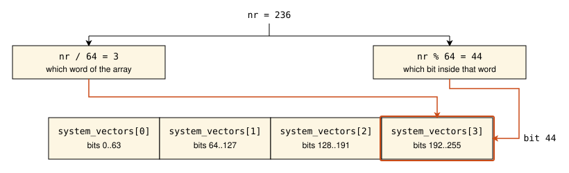
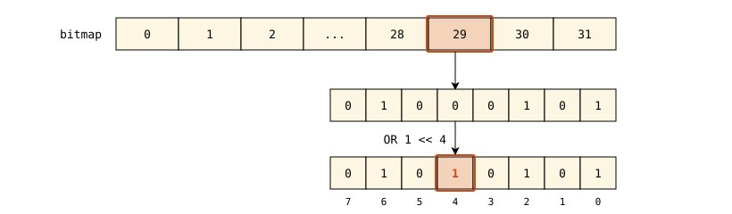
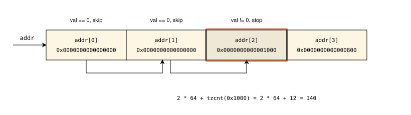

# Kernel Data Structures - Part 2

In the [first part](./linux-datastructures-1.md) of this chapter, we looked at the linked list - probably the most widespread data structure in the Linux kernel. In this part, we will look at another data structure that is simple on one hand and very common on the other - the [bit array](https://en.wikipedia.org/wiki/Bit_array), or as it is usually called in the kernel, the **bitmap**.

Just like with the linked lists, let's get a rough idea of how common bitmaps are in the kernel source code. The most basic operations on a bitmap are to set a bit, to clear a bit, and to test whether a bit is set:

```bash
rg -w 'set_bit|clear_bit|test_bit' | wc -l
28337
```

More than twenty-eight thousand calls of just three functions! Where are all these bitmaps used? The kernel needs to track sets of numbered items everywhere. Which processors are online, which interrupt vectors are already taken, which file descriptors of a process are open. Each of these questions is a yes or no question about an item with a number, and that is exactly what a bitmap answers well.

## Bit array

Before we dive into the kernel implementation, let's take a short look at this data structure in general. According to [wikipedia](https://en.wikipedia.org/wiki/Bit_array):

> A bit array (also known as bit map, bit set, bit string, or bit vector) is an array data structure that compactly stores bits. It can be used to implement a simple set data structure. A bit array is effective at exploiting bit-level parallelism in hardware to perform operations quickly.
>
> -- Wikipedia, "Bit array"

The idea is very simple. We have a sequence of bits numbered from zero, and every bit is either `0` or `1`. If we want to represent a set of small non-negative integers, we set the bit with the corresponding number for every element of the set. For example, the set `{1, 3, 8, 12}` is represented by a bit array of sixteen bits like this:



The operations on such a structure are as basic as it can be. We can set a bit, clear a bit, test whether a bit is set, and find the first set or clear bit. The first three operations touch only a single bit. The last one scans the bits, but as we will see, it does it one machine word at a time.

What makes bit arrays so attractive is how compact they are. A set that may contain any number from `0` to `255` needs only `256` bits, or `32` bytes. An array of `bool` values for the same purpose takes eight times more memory, and a linked list of integers takes much more than that. The second reason is speed. Processors can operate on a whole word of bits with a single instruction, and some instructions even work with a single bit directly. We will see this in the kernel code soon.

## Bitmaps in the Linux kernel

Now that we have refreshed the basic idea, we can take a look at how the Linux kernel represents bitmaps.

There is no special type for a bitmap in the kernel. A bitmap is just an array of `unsigned long` values. On `x86_64`, this type is `64` bits wide, so a bitmap of `N` bits occupies `N / 64` words rounded up. The kernel provides the `DECLARE_BITMAP` macro to declare such an array. It is defined in the [include/linux/types.h](https://github.com/torvalds/linux/blob/master/include/linux/types.h) header file:

<!-- https://raw.githubusercontent.com/torvalds/linux/refs/heads/master/include/linux/types.h#L9-L10 -->
```C
#define DECLARE_BITMAP(name,bits) \
	unsigned long name[BITS_TO_LONGS(bits)]
```

This macro takes two arguments:

- the name of the array
- the number of bits that the bitmap must hold

It expands to the definition of an array of `unsigned long` with `BITS_TO_LONGS(bits)` elements. The `BITS_TO_LONGS` macro is defined in the [include/linux/bitops.h](https://github.com/torvalds/linux/blob/master/include/linux/bitops.h) header file:

<!-- https://raw.githubusercontent.com/torvalds/linux/refs/heads/master/include/linux/bitops.h#L11-L11 -->
```C
#define BITS_TO_LONGS(nr)	__KERNEL_DIV_ROUND_UP(nr, BITS_PER_TYPE(long))
```

As the name suggests, it converts a number of bits into a number of `long` values. `BITS_PER_TYPE(long)` is the number of bits in a `long`, which is `64` in our case. The `__KERNEL_DIV_ROUND_UP` macro does the division and rounds the result up, so the last bits still get a word even if they do not fill it completely:

<!-- https://raw.githubusercontent.com/torvalds/linux/refs/heads/master/include/uapi/linux/const.h#L51-L51 -->
```C
#define __KERNEL_DIV_ROUND_UP(n, d) (((n) + (d) - 1) / (d))
```

Let's take a look at a real example. The `x86_64` architecture has `256` interrupt vectors. Some of them are reserved by the kernel for its own needs, for example, for the local [APIC](https://en.wikipedia.org/wiki/Advanced_Programmable_Interrupt_Controller) timer or for the [inter-processor interrupts](https://en.wikipedia.org/wiki/Inter-processor_interrupt). The kernel calls such vectors **system vectors**, and it needs to know which of them are already taken. The set of taken vectors is a bitmap defined in the [arch/x86/kernel/traps.c](https://github.com/torvalds/linux/blob/master/arch/x86/kernel/traps.c) source code file:

<!-- https://raw.githubusercontent.com/torvalds/linux/refs/heads/master/arch/x86/kernel/traps.c#L84-L84 -->
```C
DECLARE_BITMAP(system_vectors, NR_VECTORS);
```

The `NR_VECTORS` macro is defined in the [arch/x86/include/asm/irq_vectors.h](https://github.com/torvalds/linux/blob/master/arch/x86/include/asm/irq_vectors.h) header file:

<!-- https://raw.githubusercontent.com/torvalds/linux/refs/heads/master/arch/x86/include/asm/irq_vectors.h#L108-L108 -->
```C
#define NR_VECTORS			 256
```

So, `BITS_TO_LONGS(256)` gives us `(256 + 64 - 1) / 64`, which is `4`, and after the preprocessor is done, the declaration above turns into a plain array of four words:

```C
unsigned long system_vectors[4];
```

We will meet this bitmap again in the chapter about [interrupts](../Interrupts/README.md). For now, it is enough to know that bit number `N` of this bitmap is set when the interrupt vector `N` is reserved by the kernel.

Of course, a bitmap does not have to be a global variable. It can be a field of a structure like any other array. For example, the set of processors that the kernel calls `cpumask` is nothing more than a structure with a single bitmap inside:

<!-- https://raw.githubusercontent.com/torvalds/linux/refs/heads/master/include/linux/cpumask_types.h#L9-L9 -->
```C
typedef struct cpumask { DECLARE_BITMAP(bits, NR_CPUS); } cpumask_t;
```

Since a bitmap is an array of words, every bit number has to be translated into two values before the bit can be accessed. The first value is the index of the word in the array, and the second is the position of the bit inside that word. Both are easy to get. The index of the word is the bit number divided by `64`, and the position inside the word is the remainder of this division. For example, the local APIC timer uses the vector `0xEC`, or `236` in decimal:



The kernel has two macros for these calculations in the [include/linux/bits.h](https://github.com/torvalds/linux/blob/master/include/linux/bits.h) header file:

<!-- https://raw.githubusercontent.com/torvalds/linux/refs/heads/master/include/linux/bits.h#L8-L9 -->
```C
#define BIT_MASK(nr)		(UL(1) << ((nr) % BITS_PER_LONG))
#define BIT_WORD(nr)		((nr) / BITS_PER_LONG)
```

The `BIT_WORD` macro gives the index of the word, and `BIT_MASK` gives a word in which only the bit at the needed position is set. We will see both of these calculations again in the code below.

> [!NOTE]
> Bit `0` of a bitmap is the least significant bit of the first word, bit `64` is the least significant bit of the second word, and so on. Keep this in mind when you look at a bitmap in memory, for example in a debugger. The bits of each word are printed from the most significant to the least significant, so the picture looks reversed compared to the diagram above.

## Bit operations

Now it is time to look at the operations. Let's start with the most basic one - setting a bit. The kernel provides two functions for this:

- `set_bit` - the atomic variant
- `__set_bit` - the non-atomic variant

The same pair exists for every other basic operation. There are `clear_bit` and `__clear_bit`, `change_bit` and `__change_bit`, `test_and_set_bit` and `__test_and_set_bit`, and so on. The names that start with the double underscore are always the non-atomic variants.

What does atomic mean here? Setting a bit in memory is a read-modify-write operation. The processor reads the word, changes one bit in it, and writes the word back. If two processors do this with the same word at the same time, one of the changes can be lost. The atomic variant guarantees that the whole operation is executed as one indivisible step, so no other processor can touch the word in the middle. The non-atomic variant does not give such a guarantee. It must be used only when the code knows that nobody else can access the bitmap at the same time, for example, when the bitmap is protected by a lock or is not visible to the other processors yet. In exchange, it is cheaper.

Let's take a look at how the `system_vectors` bitmap is filled during the kernel initialization. The function from [arch/x86/kernel/idt.c](https://github.com/torvalds/linux/blob/master/arch/x86/kernel/idt.c) that installs the interrupt handlers for the system vectors looks like this:

<!-- https://raw.githubusercontent.com/torvalds/linux/refs/heads/master/arch/x86/kernel/idt.c#L196-L207 -->
```C
static __init void
idt_setup_from_table(gate_desc *idt, const struct idt_data *t, int size, bool sys)
{
	gate_desc desc;

	for (; size > 0; t++, size--) {
		idt_init_desc(&desc, t);
		write_idt_entry(idt, t->vector, &desc);
		if (sys)
			set_bit(t->vector, system_vectors);
	}
}
```

We do not need to understand everything here. What is interesting for us is the call of `set_bit`. Its first argument is the number of the bit, and the second is the bitmap itself. This function is defined in the [include/asm-generic/bitops/instrumented-atomic.h](https://github.com/torvalds/linux/blob/master/include/asm-generic/bitops/instrumented-atomic.h) header file:

<!-- https://raw.githubusercontent.com/torvalds/linux/refs/heads/master/include/asm-generic/bitops/instrumented-atomic.h#L26-L30 -->
```C
static __always_inline void set_bit(long nr, volatile unsigned long *addr)
{
	instrument_atomic_write(addr + BIT_WORD(nr), sizeof(long));
	arch_set_bit(nr, addr);
}
```

The first line is not related to the bit operation itself. It tells the kernel sanitizers like [KASAN](https://docs.kernel.org/dev-tools/kasan.html) and [KCSAN](https://docs.kernel.org/dev-tools/kcsan.html) that the word with the index `BIT_WORD(nr)` is about to be written. In a normal kernel build without these tools, it does nothing. The actual work is done by `arch_set_bit`. As we can guess from the name, this function is architecture-specific. For `x86`, it is defined in the [arch/x86/include/asm/bitops.h](https://github.com/torvalds/linux/blob/master/arch/x86/include/asm/bitops.h) header file:

<!-- https://raw.githubusercontent.com/torvalds/linux/refs/heads/master/arch/x86/include/asm/bitops.h#L51-L63 -->
```C
static __always_inline void
arch_set_bit(long nr, volatile unsigned long *addr)
{
	if (__builtin_constant_p(nr)) {
		asm_inline volatile(LOCK_PREFIX "orb %b1,%0"
			: CONST_MASK_ADDR(nr, addr)
			: "iq" (CONST_MASK(nr))
			: "memory");
	} else {
		asm_inline volatile(LOCK_PREFIX __ASM_SIZE(bts) " %1,%0"
			: : RLONG_ADDR(addr), "Ir" (nr) : "memory");
	}
}
```

The function has two branches, and the compiler picks one of them at compile time. The `__builtin_constant_p` is a [gcc](https://gcc.gnu.org/onlinedocs/gcc/Other-Builtins.html) builtin function that returns `1` if its argument is a constant known at compile time. In both branches we see [inline assembly](https://en.wikipedia.org/wiki/Inline_assembler), and both start with the `LOCK_PREFIX` macro. This macro is defined in the [arch/x86/include/asm/alternative.h](https://github.com/torvalds/linux/blob/master/arch/x86/include/asm/alternative.h) header file:

<!-- https://raw.githubusercontent.com/torvalds/linux/refs/heads/master/arch/x86/include/asm/alternative.h#L23-L27 -->
```C
#ifdef CONFIG_SMP
#define LOCK_PREFIX "lock "
#else
#define LOCK_PREFIX ""
#endif
```

It expands to the `lock` instruction prefix. This prefix makes the read-modify-write instruction that follows it atomic. While such an instruction is executed, no other processor can access its memory operand. This is exactly what makes `set_bit` atomic. If the kernel is built without [SMP](https://en.wikipedia.org/wiki/Symmetric_multiprocessing) support, there is only one processor, and the prefix is not needed.

Let's look at the second branch first, because it is the general case. The number of the bit is not known at compile time. In `idt_setup_from_table`, for example, it comes from a table, so this is the branch that sets the bits of `system_vectors`. The `__ASM_SIZE(bts)` macro appends the operand size suffix to the instruction, so on `x86_64` it becomes `btsq`. The [bts](https://www.felixcloutier.com/x86/bts) instruction stands for "bit test and set". It selects the bit of the memory operand `%0` with the number given by the operand `%1`, saves the value of this bit in the [CF](https://en.wikipedia.org/wiki/FLAGS_register) flag, and sets the bit to `1`. The `"Ir"` constraint tells the compiler that the bit number may be given either as an immediate constant or in a register. The memory operand is described by the `RLONG_ADDR` macro:

<!-- https://raw.githubusercontent.com/torvalds/linux/refs/heads/master/arch/x86/include/asm/bitops.h#L39-L40 -->
```C
#define RLONG_ADDR(x)			 "m" (*(volatile long *) (x))
#define WBYTE_ADDR(x)			"+m" (*(volatile char *) (x))
```

It is just the `long` value at the given address with the `m` constraint, which means a memory operand. What is important here, when the bit number is in a register and the operand is in memory, the `bts` instruction is not limited to a single word. The bit number may be larger than `63`, and the processor itself finds the right word in memory. This is why `set_bit` does not need to calculate `BIT_WORD` or `BIT_MASK`. The processor does it for us.

Now the first branch. If the number of the bit is a compile-time constant, the kernel does not use `bts` at all. In this case, the compiler knows in advance which byte of the bitmap contains the bit and which bit of that byte it is, so a simple bitwise [or](https://en.wikipedia.org/wiki/Bitwise_operation#OR) on a single byte is enough. Such an instruction is shorter and cheaper than `bts` with a memory operand. The two macros that we see in this branch calculate the address of the byte and the mask for it:

<!-- https://raw.githubusercontent.com/torvalds/linux/refs/heads/master/arch/x86/include/asm/bitops.h#L48-L49 -->
```C
#define CONST_MASK_ADDR(nr, addr)	WBYTE_ADDR((void *)(addr) + ((nr)>>3))
#define CONST_MASK(nr)			(1 << ((nr) & 7))
```

Shifting the bit number right by `3` divides it by `8` and gives the offset of the byte from the beginning of the bitmap. The remainder of this division, `nr & 7`, gives the position of the bit inside this byte. This works because `x86` is a [little-endian](https://en.wikipedia.org/wiki/Endianness) architecture, so the byte with the offset `nr / 8` is exactly the byte that holds the bit `nr` of the bitmap. The `WBYTE_ADDR` macro is similar to `RLONG_ADDR`, but describes a byte instead of a `long`, and the `+` in its constraint tells the compiler that the operand is both read and written. All that is left is the `orb` instruction. The `b` suffix means that it operates on a byte, and `%b1` tells the compiler to print the mask as a byte-sized operand. For our vector `236`, the byte is at the offset `29` and the mask is `1 << 4`:



Clearing a bit is the mirror image of what we have just seen:

<!-- https://raw.githubusercontent.com/torvalds/linux/refs/heads/master/arch/x86/include/asm/bitops.h#L71-L82 -->
```C
static __always_inline void
arch_clear_bit(long nr, volatile unsigned long *addr)
{
	if (__builtin_constant_p(nr)) {
		asm_inline volatile(LOCK_PREFIX "andb %b1,%0"
			: CONST_MASK_ADDR(nr, addr)
			: "iq" (~CONST_MASK(nr)));
	} else {
		asm_inline volatile(LOCK_PREFIX __ASM_SIZE(btr) " %1,%0"
			: : RLONG_ADDR(addr), "Ir" (nr) : "memory");
	}
}
```

There are only two differences. The general case uses the [btr](https://www.felixcloutier.com/x86/btr) instruction, "bit test and reset", instead of `bts`. The byte case uses the bitwise [and](https://en.wikipedia.org/wiki/Bitwise_operation#AND) with the inverted mask instead of `or`, so the selected bit becomes `0` and all other bits of the byte stay as they were.

Now, what about the non-atomic `__set_bit`? If we look for it, we will find that it is a macro from the [include/linux/bitops.h](https://github.com/torvalds/linux/blob/master/include/linux/bitops.h) header file:

<!-- https://raw.githubusercontent.com/torvalds/linux/refs/heads/master/include/linux/bitops.h#L53-L53 -->
```C
#define __set_bit(nr, addr)		bitop(___set_bit, nr, addr)
```

The `bitop` macro is a small optimization. If both the bit number and the content of the bitmap are known at compile time, it picks a generic implementation written in plain C, so the compiler can fold the whole operation into a constant. In all other cases, it expands to the call of `___set_bit`, which, after the same sanitizer wrapper as we saw above, ends up in the architecture-specific `arch___set_bit`:

<!-- https://raw.githubusercontent.com/torvalds/linux/refs/heads/master/arch/x86/include/asm/bitops.h#L65-L69 -->
```C
static __always_inline void
arch___set_bit(unsigned long nr, volatile unsigned long *addr)
{
	asm volatile(__ASM_SIZE(bts) " %1,%0" : : ADDR, "Ir" (nr) : "memory");
}
```

This is the same `bts` instruction, but without the `lock` prefix and without the special case for a constant bit number.

The next operation is to test a bit. The `test_bit` macro from the same [include/linux/bitops.h](https://github.com/torvalds/linux/blob/master/include/linux/bitops.h) goes through the same `bitop` macro and the same sanitizer wrapper, and finally calls `arch_test_bit`:

<!-- https://raw.githubusercontent.com/torvalds/linux/refs/heads/master/arch/x86/include/asm/bitops.h#L229-L234 -->
```C
static __always_inline bool
arch_test_bit(unsigned long nr, const volatile unsigned long *addr)
{
	return __builtin_constant_p(nr) ? constant_test_bit(nr, addr) :
					  variable_test_bit(nr, addr);
}
```

Again, we see two cases that depend on whether the bit number is known at compile time. The first one is written in plain C:

<!-- https://raw.githubusercontent.com/torvalds/linux/refs/heads/master/arch/x86/include/asm/bitops.h#L199-L203 -->
```C
static __always_inline bool constant_test_bit(long nr, const volatile unsigned long *addr)
{
	return ((1UL << (nr & (BITS_PER_LONG-1))) &
		(addr[nr >> _BITOPS_LONG_SHIFT])) != 0;
}
```

Here are both of our calculations once more. The `_BITOPS_LONG_SHIFT` macro is `6` on `x86_64`, so `nr >> 6` is the index of the word, exactly like `BIT_WORD(nr)`. The `nr & 63` is the position of the bit inside this word, so `1UL << (nr & 63)` is the same mask as `BIT_MASK(nr)`. The function applies the bitwise `and` of the mask and the word, and compares the result with zero.

The second case uses the [bt](https://www.felixcloutier.com/x86/bt) instruction, "bit test":

<!-- https://raw.githubusercontent.com/torvalds/linux/refs/heads/master/arch/x86/include/asm/bitops.h#L218-L227 -->
```C
static __always_inline bool variable_test_bit(long nr, volatile const unsigned long *addr)
{
	bool oldbit;

	asm volatile(__ASM_SIZE(bt) " %2,%1"
		     : "=@ccc" (oldbit)
		     : "m" (*(unsigned long *)addr), "Ir" (nr) : "memory");

	return oldbit;
}
```

This instruction only copies the selected bit into the `CF` flag and changes nothing in memory. The interesting part is the `"=@ccc"` output constraint. It tells the compiler that the output value of `oldbit` is the state of the carry flag after the instruction. Thanks to this, the compiler does not need to copy the flag into a register. If the result is used in a condition, it can branch on the flag directly.

As we may notice, `test_bit` has no non-atomic variant. Testing a bit does not modify anything, and a read of a single aligned word is atomic on `x86` anyway, so there is nothing to make cheaper.

The last operation that we will look at in this section combines the two previous ones. Let's take a look at the function from [arch/x86/kernel/idt.c](https://github.com/torvalds/linux/blob/master/arch/x86/kernel/idt.c) that reserves one system vector at a time:

<!-- https://raw.githubusercontent.com/torvalds/linux/refs/heads/master/arch/x86/kernel/idt.c#L353-L363 -->
```C
void __init idt_install_sysvec(unsigned int n, const void *function)
{
	if (WARN_ON(n < FIRST_SYSTEM_VECTOR))
		return;

	if (WARN_ON(idt_setup_done))
		return;

	if (!WARN_ON(test_and_set_bit(n, system_vectors)))
		set_intr_gate(n, function);
}
```

The `test_and_set_bit` function sets the bit and returns its old value in one atomic step. If the old value was `1`, the vector was already taken, and the kernel warns about it instead of installing a second handler. The two steps can not be separated here. If the kernel first tested the bit and then set it with a second call, another processor could take the same vector between these two calls. The implementation of `test_and_set_bit` in [arch/x86/include/asm/bitops.h](https://github.com/torvalds/linux/blob/master/arch/x86/include/asm/bitops.h) is `lock bts` again. The only difference from `set_bit` is that the value of the `CF` flag is returned to the caller, exactly like in `variable_test_bit`.

## Bitmap operations

So far we have looked at the operations that work with a single bit. Besides them, the kernel provides API that works with a whole bitmap. Most of it can be found in the [include/linux/bitmap.h](https://github.com/torvalds/linux/blob/master/include/linux/bitmap.h) header file and in the [lib/bitmap.c](https://github.com/torvalds/linux/blob/master/lib/bitmap.c) source code file. The simplest functions there are `bitmap_zero` and `bitmap_fill`, which clear all bits of a bitmap or set all of them:

<!-- https://raw.githubusercontent.com/torvalds/linux/refs/heads/master/include/linux/bitmap.h#L241-L249 -->
```C
static __always_inline void bitmap_zero(unsigned long *dst, unsigned int nbits)
{
	unsigned int len = bitmap_size(nbits);

	if (small_const_nbits(nbits))
		*dst = 0;
	else
		memset(dst, 0, len);
}
```

The `bitmap_size` macro converts the number of bits into the number of bytes that the bitmap occupies, that is, the number of bits rounded up to a multiple of `64` and divided by `8`. The `small_const_nbits` macro is defined in the [include/asm-generic/bitsperlong.h](https://github.com/torvalds/linux/blob/master/include/asm-generic/bitsperlong.h) header file:

<!-- https://raw.githubusercontent.com/torvalds/linux/refs/heads/master/include/asm-generic/bitsperlong.h#L45-L46 -->
```C
	(__builtin_constant_p(nbits) && (nbits) <= BITS_PER_LONG && (nbits) > 0)

```

It checks that the number of bits is known at compile time and fits into a single word. If this is the case, the whole bitmap can be cleared with a single store. Otherwise, the function falls back to [memset](https://man7.org/linux/man-pages/man3/memset.3.html). This pattern repeats in almost every function of the bitmap API. The small bitmaps with a compile-time size get a fast inline path, and everything else goes through the generic code. The `bitmap_fill` function is the same, but stores `~0UL` or `0xff` bytes instead of zeros:

<!-- https://raw.githubusercontent.com/torvalds/linux/refs/heads/master/include/linux/bitmap.h#L251-L259 -->
```C
static __always_inline void bitmap_fill(unsigned long *dst, unsigned int nbits)
{
	unsigned int len = bitmap_size(nbits);

	if (small_const_nbits(nbits))
		*dst = ~0UL;
	else
		memset(dst, 0xff, len);
}
```

Note that both functions work with whole words. If the number of bits is not a multiple of `64`, the bits of the last word that do not belong to the bitmap are cleared or set as well.

The more interesting part of the API is searching. The two basic functions here are `find_first_bit` and `find_next_bit` from the [include/linux/find.h](https://github.com/torvalds/linux/blob/master/include/linux/find.h) header file. The first one returns the number of the first set bit:

<!-- https://raw.githubusercontent.com/torvalds/linux/refs/heads/master/include/linux/find.h#L203-L213 -->
```C
static __always_inline
unsigned long find_first_bit(const unsigned long *addr, unsigned long size)
{
	if (small_const_nbits(size)) {
		unsigned long val = *addr & GENMASK(size - 1, 0);

		return val ? __ffs(val) : size;
	}

	return _find_first_bit(addr, size);
}
```

The same two paths again. In the case of a small bitmap, the single word is masked with `GENMASK(size - 1, 0)`, which is a word with the bits from `0` to `size - 1` set, so the bits beyond the bitmap can not affect the result. If anything is left after the masking, `__ffs` returns the index of the lowest set bit. Otherwise, the function returns `size`. This is the convention for the whole family of search functions. The value equal to the size of the bitmap means that nothing was found.

The `__ffs` macro, "find first set", has an architecture-specific implementation in [arch/x86/include/asm/bitops.h](https://github.com/torvalds/linux/blob/master/arch/x86/include/asm/bitops.h):

<!-- https://raw.githubusercontent.com/torvalds/linux/refs/heads/master/arch/x86/include/asm/bitops.h#L243-L249 -->
```C
static __always_inline __attribute_const__ unsigned long variable__ffs(unsigned long word)
{
	asm("tzcnt %1,%0"
		: "=r" (word)
		: ASM_INPUT_RM (word));
	return word;
}
```

The [tzcnt](https://www.felixcloutier.com/x86/tzcnt) instruction counts the trailing zero bits of its operand. For a non-zero word, this number is exactly the position of the lowest set bit. Here is the bit-level parallelism from the Wikipedia definition in action. One instruction examines all `64` bits of the word at once.

The general case is handled by `_find_first_bit` from the [lib/find_bit.c](https://github.com/torvalds/linux/blob/master/lib/find_bit.c) source code file:

<!-- https://raw.githubusercontent.com/torvalds/linux/refs/heads/master/lib/find_bit.c#L100-L103 -->
```C
unsigned long _find_first_bit(const unsigned long *addr, unsigned long size)
{
	return FIND_FIRST_BIT(addr[idx], /* nop */, size);
}
```

The function just expands the `FIND_FIRST_BIT` macro defined in the same file. The reason for the macro is that the same loop is shared by the whole family of functions. `find_first_zero_bit`, for example, fetches `~addr[idx]` instead of `addr[idx]`, and `find_first_and_bit` fetches the `and` of the words of two bitmaps. The loop itself looks like this:

<!-- https://raw.githubusercontent.com/torvalds/linux/refs/heads/master/lib/find_bit.c#L29-L42 -->
```C
#define FIND_FIRST_BIT(FETCH, MUNGE, size)					\
({										\
	unsigned long idx, val, sz = (size);					\
										\
	for (idx = 0; idx * BITS_PER_LONG < sz; idx++) {			\
		val = (FETCH);							\
		if (val) {							\
			sz = min(idx * BITS_PER_LONG + __ffs(MUNGE(val)), sz);	\
			break;							\
		}								\
	}									\
										\
	sz;									\
})
```

It walks the bitmap word by word. Words that are equal to zero are skipped as a whole, without looking at the individual bits. For the first non-zero word, `__ffs` gives the position of the lowest set bit inside the word, and `idx * BITS_PER_LONG` added to it gives the number of the bit in the whole bitmap. The `min` is needed for the last word, which may contain set bits beyond the size of the bitmap. If the loop runs to the end without finding anything, the result is `size`:



The `find_next_bit` function does the same, but starts the search from a given bit instead of the beginning. It is the base for the iterator macros, which are probably the most frequently used part of the bitmap API:

<!-- https://raw.githubusercontent.com/torvalds/linux/refs/heads/master/include/linux/find.h#L583-L584 -->
```C
#define for_each_set_bit(bit, addr, size) \
	for ((bit) = 0; (bit) = find_next_bit((addr), (size), (bit)), (bit) < (size); (bit)++)
```

This is a regular `for` loop. The `bit` variable starts from zero. On every iteration, `find_next_bit` is called first to move `bit` to the next set bit starting from its current value, and then the result is compared with `size`. If it is less, the body of the loop is executed with `bit` equal to the number of a set bit. After the body, `bit` is incremented so the next search starts after the bit that was just visited. When `find_next_bit` returns `size`, the loop ends.

Let's return to our `system_vectors` bitmap for the last time. When the local APIC is initialized, the kernel has to tell its interrupt vector allocator which vectors are already reserved as system vectors, so they are never given to a device. This is done in [arch/x86/kernel/apic/vector.c](https://github.com/torvalds/linux/blob/master/arch/x86/kernel/apic/vector.c) with a single loop over the set bits:

<!-- https://raw.githubusercontent.com/torvalds/linux/refs/heads/master/arch/x86/kernel/apic/vector.c#L778-L779 -->
```C
	for_each_set_bit(vector, system_vectors, NR_VECTORS)
		irq_matrix_assign_system(vector_matrix, vector, false);
```

At this point, I think we know enough to understand the basic idea behind bitmaps in the kernel. We have seen how a bitmap is declared, how a bit number is split into the word index and the position inside the word, how the atomic and non-atomic bit operations are implemented on `x86_64`, and how the kernel searches and iterates over the set bits.

The rest of the bitmap API follows the same ideas. There are functions for the bitwise `and`, `or`, and `xor` of two bitmaps, for counting the set bits, for comparing bitmaps, for shifting them, and for parsing and printing them. I will not go through each of them here. With what we already know, reading their implementation in [include/linux/bitmap.h](https://github.com/torvalds/linux/blob/master/include/linux/bitmap.h) and [lib/bitmap.c](https://github.com/torvalds/linux/blob/master/lib/bitmap.c) can be a good exercise.

## Conclusion

This is the end of the second part about the data structures used in the Linux kernel. If you have questions or suggestions, feel free to ping me on X - [0xAX](https://twitter.com/0xAX), drop me an [email](mailto:anotherworldofworld@gmail.com), or just create an [issue](https://github.com/0xAX/linux-insides/issues/new).
