# Kernel Data Structures - Part 2

In the [previous part](./linux-datastructures-1.md) of this chapter, we looked at the first and probably one of the most common data structures used in the Linux kernel - [linked list](https://en.wikipedia.org/wiki/Linked_list). In this part, we will continue looking at common data structures and algorithms and how they are implemented in the Linux kernel.

Linux is an operating system kernel, so it naturally deals with low-level primitives and abstractions built on top of them. One such abstraction, used extensively in the kernel, is the [bit array](https://en.wikipedia.org/wiki/Bit_array), or, as it is usually called in the kernel, the **bitmap**.

The statement that this abstraction is used very often in the kernel is not just an empty claim. Just like with the linked lists, we can try to get a rough idea of how common bitmaps are in the kernel source code. The most basic operations on a bitmap are:

- to set a bit
- to clear a bit
- to test whether a bit is set

Let's see how often these operations appear in the kernel source:

```bash
rg -w 'set_bit|clear_bit|test_bit' | wc -l
28340
```

Of course, the number above can be different if you are using a different version of the kernel. But anyway, it should be quite visible how often it is used. So it is definitely worth looking at and understanding how bitmaps are implemented in the Linux kernel.

## Bit arrays

A bitmap is just a sequence of bits where every bit represents some state, for example:

- set or clear
- available or unavailable
- enabled or disabled

This makes bitmaps especially useful when the kernel needs to keep track of a large number of objects or states and, at the same time, use as little memory as possible.

As usual, before we dive into the kernel implementation, let's take a short look at this data structure in general. According to [Wikipedia](https://en.wikipedia.org/wiki/Bit_array):

> A bit array (also known as bit map, bit set, bit string, or bit vector) is an array data structure that compactly stores bits. It can be used to implement a simple set data structure. A bit array is effective at exploiting bit-level parallelism in hardware to perform operations quickly.
>
> -- Wikipedia, "Bit array"

At first glance, the idea sounds relatively simple, right?

We have a sequence of bits numbered from zero, and every bit is either `0` or `1`. Since every bit has an index that identifies its position in the bit array, we can treat this index as a value and the bit itself as an answer to the question "is this value present?". This is exactly how a bit array implements the `set` mentioned in the quote above. For example, to store the set of numbers `{1, 3, 8, 12}`, we can take a bit array of sixteen bits, set the bits with indexes `1`, `3`, `8` and `12`, and leave all other bits clear. We can visualize it like this:


Since the indexes go from zero to the size of the bit array minus one, only numbers from this range can be stored in such a set.

So what can we do with such a set? Quite a few useful things, actually. We can set a bit, clear a bit, test whether a bit is set, and find the first set or clear bit. The first three operations touch only a single bit. The last one scans the bits, but as we will see, it does it one machine word at a time.

What makes bit arrays so attractive is how compact they are. A set that may contain any number from `0` to `255` needs only `256` bits, or `32` bytes. An array of `bool` values for the same purpose takes at least eight times more memory, because each `bool` occupies at least one byte, and a linked list of integers takes much more than that. The second reason is speed. Processors can operate on a whole word of bits with a single instruction, so checking or combining many flags at once is cheap, and `x86` even has instructions that test or modify a single bit directly. We will see all of this in the kernel code soon.

## Bitmaps in the Linux kernel

Now that we have briefly revisited what a bit array is, we can see how the kernel implements it.

Before we look at the API for manipulating bitmaps, we need to know how the kernel declares them. There is no special type for a bitmap. A bitmap is an array of `unsigned long` values. On `x86_64`, this data type is `64` bits wide, so every `64` bits of a bitmap take one word. If the number of bits is not a multiple of `64`, the remaining bits still get a whole word. For example, a bitmap of `100` bits occupies `128` bits, or `16` bytes. 

The kernel provides the `DECLARE_BITMAP` macro to declare such an array. It is defined in the [include/linux/types.h](https://github.com/torvalds/linux/blob/master/include/linux/types.h) header file and looks like this:

<!-- https://raw.githubusercontent.com/torvalds/linux/refs/heads/master/include/linux/types.h#L9-L10 -->
```C
#define DECLARE_BITMAP(name,bits) \
	unsigned long name[BITS_TO_LONGS(bits)]
```

No big surprises here. To declare a bitmap, we only need to pass two things to the macro:

- the name of the array
- the number of bits the bitmap consists of

It expands to the definition of an array of `unsigned long` with `BITS_TO_LONGS(bits)` elements. The `BITS_TO_LONGS` macro, in turn, is defined in the [include/linux/bitops.h](https://github.com/torvalds/linux/blob/master/include/linux/bitops.h) header file:

<!-- https://raw.githubusercontent.com/torvalds/linux/refs/heads/master/include/linux/bitops.h#L11-L11 -->
```C
#define BITS_TO_LONGS(nr)	__KERNEL_DIV_ROUND_UP(nr, BITS_PER_TYPE(long))
```

As the name suggests, it converts a number of bits into a number of `long` values. Here, the `BITS_PER_TYPE(long)` macro expands to the number of bits in a `long`, which is `64` in our case. The `__KERNEL_DIV_ROUND_UP` macro does the division and rounds the result up, so the last bits still get a word even if they do not fill it completely:

<!-- https://raw.githubusercontent.com/torvalds/linux/refs/heads/master/include/uapi/linux/const.h#L51-L51 -->
```C
#define __KERNEL_DIV_ROUND_UP(n, d) (((n) + (d) - 1) / (d))
```

That is all we need to know about how bitmaps can be declared in the kernel. It is time to take a look at a real example.

At the beginning of this part, we have seen that bitmaps are very common in the kernel. So, we do not need to go far to find one. A good candidate is something the kernel has a fixed number of and needs to track its availability. [Interrupt](https://en.wikipedia.org/wiki/Interrupt) vectors are exactly that.

The `x86_64` architecture has `256` interrupt vectors, and not all of them are free for devices to use. During boot, the kernel reserves some of them for its own needs. For example, some vectors are reserved for the local [APIC](https://en.wikipedia.org/wiki/Advanced_Programmable_Interrupt_Controller) timer or the [inter-processor interrupts](https://en.wikipedia.org/wiki/Inter-processor_interrupt). Such vectors are called **system vectors**. So how does the kernel remember which vectors it has reserved? The answer, as you may have already guessed, is a bitmap.

We can find the declaration of this bitmap in the [arch/x86/kernel/traps.c](https://github.com/torvalds/linux/blob/master/arch/x86/kernel/traps.c) source code file:

<!-- https://raw.githubusercontent.com/torvalds/linux/refs/heads/master/arch/x86/kernel/traps.c#L84-L84 -->
```C
DECLARE_BITMAP(system_vectors, NR_VECTORS);
```

The `NR_VECTORS` macro confirms that there are `256` of the vectors:

<!-- https://raw.githubusercontent.com/torvalds/linux/refs/heads/master/arch/x86/include/asm/irq_vectors.h#L108-L108 -->
```C
#define NR_VECTORS			 256
```

We have already seen the `BITS_TO_LONGS` macro above. As a reminder, this macro calculates how many `unsigned long` values are needed to hold the given number of bits. We can try to apply the same calculation and see what array size it produces. It gives us `(256 + 64 - 1) / 64`, which is `4`, so after the macro expansion is done, the declaration above expands into a plain array of four words:

```C
unsigned long system_vectors[4];
```

In the case of the interrupt vectors, the bitmap is a global variable. Of course, a bitmap does not have to be one. Another common case is a bitmap as a field of a structure, just like any other array. For example, the set of processors that the kernel calls `cpumask` is nothing more than a structure with a single bitmap inside:

<!-- https://raw.githubusercontent.com/torvalds/linux/refs/heads/master/include/linux/cpumask_types.h#L9-L9 -->
```C
typedef struct cpumask { DECLARE_BITMAP(bits, NR_CPUS); } cpumask_t;
```

## Single-bit operations

Now that we know how a bitmap is declared in the kernel, we can take a look at the existing API to work with bitmaps.

This API can be divided into two big groups:

- API that works with a single bit of a bitmap
- API for the whole bitmap at once.

We start with the simplest one - operations on single bits. We will see how to find a bit in a bitmap and then how to set, clear, and test it.

### Accessing a bit

Since a bitmap is an array of words, to access a bit we need to translate the bit number into two values:

- the index of the word in the array
- the position of the bit inside that word

Both are relatively easy to get. To get the index of the word, we can divide the given bit number by `64`. The position inside the word is the remainder of this division. 

For example, the local APIC timer uses the vector `0xEC`, or `236` in decimal. To find the word and the bit inside it for this vector, let's try to do the calculations:

- the index of the word is `236 / 64 = 3`
- the position of the bit inside this word is `236 % 64 = 44`

So the local APIC timer vector corresponds to bit `44` in the last word of the interrupt vector bitmap:


Of course, there is no need to do these operations manually every time. The kernel has two macros for these calculations:

<!-- https://raw.githubusercontent.com/torvalds/linux/refs/heads/master/include/linux/bits.h#L8-L9 -->
```C
#define BIT_MASK(nr)		(UL(1) << ((nr) % BITS_PER_LONG))
#define BIT_WORD(nr)		((nr) / BITS_PER_LONG)
```

The `BIT_WORD` macro is exactly the division we just did by hand. If we pass our value `236` to `BIT_WORD`, it gives us `3`, the same result as our calculation. The `BIT_MASK` macro does a little more than return the position within the word. It returns a whole word with only bit `44` set.

With the index of the word and the mask, we have everything we need to work with a single bit. For example, to set the bit `236`, it is enough to combine the word and the mask with the [bitwise OR](https://en.wikipedia.org/wiki/Bitwise_operation#OR):

```C
system_vectors[BIT_WORD(236)] |= BIT_MASK(236);
```

### Setting a bit

We already know how to find any bit in a bitmap and even how to set it with a single line of code. Despite this, the kernel provides an API for these operations:

- `set_bit` - the [atomic](https://en.wikipedia.org/wiki/Linearizability) variant
- `__set_bit` - the non-atomic variant

The same pair exists for every other basic operation. There are `clear_bit` and `__clear_bit`, `change_bit` and `__change_bit`, `test_and_set_bit` and `__test_and_set_bit`, and so on. The names that start with the double underscore are always the non-atomic variants.

Why does the kernel need separate operations when we already know how to set or clear a bit using the macros that we have seen in the previous section? The answer to this question is simple. It turns out that a plain `|=` is not always as innocent as it may look, and very soon we will see why.

Before we take a look at the implementation of these APIs, we need to figure out what atomic means here.

Setting a bit in memory is a [read-modify-write](https://en.wikipedia.org/wiki/Read%E2%80%93modify%E2%80%93write) operation. The processor reads the word, changes one bit in it, and writes the word back. If two processors do this with the same word at the same time, one of the changes can be lost. The atomic variant guarantees that the whole operation is executed as one indivisible step, so no other processor can touch the word in the middle. In contrast, the non-atomic variant does not give such a guarantee. It must be used only when the code knows that nobody else can access the bitmap at the same time, for example, when the bitmap is protected by a lock or is not visible to the other processors yet.

After this short introduction to what atomic means, we can go back to our `system_vectors` bitmap and find out how the kernel fills it during initialization. This job is done by the `idt_setup_from_table` function from the [arch/x86/kernel/idt.c](https://github.com/torvalds/linux/blob/master/arch/x86/kernel/idt.c) source code file. Besides installing the interrupt handlers for the system vectors, it also marks them as reserved in the bitmap:

<!-- https://raw.githubusercontent.com/torvalds/linux/refs/heads/master/arch/x86/kernel/idt.c#L196-L207 -->
```C
static __init void
idt_setup_from_table(gate_desc *idt, const struct idt_data *t, int size, bool sys)
{
	gate_desc desc;

	for (; size > 0; t++, size--) {
		idt_init_desc(&desc, t);
		write_idt_entry(idt, t->vector, &desc);
		if (sys)
			set_bit(t->vector, system_vectors);
	}
}
```

We do not need to understand everything here since this part is not about interrupts. What interests us here is the call to `set_bit`. Its first argument is the number of the bit, and the second is the bitmap itself. This function is defined in the [include/asm-generic/bitops/instrumented-atomic.h](https://github.com/torvalds/linux/blob/master/include/asm-generic/bitops/instrumented-atomic.h) header file and looks like this:

<!-- https://raw.githubusercontent.com/torvalds/linux/refs/heads/master/include/asm-generic/bitops/instrumented-atomic.h#L26-L30 -->
```C
static __always_inline void set_bit(long nr, volatile unsigned long *addr)
{
	instrument_atomic_write(addr + BIT_WORD(nr), sizeof(long));
	arch_set_bit(nr, addr);
}
```

The first line is not related to the bit operation itself. It tells the kernel sanitizers like [KASAN](https://docs.kernel.org/dev-tools/kasan.html) and [KCSAN](https://docs.kernel.org/dev-tools/kcsan.html) that the word with the index `BIT_WORD(nr)` is about to be written. All the actual work is done by `arch_set_bit`. The `arch_` prefix tells us that this function is architecture-specific. For the `x86_64` architecture, this function is defined in the [arch/x86/include/asm/bitops.h](https://github.com/torvalds/linux/blob/master/arch/x86/include/asm/bitops.h) header file. The implementation looks like this:

<!-- https://raw.githubusercontent.com/torvalds/linux/refs/heads/master/arch/x86/include/asm/bitops.h#L51-L63 -->
```C
static __always_inline void
arch_set_bit(long nr, volatile unsigned long *addr)
{
	if (__builtin_constant_p(nr)) {
		asm_inline volatile(LOCK_PREFIX "orb %b1,%0"
			: CONST_MASK_ADDR(nr, addr)
			: "iq" (CONST_MASK(nr))
			: "memory");
	} else {
		asm_inline volatile(LOCK_PREFIX __ASM_SIZE(bts) " %1,%0"
			: : RLONG_ADDR(addr), "Ir" (nr) : "memory");
	}
}
```

This function has two branches, and the compiler picks one of them at compile time, based on the result of [`__builtin_constant_p(nr)`](https://gcc.gnu.org/onlinedocs/gcc/Other-Builtins.html#index-_005f_005fbuiltin_005fconstant_005fp). This is a compiler builtin function that returns `1` if its argument is a constant known at compile time, and `0` otherwise.

In our case, `idt_setup_from_table` passes `t->vector` as the number of the bit. This value is read from a table while the loop runs, so the compiler cannot know it in advance, and `__builtin_constant_p(nr)` returns `0`. But this is not always the case. Very often, the number of the bit is just a named constant. For example, the [EFI](https://en.wikipedia.org/wiki/UEFI) code marks that the EFI runtime services can be used like this:

<!-- https://raw.githubusercontent.com/torvalds/linux/refs/heads/master/arch/x86/platform/efi/efi.c#L498-L498 -->
```C
	set_bit(EFI_RUNTIME_SERVICES, &efi.flags);
```

Back in `arch_set_bit`, both branches use [inline assembly](https://en.wikipedia.org/wiki/Inline_assembler) instructions that start with the `LOCK_PREFIX` macro. This macro expands to the [lock](https://www.felixcloutier.com/x86/lock) prefix:

<!-- https://raw.githubusercontent.com/torvalds/linux/refs/heads/master/arch/x86/include/asm/alternative.h#L23-L27 -->
```C
#ifdef CONFIG_SMP
#define LOCK_PREFIX "lock "
#else
#define LOCK_PREFIX ""
#endif
```

This prefix makes the instruction that follows it atomic, and this is exactly what makes `set_bit` atomic. If the kernel is built without [SMP](https://en.wikipedia.org/wiki/Symmetric_multiprocessing) support, there is only one processor, and the prefix is obviously not needed.

So what does this inline assembly actually do? I would start with the second branch, because it handles the general case, when the number of the bit is not known at compile time. This branch uses only one instruction - [bts](https://www.felixcloutier.com/x86/bts) that does the "bit test and set" operation. This instruction takes the address of the bitmap and the number of the bit, and sets this bit to `1`. The interesting thing about the `bts` instruction is that the number of the bit is not limited to `63`. The processor itself finds the right word in memory, so `set_bit` does not need `BIT_WORD` or `BIT_MASK` at all.

Now, the first branch. We already know that it is an optimization for the case when the number of the bit is known at compile time. Here, the compiler can calculate in advance which byte of the bitmap holds the bit and which bit of that byte it is. The kernel provides following macros for that:

<!-- https://raw.githubusercontent.com/torvalds/linux/refs/heads/master/arch/x86/include/asm/bitops.h#L48-L49 -->
```C
#define CONST_MASK_ADDR(nr, addr)	WBYTE_ADDR((void *)(addr) + ((nr)>>3))
#define CONST_MASK(nr)			(1 << ((nr) & 7))
```

These macros do the same calculations as `BIT_WORD` and `BIT_MASK` from the previous section. The difference is only that they do it with bytes instead of 64-bit words. Shifting `nr` right by `3` is the same as dividing it by `8`, so `CONST_MASK_ADDR` gives the address of the byte that holds the bit. The `nr & 7` expression is the remainder of this division, so `CONST_MASK` gives a byte with only the needed bit set. 

This works because `x86` is a [little-endian](https://en.wikipedia.org/wiki/Endianness) architecture, so the bit `nr` of a bitmap is always stored in the byte `nr / 8`. Having the byte and the mask, a single `orb` instruction, a [bitwise OR](https://en.wikipedia.org/wiki/Bitwise_operation#OR) on one byte, is enough to set the bit. 

Why does the kernel need two branches at all, if `bts` can handle any bit? With `bts`, the processor has to find the right word in memory from the number of the bit every time the instruction runs. With a constant, the compiler does this work only once, at compile time, and the processor only has to apply a simple `OR` to a byte with a known address.

Let's see how it works with our vector `236`, pretending for a moment that it is a constant. This time we need to repeat two operations to find the bit in the byte array:

- the byte that holds the bit: `236 / 8 = 29`
- the position of the bit inside this byte: `236 % 8 = 4`

In other words, the kernel takes the byte `29` of the bitmap and combines it with the mask `1 << 4` using `OR`. Here is what happens with the bits of this byte:


Now we can finally answer the question from the beginning of this section. What would go wrong if we used the plain `|=` here? To find out, let's take the line from the previous section and see what the compiler generates for it:

```C
system_vectors[BIT_WORD(236)] |= BIT_MASK(236);
```

For example, `clang` generates exactly the same `orb` as we have just seen in `arch_set_bit`:

```assembly
orb	$16, system_vectors+29(%rip)
```

The only thing that is missing here is the `lock` prefix, and we already know why it matters.

And what about the non-atomic `__set_bit`? You can probably already guess the answer. On `x86_64`, it ends up in the `arch___set_bit` function, which uses the same `bts` instruction, just without the `lock` prefix.

### Clearing a bit

Clearing a bit is implemented in a very similar way. The `arch_clear_bit` function has the same two branches, with two small differences:

1. Instead of `bts`, the general case uses the [btr](https://www.felixcloutier.com/x86/btr) instruction.
2. Instead of `orb`, the constant case uses the [bitwise and](https://en.wikipedia.org/wiki/Bitwise_operation#AND) with the inverted mask.

If you want to check it yourself, you can find the implementation in the same
[arch/x86/include/asm/bitops.h](https://github.com/torvalds/linux/blob/master/arch/x86/include/asm/bitops.h) header file. It can be a nice little exercise to read it and see that everything we have just learned about `set_bit` works there too.

### Testing a bit

Setting and clearing bits is nice, but a bitmap would be relatively useless if we could not ask it what is inside. This is the job of `test_bit`, the last one we will look at. 

The `test_bit` macro is located in the [include/linux/bitops.h](https://github.com/torvalds/linux/blob/master/include/linux/bitops.h) header file and it expands to a call of the architecture-specific function `arch_test_bit`:

<!-- https://raw.githubusercontent.com/torvalds/linux/refs/heads/master/arch/x86/include/asm/bitops.h#L229-L234 -->
```C
static __always_inline bool
arch_test_bit(unsigned long nr, const volatile unsigned long *addr)
{
	return __builtin_constant_p(nr) ? constant_test_bit(nr, addr) :
					  variable_test_bit(nr, addr);
}
```

Just like in `arch_set_bit`, there are two branches, and the choice between them depends on whether the bit number is known at compile time or not. 

When the bit number is known at compile time, `arch_test_bit` calls `constant_test_bit`. Take a close look at it, maybe you will recognize something that we have already seen:

<!-- https://raw.githubusercontent.com/torvalds/linux/refs/heads/master/arch/x86/include/asm/bitops.h#L199-L203 -->
```C
static __always_inline bool constant_test_bit(long nr, const volatile unsigned long *addr)
{
	return ((1UL << (nr & (BITS_PER_LONG-1))) &
		(addr[nr >> _BITOPS_LONG_SHIFT])) != 0;
}
```

If we look closely, we will see our old friends `BIT_WORD` and `BIT_MASK` here, just written in a slightly different way. The `_BITOPS_LONG_SHIFT` macro is `6` on `x86_64`, so `nr >> 6` is the same as dividing `nr` by `64`, and `nr & (BITS_PER_LONG-1)` gives the remainder of this division. Having the word and the mask, the function checks whether the bit is set in the word.

When the bit number is not known at compile time, `arch_test_bit` calls `variable_test_bit`, which uses the [bt](https://www.felixcloutier.com/x86/bt) instruction:

<!-- https://raw.githubusercontent.com/torvalds/linux/refs/heads/master/arch/x86/include/asm/bitops.h#L218-L227 -->
```C
static __always_inline bool variable_test_bit(long nr, volatile const unsigned long *addr)
{
	bool oldbit;

	asm volatile(__ASM_SIZE(bt) " %2,%1"
		     : "=@ccc" (oldbit)
		     : "m" (*(unsigned long *)addr), "Ir" (nr) : "memory");

	return oldbit;
}
```

If you do not have much experience with inline assembly, the strangest part here is probably the `"=@ccc"` string right before `oldbit`. It tells the compiler that the value of `oldbit` should be taken from the [carry flag](https://en.wikipedia.org/wiki/Carry_flag). But how does the value of the bit we are interested in end up in this flag? The `bt` instruction does exactly this. It copies the selected bit into the carry flag.

## Bitmap operations

Now we know how to do anything we want with a single bit. In theory, these primitives are already enough for almost any task with bitmaps. But what if, for example, we need to set or clear the whole bitmap, or find the first set bit in it? These operations are so common in the kernel that it provides an API for them along with the operations on a single bit.

You can find most of this API in the following source code files:

- [include/linux/bitmap.h](https://github.com/torvalds/linux/blob/master/include/linux/bitmap.h)
- [lib/bitmap.c](https://github.com/torvalds/linux/blob/master/lib/bitmap.c)

A few of the bitmap operations defined by this API are worth a closer look.

### Clearing and filling a bitmap

One of the most commonly used functions there is `bitmap_zero`, which clears all bits of a bitmap:

<!-- https://raw.githubusercontent.com/torvalds/linux/refs/heads/master/include/linux/bitmap.h#L241-L249 -->
```C
static __always_inline void bitmap_zero(unsigned long *dst, unsigned int nbits)
{
	unsigned int len = bitmap_size(nbits);

	if (small_const_nbits(nbits))
		*dst = 0;
	else
		memset(dst, 0, len);
}
```

The `bitmap_size` macro converts the number of bits into the size of the bitmap in bytes. Since the kernel knows the number of bytes to clear, it can choose the optimal way to clear them. If the whole bitmap fits into a single word and its size is known at compile time, it can write zero into this word directly. If not, the kernel uses [memset](https://man7.org/linux/man-pages/man3/memset.3.html) to fill all bytes of the bitmap with zeros.

Its twin is `bitmap_fill`, which sets the bits in the given bitmap instead of clearing them. The implementation differs in one detail only - it fills the bitmap with ones instead of zeros:

<!-- https://raw.githubusercontent.com/torvalds/linux/refs/heads/master/include/linux/bitmap.h#L251-L259 -->
```C
static __always_inline void bitmap_fill(unsigned long *dst, unsigned int nbits)
{
	unsigned int len = bitmap_size(nbits);

	if (small_const_nbits(nbits))
		*dst = ~0UL;
	else
		memset(dst, 0xff, len);
}
```

### Finding set bits

Let's go back to our `system_vectors` bitmap for a moment. During initialization, the kernel marked every system vector in it with `set_bit`. Later, the local APIC code has to do the opposite. It needs to walk through the bitmap and pick up every reserved vector, so that none of them is ever given to a device. This whole job fits into the following lines of code:

<!-- https://raw.githubusercontent.com/torvalds/linux/refs/heads/master/arch/x86/kernel/apic/vector.c#L778-L779 -->
```C
	for_each_set_bit(vector, system_vectors, NR_VECTORS)
		irq_matrix_assign_system(vector_matrix, vector, false);
```

The `for_each_set_bit` macro is another API that the kernel provides to traverse all the set bits in the given bitmap. Its definition lives in the [include/linux/find.h](https://github.com/torvalds/linux/blob/master/include/linux/find.h) header file and is shorter than you might expect:

<!-- https://raw.githubusercontent.com/torvalds/linux/refs/heads/master/include/linux/find.h#L583-L584 -->
```C
#define for_each_set_bit(bit, addr, size) \
	for ((bit) = 0; (bit) = find_next_bit((addr), (size), (bit)), (bit) < (size); (bit)++)
```

On every iteration of the loop, `bit` holds the current position in the bitmap, and `find_next_bit` looks for the next set bit starting from there. If there are no set bits left, `find_next_bit` returns the size of the bitmap. This value cannot be a valid bit position, so the loop ends. Let's take a look at the `find_next_bit` function:

<!-- https://raw.githubusercontent.com/torvalds/linux/refs/heads/master/include/linux/find.h#L57-L72 -->
```C
static __always_inline
unsigned long find_next_bit(const unsigned long *addr, unsigned long size,
			    unsigned long offset)
{
	if (small_const_nbits(size)) {
		unsigned long val;

		if (unlikely(offset >= size))
			return size;

		val = *addr & GENMASK(size - 1, offset);
		return val ? __ffs(val) : size;
	}

	return _find_next_bit(addr, size, offset);
}
```

One more time we see the two paths here.

If the bitmap fits into a single word and its size is known at compile time, the search is pretty easy. The kernel takes this single word, masks all the bits in it before the one that is current in the `for_each_set_bit` loop and, if anything is left, passes the result to `__ffs`. Otherwise, the loop will be stopped since there is nothing to look for anymore. 

The `__ffs` macro has an architecture-specific implementation in [arch/x86/include/asm/bitops.h](https://github.com/torvalds/linux/blob/master/arch/x86/include/asm/bitops.h):

<!-- https://raw.githubusercontent.com/torvalds/linux/refs/heads/master/arch/x86/include/asm/bitops.h#L243-L249 -->
```C
static __always_inline __attribute_const__ unsigned long variable__ffs(unsigned long word)
{
	asm("tzcnt %1,%0"
		: "=r" (word)
		: ASM_INPUT_RM (word));
	return word;
}
```

The [tzcnt](https://www.felixcloutier.com/x86/tzcnt) instruction counts the trailing zero bits of its operand. For a non-zero word, this number is exactly the position of the lowest set bit.

On a small 8-bit bitmap, the whole loop looks like this:



If the bitmap does not fit into a single word or its size is not known at compile time, the next set bit is found by the `_find_next_bit` function from [lib/find_bit.c](https://github.com/torvalds/linux/blob/master/lib/find_bit.c).

The idea is the same as for a single word, but now there are many words to look through. The search starts from the word that holds the current bit of the `for_each_set_bit` loop and clears all the bits in it before this bit, as we have seen above. If nothing is left in this word, the search moves on to the next word until it meets a word with at least one set bit. Only then does `__ffs` return the position of the lowest set bit inside this word. Together with the number of the word within the bitmap, this position gives us the number of the bit in the whole bitmap. If the search reaches the end of the bitmap without finding a set bit, `_find_next_bit` returns the size of the bitmap, the same as in the single-word case.



The rest of the bitmap API follows the same ideas that we have seen in this part. There are functions for the bitwise `and`, `or`, and `xor` of two bitmaps, for counting the set bits, for comparing bitmaps, for shifting them, and for parsing and printing them. I will not go through each of them here. With what we already know, reading their implementation in [include/linux/bitmap.h](https://github.com/torvalds/linux/blob/master/include/linux/bitmap.h) and [lib/bitmap.c](https://github.com/torvalds/linux/blob/master/lib/bitmap.c) can be another good exercise.

## Conclusion

This is the end of the second part about the data structures used in the Linux kernel. If you have questions or suggestions, feel free to ping me on X - [0xAX](https://twitter.com/0xAX), drop me an [email](mailto:anotherworldofworld@gmail.com), or just create an [issue](https://github.com/0xAX/linux-insides/issues/new).
