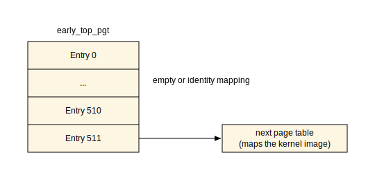
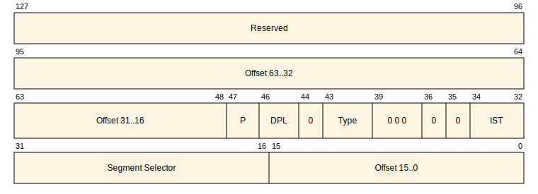
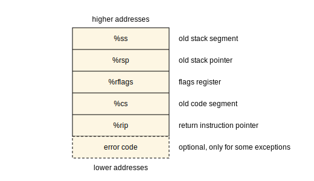
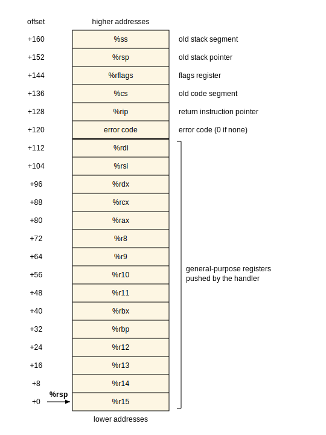
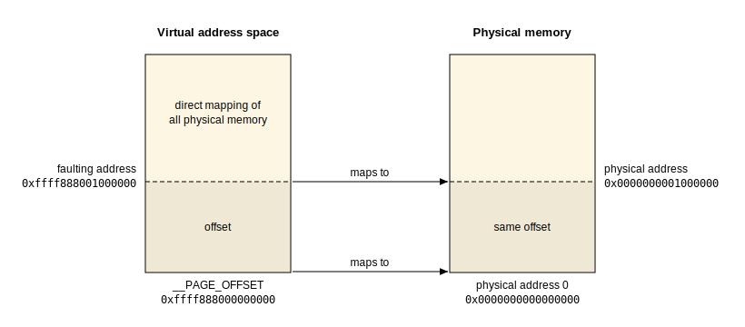

# Linux kernel initialization - Part 2

In the previous [part](linux-initialization-1.md), we saw the first assembly instructions of the Linux kernel code. The kernel started the initialization process and performed the following first steps:

- Early stack setup
- Loading of the kernel Global Descriptor Table
- Initialization of the kernel page tables

After these steps, we can finally leave the assembly code, at least for a while, and switch to C code. Last time, we stopped at the call to the `x86_64_start_kernel` function from [arch/x86/kernel/head64.c](https://github.com/torvalds/linux/blob/master/arch/x86/kernel/head64.c). This is where we will continue in this chapter.

At this point, the kernel has already loaded or re-initialized a few important structures, but most of the system is still not ready. One of the next structures the Linux kernel has to prepare is the [Interrupt Descriptor Table](https://en.wikipedia.org/wiki/Interrupt_descriptor_table). The Interrupt Descriptor Table, or IDT, stores the addresses of interrupt and exception handlers. In this chapter, we will see how this structure is built and how the kernel handles early interrupts and exceptions.

Now that we have a rough plan for what comes next, let's continue our dive into the Linux kernel internals.

## First steps in the C code

The assembly code is now behind us, and we are back in C. The kernel is still far from its normal working state. We have not even reached the generic kernel code yet, because we are still in the early architecture-specific setup. At this stage, [maskable](https://en.wikipedia.org/wiki/Interrupt#Masking) hardware interrupts are disabled, so no device interrupt will arrive during this part of boot. However, hardware interrupts are not the only events that can be triggered in the system. For example, CPU exceptions, such as a [page fault](https://en.wikipedia.org/wiki/Page_fault), are different. They are synchronous events raised by the processor itself. For this reason, even at this early initialization stage, the kernel needs to know how to handle exceptions. This becomes especially important after the kernel starts removing temporary identity mappings from the page tables. One of the main goals of the `x86_64_start_kernel` function is to finish this early preparation so the kernel can move on to its main initialization.

But before we reach the initialization of the Interrupt Descriptor Table, the kernel has a few smaller tasks to finish. The first C code starts with build-time sanity checks:

<!-- https://raw.githubusercontent.com/torvalds/linux/refs/heads/master/arch/x86/kernel/head64.c#L228-L236 -->
```C
	BUILD_BUG_ON(MODULES_VADDR < __START_KERNEL_map);
	BUILD_BUG_ON(MODULES_VADDR - __START_KERNEL_map < KERNEL_IMAGE_SIZE);
	BUILD_BUG_ON(MODULES_LEN + KERNEL_IMAGE_SIZE > 2*PUD_SIZE);
	BUILD_BUG_ON((__START_KERNEL_map & ~PMD_MASK) != 0);
	BUILD_BUG_ON((MODULES_VADDR & ~PMD_MASK) != 0);
	BUILD_BUG_ON(!(MODULES_VADDR > __START_KERNEL));
	MAYBE_BUILD_BUG_ON(!(((MODULES_END - 1) & PGDIR_MASK) ==
				(__START_KERNEL & PGDIR_MASK)));
	BUILD_BUG_ON(__fix_to_virt(__end_of_fixed_addresses) <= MODULES_END);
```

The `BUILD_BUG_ON` macro validates its condition at compile time. If the condition passed to this macro is true, the kernel build fails. Using this macro, the kernel verifies the layout of its virtual address space. For example, it checks that the area reserved for kernel modules does not overlap the kernel image.

The next step after these sanity checks is quite interesting. Did you know that accessing a CPU register can be more expensive than accessing memory? If you have not spent much time with system programming or reading Intel manuals from cover to cover, this statement may sound surprising. The next function after the sanity checks is a good example of such a case:

<!-- https://raw.githubusercontent.com/torvalds/linux/refs/heads/master/arch/x86/kernel/head64.c#L238-L238 -->
```C
	cr4_init_shadow();
```

We have already met the [`cr4` control register](https://en.wikipedia.org/wiki/Control_register) in the previous parts. This register contains flags that enable or disable certain processor features, among others:

- [Physical address extension](https://en.wikipedia.org/wiki/Physical_Address_Extension)
- [Page Size Extension](https://en.wikipedia.org/wiki/Page_Size_Extension)

The kernel preserves the value of this register because it is used quite often. We will see many examples later. Reading and writing this register is an expensive operation. [Intel® 64 and IA-32 Architectures Software Developer's Manual](https://www.intel.com/content/www/us/en/developer/articles/technical/intel-sdm.html) says:

> MOV CR* instructions, except for MOV CR8, are serializing instructions

And:

> The Intel 64 and IA-32 architectures define several serializing instructions. These instructions force the processor to complete all modifications to flags, registers, and memory by previous instructions and to drain all buffered writes to memory before the next instruction is fetched and executed

To avoid paying extra CPU cycles, the Linux kernel saves the value of the `cr4` control register in memory. From this point, the kernel changes bits of the `cr4` register only using special helpers like `cr4_set_bits` and `cr4_clear_bits`, which update the shadow copy and write the new value to the actual register only if it differs from the stored one.

## Preparing the kernel memory layout

Before the kernel can move on to the generic initialization, it has to bring its memory into a known and consistent state. So far the kernel runs on top of the page tables and the memory layout that were prepared just enough to get the C code running. Some of these early structures are temporary and have to be cleaned up, while others have to be initialized for the first time.

In the next few steps we will see how the kernel:

- [Gets rid of the leftover identity mapping in the early page tables](#resetting-the-early-page-tables)
- [Clears the memory regions that must start zeroed, such as the `BSS` section](#clearing-the-initial-memory-state)
- [Prepares the top-level page table that the kernel will use after the early boot](#preparing-the-final-top-level-page-table)
- [Flushes the global TLB](#flushing-the-global-tlb)

Let's go through these steps one by one.

### Resetting the early page tables

One of the previous kernel steps was to set up new page tables. At this point, they still contain identity mappings left over from the earliest page-table setup. If you read the previous part, you may remember that these mappings were temporary. They existed only so the processor could switch to the new page tables without causing a page fault.

Since the kernel has switched to running from its high virtual addresses, this identity mapping is no longer needed. At this stage, the top-level page table is referenced by the `early_top_pgt` symbol. The entries of this page table look like this:



The top-level page table contains `PTRS_PER_PGD` entries, which is `512` on `x86_64`. Only the last entry points to the next page table that maps the kernel image. All other entries are either empty or belong to the identity-mapped range. The `reset_early_page_tables` function wipes all of these first `511` entries:

<!-- https://raw.githubusercontent.com/torvalds/linux/refs/heads/master/arch/x86/kernel/head64.c#L71-L76 -->
```C
static void __init reset_early_page_tables(void)
{
	memset(early_top_pgt, 0, sizeof(pgd_t)*(PTRS_PER_PGD-1));
	next_early_pgt = 0;
	write_cr3(__sme_pa_nodebug(early_top_pgt));
}
```

After clearing these entries, the function resets `next_early_pgt` to `0`. This variable is an index into `early_dynamic_pgts`, which is a small pool of reserved page table buffers. We will meet it again later in this part, when the page fault handler builds new page tables on demand.

Finally, the function reloads the `cr3` control register with the physical address of `early_top_pgt`. The `cr3` register holds the physical address of the top-level page table, so writing to it makes the processor use the updated tables and flushes non-global `TLB` entries.

Starting from this point on, only the kernel high mapping is left in `early_top_pgt`. Any access that depends on the removed identity mappings, or on mappings that have not been built yet, will trigger a page fault. For example, the `boot_params` structure prepared by the boot loader lives in low physical memory and is reached through the direct mapping of all physical memory. The page fault handler that we will see later in this part will build the missing page tables on demand.

### Clearing the initial memory state

The next thing to clear is the kernel's [BSS](https://en.wikipedia.org/wiki/.bss) section. As the name of this function suggests, the `clear_bss` function zeroes it:

<!-- https://raw.githubusercontent.com/torvalds/linux/refs/heads/master/arch/x86/kernel/head64.c#L177-L183 -->
```C
void __init clear_bss(void)
{
	memset(__bss_start, 0,
	       (unsigned long) __bss_stop - (unsigned long) __bss_start);
	memset(__brk_base, 0,
	       (unsigned long) __brk_limit - (unsigned long) __brk_base);
}
```

Function names are helpful, of course, but sometimes they do not tell the whole story. As we can see, `clear_bss` clears two memory areas. The first `memset` zeroes the `BSS` section, where global and static variables that must start as zero are stored. The second `memset` clears the `brk` area, which the early kernel uses as a primitive allocator before the real memory allocators are available.

We already met the `BSS` section in previous chapters. We can check the symbols related to it using the following simple command:

```bash
$ nm -n vmlinux | awk '/ __bss_start$/,/ __bss_stop$/ { if (n++ < 11 || / __bss_stop$/) print }'
```

The output should be something like this:

```
ffffffff82f6b000 B __bss_start
ffffffff82f6b000 b idt_table
ffffffff82f6b000 D __nosave_end
ffffffff82f6c000 b espfix_pud_page
ffffffff82f6d000 b bm_pte
ffffffff82f6e000 B empty_zero_page
ffffffff82f6f000 B initcall_debug
ffffffff82f6f004 B reset_devices
ffffffff82f6f008 b initcall_calltime
ffffffff82f6f010 b panic_param
ffffffff82f6f018 b panic_later
ffffffff8309a000 B __bss_stop
```

Both of these regions are reserved in the kernel's [linker script](https://github.com/torvalds/linux/blob/master/arch/x86/kernel/vmlinux.lds.S), so all the kernel needs to do here is set their contents to zero.

### Preparing the final top-level page table

The next structure that has to be cleared is the final top-level page table that the Linux kernel will switch to for normal operation:

<!-- https://raw.githubusercontent.com/torvalds/linux/refs/heads/master/arch/x86/kernel/head64.c#L251-L255 -->
```C
	/*
	 * This needs to happen *before* kasan_early_init() because latter maps stuff
	 * into that page.
	 */
	clear_page(init_top_pgt);
```

For now, the kernel is still using the `early_top_pgt` page table, and it will continue to use it during the early initialization stage. But as the comment above the call says, `init_top_pgt` must be cleared before the next initialization steps map anything into it. We will see later how the kernel finishes filling this table and switches to it.

This page must be cleared before `kasan_early_init()` runs, because KASAN will install its early [shadow-memory](https://docs.kernel.org/dev-tools/kasan.html#shadow-memory) mappings into it. [KASAN](https://docs.kernel.org/dev-tools/kasan.html) uses shadow memory to track accesses to kernel memory. Since `kasan_early_init()` runs in the one of the next steps, `init_top_pgt` must already be ready for KASAN to populate. Clearing `init_top_pgt` gives KASAN an empty page table page to fill, without stale entries from earlier boot code.

### Flushing the global TLB

The last memory-cleanup step before the kernel turns to interrupt handling is to flush the global [TLB](https://en.wikipedia.org/wiki/Translation_lookaside_buffer) entries. The `TLB`, or Translation Lookaside Buffer, is a cache that the processor uses to speed up the translation of virtual addresses to physical ones. Whenever the kernel changes the page tables, the entries cached in the `TLB` may become stale and must be invalidated.

The early page tables we saw above had two kinds of mappings:

- the high kernel mapping
- the identity mapping

This identity mapping was needed during the switch to long mode and to the high kernel mapping, but the `reset_early_page_tables` function has already removed it. The problem is that these identity mappings are global, which means that the processor may keep them in the `TLB` even across a reload of the `cr3` register. Usually writing to the `cr3` register flushes the `TLB`, but global entries are intentionally excluded from this flush. The [Intel® 64 and IA-32 Architectures Software Developer's Manual](https://www.intel.com/content/www/us/en/developer/articles/technical/intel-sdm.html) describes this behavior:

> MOV to CR3. The behavior of the instruction depends on the value of CR4.PCIDE:
>
> If CR4.PCIDE = 0, the instruction invalidates all TLB entries associated with PCID 000H except those for global pages. It also invalidates all entries in all paging-structure caches associated with PCID 000H.

So even after the identity mapping is gone from the page tables, stale translations for it might still be cached. To get rid of them, the kernel forces a flush of the global entries with the `__native_tlb_flush_global` function:

<!-- https://raw.githubusercontent.com/torvalds/linux/refs/heads/master/arch/x86/kernel/head64.c#L274-L274 -->
```C
	__native_tlb_flush_global(this_cpu_read(cpu_tlbstate.cr4));
```

An additional reason to flush the `TLB` is the so-called `trampoline page table`. This is a separate page table that establishes the same kind of global identity mappings. Secondary processors use it during their early bring-up path, before they switch to the normal kernel page tables. We will meet it later when we talk about [`SMP`](https://en.wikipedia.org/wiki/Symmetric_multiprocessing) initialization. For now it is enough to know that the boot processor itself was running on the early page tables we discussed above, and the goal of this step is to drop any stale global translation of the identity mapping from the `TLB`.

With this, the early preparation of the kernel memory layout is finished. The kernel can now move on to setting up the handlers for interrupts and exceptions.

## Early interrupt and exception handling

Now we have reached the main goal of this chapter, which is the initialization of the Interrupt Descriptor Table. But before we jump directly to the code, we need to know what an interrupt is and why this table is used by the Linux kernel.

### Interrupt Descriptor Table

An interrupt is a signal sent to the CPU by software or hardware. For example, a keyboard controller can signal that a user pressed a key. For our purposes, we can split these events into three types:

- Software interrupts - signals triggered by software to request a service from the kernel. Historically, these interrupts were often used for [system calls](https://en.wikipedia.org/wiki/System_call). For example, a program may need to read a file.
- Hardware interrupts - signals sent by hardware to report that an event occurred. For example, a network card may signal that a packet has arrived.
- Exceptions - processor-generated events raised while executing an instruction. For example, division by zero raises an exception.

When an interrupt or exception is triggered, the CPU stops the current execution flow and transfers control to an [interrupt handler](https://en.wikipedia.org/wiki/Interrupt_handler). The handler deals with the event and then returns control to the interrupted code. The CPU finds this handler through an entry, traditionally called a gate, in a special table called the Interrupt Descriptor Table, or IDT.

Every interrupt and exception has assigned a unique number called a `vector number`. A vector number can be any value from `0` to `255`. The first `32` (starting from zero) numbers are reserved for CPU exceptions, like divide error, page fault and so on:

| Vector | Mnemonic | Description                    | Type  | Error Code | Source                         |
|--------|----------|--------------------------------|-------|------------|--------------------------------|
| 0      | #DE      | Divide Error                   | Fault | NO         | DIV and IDIV                   |
| 1      | #DB      | Debug                          | F/T   | NO         | Debug conditions               |
| 2      | ---      | Non-maskable Interrupt         | INT   | NO         | External NMI                   |
| 3      | #BP      | Breakpoint                     | Trap  | NO         | INT3                           |
| 4      | #OF      | Overflow                       | Trap  | NO         | INTO instruction               |
| 5      | #BR      | Bound Range Exceeded           | Fault | NO         | BOUND instruction              |
| 6      | #UD      | Invalid Opcode                 | Fault | NO         | UD2 or invalid instruction     |
| 7      | #NM      | Device Not Available           | Fault | NO         | Floating point or [F]WAIT      |
| 8      | #DF      | Double Fault                   | Abort | YES        | Exception while handling fault |
| 9      | ---      | Reserved                       |       | NO         |                                |
| 10     | #TS      | Invalid TSS                    | Fault | YES        | TSS access                     |
| 11     | #NP      | Segment Not Present            | Fault | YES        | Segment load or access         |
| 12     | #SS      | Stack-Segment Fault            | Fault | YES        | Stack operations               |
| 13     | #GP      | General Protection             | Fault | YES        | Protection violation           |
| 14     | #PF      | Page Fault                     | Fault | YES        | Memory reference               |
| 15     | ---      | Reserved                       |       | NO         |                                |
| 16     | #MF      | x87 FPU Floating-Point Error   | Fault | NO         | x87 floating-point operation   |
| 17     | #AC      | Alignment Check                | Fault | YES        | Unaligned data reference       |
| 18     | #MC      | Machine Check                  | Abort | NO         | Hardware error                 |
| 19     | #XM/#XF  | SIMD Floating-Point Exception  | Fault | NO         | SSE/SIMD operation             |
| 20     | #VE      | Virtualization Exception       | Fault | NO         | EPT violation                  |
| 21     | #CP      | Control Protection Exception   | Fault | YES        | CET protection violation       |
| 22-28  | ---      | Reserved                       |       | NO         |                                |
| 29     | #VC      | VMM Communication Exception    | Fault | YES        | SEV-ES                         |
| 30-31  | ---      | Reserved                       |       | NO         |                                |

> [!NOTE]
> Some vectors in this range are vendor-specific. For example, Linux defines vector `29` as `#VC`, which is AMD-specific and used by [SEV-ES](https://www.amd.com/en/developer/sev.html) guests.

The vector numbers from `32` to `255` are not reserved for processor exceptions. The operating system can use them for external interrupts and other IDT entries, such as inter-processor interrupts or legacy software interrupt entry points.

When an interrupt or exception occurs, the CPU uses the vector number as an index into the `Interrupt Descriptor Table`. Each entry is a descriptor that contains a pointer to the interrupt or exception handler. The base address of the `Interrupt Descriptor Table` is stored in a special register called `IDTR`. This register is loaded with the `LIDT` instruction, which takes a pointer to a descriptor holding the base address and size limit of the `IDT`.

The structure of the Interrupt Descriptor Table on x86_64 is:



Here:

- `Offset` - the 64-bit virtual address of the interrupt or exception handler
- `Segment Selector` - a code segment selector that the processor loads into the `cs` register before it jumps to the handler. It must point to a valid code segment in the Global Descriptor Table. In the Linux kernel, it points to the kernel code segment `__KERNEL_CS`.
- `IST` - the Interrupt Stack Table index. It lets the processor run the handler on a dedicated, reserved stack instead of the stack that was in use when the interrupt happened. This matters for a few critical handlers that must work even if the current stack is broken, such as a double fault. When this field is zero, the handler just runs on the normal kernel stack.
- `Type` - the kind of the gate. In 64-bit mode the `IDT` may hold two kinds of gates:
  - `Interrupt gate` - when the processor enters the handler through it, it clears the `IF` interrupt flag. This flag tells the processor whether it is allowed to deliver hardware interrupts or not. Clearing it prevents other hardware interrupts from interrupting the handler while it runs.
  - `Trap gate` - works like an interrupt gate, but the processor leaves the `IF` flag unchanged, so the handler can still be interrupted by hardware interrupts.
- `DPL` - the Descriptor Privilege Level. It is the minimum privilege level a task must have to invoke this gate with a software instruction like [`int n`](https://en.wikipedia.org/wiki/INT_(x86_instruction)). Hardware interrupts and processor-generated exceptions ignore this field.
- `P` - the present flag. It must be set for a valid descriptor. A reference to a gate whose `P` flag is clear raises a segment-not-present (`#NP`) exception.

The remaining bits, including the topmost `Reserved` part, must be zero.

The structure of the descriptor pointing to the Interrupt Descriptor Table is:


The processor uses this descriptor to find the `IDT` in memory. The `Limit` field holds the size of the table in bytes minus one, and the `Base Address` field holds the virtual address of the first entry of the table. This is exactly the descriptor that the `LIDT` instruction loads into the `IDTR` register.

### Handling of interrupts on x86_64

Knowing how the Interrupt Descriptor Table is structured, we can take a short look at how an interrupt or exception is handled by the processor in 64-bit mode.

> [!NOTE]
> If you are interested in more details, the exact algorithm is described in the [Intel® 64 and IA-32 Architectures Software Developer's Manual](https://www.intel.com/content/www/us/en/developer/articles/technical/intel-sdm.html), Volume 3A, in the following sections:
>
> - `7.12 Exception and Interrupt Handling`
> - `7.14 Exception and Interrupt Handling in 64-bit Mode`

When an interrupt or exception occurs, the processor takes the vector number and multiplies it by `16` to get the offset of the gate inside the `IDT`. The multiplication by `16` is needed because each IDT entry is 16 bytes. The processor reads the gate at this offset and checks that it is an interrupt or trap gate that points to a 64-bit code segment. Then it decides which stack the handler will run on, following the rules we have already seen for the `IST` field. It can be a dedicated stack from the `IST` or the current stack. After the stack is chosen, the processor pushes a so-called interrupt frame. The interrupted state is now on the stack, so the code can be resumed later.

The interrupt frame consists of the following registers, from higher to lower addresses:



After the state is saved, the processor loads the handler's code segment selector and offset from the gate into the `cs` and `rip` registers and switches to the execution of the handler.

When the handler finishes its job, it returns with the special `iretq` instruction. This instruction pops the saved state, restores the saved flags and resumes the interrupted code from the point where it stopped.

### Set up early Interrupt Descriptor Table

With the theory behind us, let's return to the kernel code. We stopped in the `x86_64_start_kernel` function, right before the call of:

<!-- https://raw.githubusercontent.com/torvalds/linux/refs/heads/master/arch/x86/kernel/head64.c#L276-L276 -->
```C
	idt_setup_early_handler();
```

At this early stage the kernel does not need a complete `IDT` yet. Interrupts are still disabled, so no hardware interrupt is going to arrive. Exceptions can still happen though. A page fault is the most important example for this part. So the kernel needs at least a minimal `IDT` that can catch processor exceptions. This is exactly what the `idt_setup_early_handler` function does. It is defined in [arch/x86/kernel/idt.c](https://github.com/torvalds/linux/blob/master/arch/x86/kernel/idt.c) and looks like this:

<!-- https://raw.githubusercontent.com/torvalds/linux/refs/heads/master/arch/x86/kernel/idt.c#L330-L341 -->
```C
void __init idt_setup_early_handler(void)
{
	int i;

	for (i = 0; i < NUM_EXCEPTION_VECTORS; i++)
		set_intr_gate(i, early_idt_handler_array[i]);
#ifdef CONFIG_X86_32
	for ( ; i < NR_VECTORS; i++)
		set_intr_gate(i, early_ignore_irq);
#endif
	load_idt(&idt_descr);
}
```

The number of exception vectors specified by `NUM_EXCEPTION_VECTORS` is `32`. The kernel iterates over these vectors and calls the `set_intr_gate` function, which initializes the given gate descriptor with the vector number, handler address and flags:

<!-- https://raw.githubusercontent.com/torvalds/linux/refs/heads/master/arch/x86/kernel/idt.c#L209-L216 -->
```C
static __init void set_intr_gate(unsigned int n, const void *addr)
{
	struct idt_data data;

	init_idt_data(&data, n, addr);

	idt_setup_from_table(idt_table, &data, 1, false);
}
```

The `idt_data` structure is defined in [arch/x86/include/asm/desc_defs.h](https://github.com/torvalds/linux/blob/master/arch/x86/include/asm/desc_defs.h) and contains the following fields:

<!-- https://raw.githubusercontent.com/torvalds/linux/refs/heads/master/arch/x86/include/asm/desc_defs.h#L127-L132 -->
```C
struct idt_data {
	unsigned int	vector;
	unsigned int	segment;
	struct idt_bits	bits;
	const void	*addr;
};
```

The Interrupt Descriptor Table itself is represented as an array of the following structures, defined in the same [arch/x86/include/asm/desc_defs.h](https://github.com/torvalds/linux/blob/master/arch/x86/include/asm/desc_defs.h):

<!-- https://raw.githubusercontent.com/torvalds/linux/refs/heads/master/arch/x86/include/asm/desc_defs.h#L134-L143 -->
```C
struct gate_struct {
	u16		offset_low;
	u16		segment;
	struct idt_bits	bits;
	u16		offset_middle;
#ifdef CONFIG_X86_64
	u32		offset_high;
	u32		reserved;
#endif
} __attribute__((packed));
```

After all the entries are initialized and copied to the Interrupt Descriptor Table, the `load_idt` function executes the `lidt` instruction to load the address of the newly built table.

### Common interrupt handlers

Starting from this point, the `IDT` is initialized and loaded, so the kernel can handle the early exceptions it cares about. But which handlers does it actually have now? The answer is in `early_idt_handler_array`. This array is defined in [arch/x86/kernel/head_64.S](https://github.com/torvalds/linux/blob/master/arch/x86/kernel/head_64.S):

<!-- https://github.com/torvalds/linux/raw/refs/heads/master/arch/x86/kernel/head_64.S#L488-L505 -->
```assembly
SYM_CODE_START(early_idt_handler_array)
	i = 0
	.rept NUM_EXCEPTION_VECTORS
	.if ((EXCEPTION_ERRCODE_MASK >> i) & 1) == 0
		UNWIND_HINT_IRET_REGS
		ENDBR
		pushq $0	# Dummy error code, to make stack frame uniform
	.else
		UNWIND_HINT_IRET_REGS offset=8
		ENDBR
	.endif
	pushq $i		# 72(%rsp) Vector number
	jmp early_idt_handler_common
	UNWIND_HINT_IRET_REGS
	i = i + 1
	.fill early_idt_handler_array + i*EARLY_IDT_HANDLER_SIZE - ., 1, 0xcc
	.endr
SYM_CODE_END(early_idt_handler_array)
```

This macro can look scary at first glance, but do not worry. Let's go through it and try to understand what it does.

The `early_idt_handler_array` macro generates a contiguous block of executable code containing `32` fixed-size exception entry stubs. The [`.rept`](https://sourceware.org/binutils/docs/as/Rept.html) directive is a simple loop that repeats the stub body `32` times. For exceptions where the CPU does not push an error code, the generated stub pushes a dummy zero, so all early exception handlers see the same stack layout. Then the stub pushes the vector number and jumps to the `early_idt_handler_common` label. At the end of each generated stub, the assembler fills the remaining bytes with `0xcc` until the stub has exactly `EARLY_IDT_HANDLER_SIZE` bytes.

> [!NOTE]
> There is one interesting detail about this padding. `0xcc` is the opcode for the [INT3](https://en.wikipedia.org/wiki/INT_(x86_instruction)#INT3) instruction, so if the padding is accidentally executed, it will cause a breakpoint exception rather than running random bytes.

If we inspect the kernel image with [`objdump`](https://man7.org/linux/man-pages/man1/objdump.1.html), we can see these generated instructions:

```bash
objdump -d vmlinux | grep '<early_idt_handler_array>:' -A 24
```

The output should look similar to this:

```
ffffffff83d3fd10 <early_idt_handler_array>:
ffffffff83d3fd10:	f3 0f 1e fa          	endbr64
ffffffff83d3fd14:	6a 00                	push   $0x0
ffffffff83d3fd16:	6a 00                	push   $0x0
ffffffff83d3fd18:	e9 93 01 00 00       	jmp    ffffffff83d3feb0 <early_idt_handler_common>
ffffffff83d3fd1d:	f3 0f 1e fa          	endbr64
ffffffff83d3fd21:	6a 00                	push   $0x0
ffffffff83d3fd23:	6a 01                	push   $0x1
ffffffff83d3fd25:	e9 86 01 00 00       	jmp    ffffffff83d3feb0 <early_idt_handler_common>
ffffffff83d3fd2a:	f3 0f 1e fa          	endbr64
ffffffff83d3fd2e:	6a 00                	push   $0x0
ffffffff83d3fd30:	6a 02                	push   $0x2
ffffffff83d3fd32:	e9 79 01 00 00       	jmp    ffffffff83d3feb0 <early_idt_handler_common>
ffffffff83d3fd37:	f3 0f 1e fa          	endbr64
ffffffff83d3fd3b:	6a 00                	push   $0x0
ffffffff83d3fd3d:	6a 03                	push   $0x3
ffffffff83d3fd3f:	e9 6c 01 00 00       	jmp    ffffffff83d3feb0 <early_idt_handler_common>
ffffffff83d3fd44:	f3 0f 1e fa          	endbr64
ffffffff83d3fd48:	6a 00                	push   $0x0
ffffffff83d3fd4a:	6a 04                	push   $0x4
ffffffff83d3fd4c:	e9 5f 01 00 00       	jmp    ffffffff83d3feb0 <early_idt_handler_common>
ffffffff83d3fd51:	f3 0f 1e fa          	endbr64
ffffffff83d3fd55:	6a 00                	push   $0x0
ffffffff83d3fd57:	6a 05                	push   $0x5
ffffffff83d3fd59:	e9 52 01 00 00       	jmp    ffffffff83d3feb0 <early_idt_handler_common>
```

All of these stubs jump to the common `early_idt_handler_common` routine. Before doing anything else, it saves all general purpose registers on the stack so they can be restored when the kernel returns from the exception. After all the registers are saved, the stack looks like this:



With this stack frame prepared, the kernel calls the `do_early_exception` function. This function first handles a few special early exceptions by vector number, and then falls back to the Linux kernel exception table:

<!-- https://github.com/torvalds/linux/raw/refs/heads/master/arch/x86/kernel/head64.c#L159-L173 -->
```C
void __init do_early_exception(struct pt_regs *regs, int trapnr)
{
	if (trapnr == X86_TRAP_PF &&
	    early_make_pgtable(native_read_cr2()))
		return;

	if (IS_ENABLED(CONFIG_AMD_MEM_ENCRYPT) &&
	    trapnr == X86_TRAP_VC && handle_vc_boot_ghcb(regs))
		return;

	if (trapnr == X86_TRAP_VE && tdx_early_handle_ve(regs))
		return;

	early_fixup_exception(regs, trapnr);
}
```

> [!NOTE]
> We skip the virtualization-related exceptions in this chapter, since they are not the main topic here. The `#VC` path is used for AMD memory-encrypted guests, and the `#VE` path is used for TDX guests. For now, we will focus on the page fault path and the generic exception-table fallback.

### Page fault exception handler

A page fault is an exception that the processor raises whenever a program, or in our case the kernel, tries to access a virtual memory address that the processor cannot translate into a physical address. This can happen for different reasons. The most common one is that there is no page table entry that maps the address. When this happens, the processor performs the following actions:

- stores the faulting address in the `cr2` control register
- pushes an error code that describes the reason of the fault
- transfers control to the page fault handler

During this early boot phase, the Linux kernel does not install the full page fault handler that will be used later during normal kernel execution. The IDT entry for page faults points to one of the generic early stubs, and the real work happens in `do_early_exception`. This function checks whether the exception is a page fault and, if yes, calls `early_make_pgtable`, passing the faulting address from the `cr2` register. The `early_make_pgtable` function translates the faulting virtual address to a physical address and computes the PMD entry for it:

<!-- https://github.com/torvalds/linux/raw/refs/heads/master/arch/x86/kernel/head64.c#L149-L157 -->
```C
static bool __init early_make_pgtable(unsigned long address)
{
	unsigned long physaddr = address - __PAGE_OFFSET;
	pmdval_t pmd;

	pmd = (physaddr & PMD_MASK) + early_pmd_flags;

	return __early_make_pgtable(address, pmd);
}
```

For the 4-level x86_64 layout shown in the [kernel documentation](https://github.com/torvalds/linux/blob/master/Documentation/arch/x86/x86_64/mm.rst), the `__PAGE_OFFSET` macro expands to the `0xffff888000000000` address. This is the virtual base address Linux uses to access physical memory through the direct mapping.

<!-- https://raw.githubusercontent.com/torvalds/linux/refs/heads/master/Documentation/arch/x86/x86_64/mm.rst#L57-L57 -->
```
   ffff888000000000 | -119.5  TB | ffffc87fffffffff |   64 TB | direct mapping of all physical memory (page_offset_base)
```

Since `0xffff888000000000` maps to physical address `0` in this layout, subtracting it from the faulting virtual address gives us the corresponding physical address.



If the faulting address belongs to the valid direct-mapping range, the kernel can build the missing mapping. This work is done by the `__early_make_pgtable` function. The process itself is very similar to what we have already seen a couple of times while mapping new pages. It looks like this:

1. Start from the top-level page table and find the entry that covers the address that caused the fault
2. If the current entry points to the next-level table, continue walking down
3. If the next-level table is missing, allocate one from the early page-table pool and install a new entry

This process is repeated until the kernel reaches the level it needs for this early mapping. In this case, it installs a PMD entry. As soon as the entry is created, the general purpose registers are restored and control returns to the faulting instruction. This time, the address translation succeeds.

### Exception handling through the exception table

In the previous [section](#page-fault-exception-handler) we saw how the early page fault handler recovers from a page fault by building the missing page tables on demand. But a page fault is not the only exception that may happen. If we look back at the `do_early_exception` function, we see one last step after the special early handlers, the call to `early_fixup_exception`. This is the path that handles all remaining early exceptions.

Unlike a page fault, such an exception usually cannot be resolved by simply mapping a new page. The kernel can recover only if the faulting instruction is one it knows about in advance. For this purpose, the Linux kernel maintains a table called the `exception table`.

As we already saw, the `do_early_exception` function selects a handler for some exceptions based on the vector number. The exception table works differently. Instead of using the vector number, it relies on the address of the instruction that caused the exception. The kernel collects such known-risk instructions at build time into a special table. In this table, each instruction is associated with fixup metadata that tells the kernel where execution should continue if the instruction faults. So the kernel looks up the faulting instruction in this table and, if it is found, transfers control to the matching fixup path. If no matching entry is found, the early exception handler has no safe recovery path. It prints a panic message, dumps the registers and halts the CPU.

The table itself is built during the kernel build and consists of a contiguous set of the following structures:

<!-- https://github.com/torvalds/linux/raw/refs/heads/master/arch/x86/include/asm/extable.h#L23-L25 -->
```C
struct exception_table_entry {
	int insn, fixup, data;
};
```

Where:

- `insn` - address of the instruction that may fault
- `fixup` - address where execution should continue after fixup
- `data` - fixup type and additional exception metadata

The table is populated with entries using `_ASM_EXTABLE_TYPE` and similar macros from the same family:

<!-- https://github.com/torvalds/linux/raw/refs/heads/master/arch/x86/include/asm/asm.h#L138-L144 -->
```C
# define _ASM_EXTABLE_TYPE(from, to, type)				\
	.pushsection "__ex_table", "aM", @progbits, EXTABLE_SIZE ;	\
	.balign 4 ;							\
	.long (from) - . ;						\
	.long (to) - . ;						\
	.long type ;							\
	.popsection
```

For example, one of the next steps during kernel initialization is loading CPU microcode in the `load_ucode_bsp` function. This function uses the `rdmsr` instruction to check the AMD patch level:

<!-- https://github.com/torvalds/linux/raw/refs/heads/master/arch/x86/include/asm/msr.h#L66-L76 -->
```C
static __always_inline u64 __rdmsr(u32 msr)
{
	EAX_EDX_DECLARE_ARGS(val, low, high);

	asm volatile("1: rdmsr\n"
		     "2:\n"
		     _ASM_EXTABLE_TYPE(1b, 2b, EX_TYPE_RDMSR)
		     : EAX_EDX_RET(val, low, high) : "c" (msr));

	return EAX_EDX_VAL(val, low, high);
}
```

The `rdmsr` instruction reads a [model-specific register](https://en.wikipedia.org/wiki/Model-specific_register) whose number is passed in the `ecx` register. If such a register does not exist on the current processor, the instruction raises a [general protection](https://en.wikipedia.org/wiki/General_protection_fault) exception. Instead of crashing the kernel, the entry registered by the macro allows it to skip over the faulting instruction and continue execution.

The `_ASM_EXTABLE_TYPE` macro is used here to tell the kernel that the `rdmsr` instruction at the label `1` may fault, and if it does, execution should be resumed at the label `2`, which is just the next instruction in this case. The fault itself should be treated as an exception of the `EX_TYPE_RDMSR` type.

As a result, for every instruction wrapped in such a macro, the kernel gets one `struct exception_table_entry` in the `__ex_table` section. All these entries together form the exception table that the early exception handler, and later the generic kernel code, search through to recover from faults.

Now we know how the Linux kernel can recover from selected exceptions without choosing a handler only by vector number. When an exception reaches this path, the kernel searches the exception table for an entry whose `insn` field matches the saved `rip` value. If an entry is found, the kernel runs the fixup handler encoded in the entry's `data` field. For the failed MSR read shown above, the handler clears the `ax` and `dx` registers so the caller does not see garbage. After that, execution jumps to the `fixup` address, which in this case is just the next instruction after `rdmsr`.

## Jump to the generic kernel entry point

We have finished the main goal of this chapter, setting up the Interrupt Descriptor Table. Only a few architecture-specific steps remain before we reach the generic kernel entry point from [init/main.c](https://github.com/torvalds/linux/blob/master/init/main.c):

<!-- https://github.com/torvalds/linux/raw/refs/heads/master/init/main.c#L971-L972 -->
```C
asmlinkage __visible __init __no_sanitize_address __noreturn __no_stack_protector
void start_kernel(void)
```

Right after the early Interrupt Descriptor Table is loaded, the `x86_64_start_kernel` function performs the last few architecture-specific steps before it hands control over to the generic kernel code.

First, the kernel copies the boot data that the boot loader prepared for it. The boot loader fills the `boot_params` structure together with the kernel command line and leaves them in the real-mode data area, which is usually located at low addresses. The `copy_bootdata` function copies this data into the kernel's own structures in the kernel address space, so the rest of the kernel no longer needs to care where exactly the boot loader placed it. This is also a good moment to recall the page fault handler we saw earlier in this part. The boot data is reached through the direct mapping of physical memory, but after the kernel has reset all top-level page-table entries except the one that maps the kernel image, only the kernel high mapping is left in `early_top_pgt`. The direct mapping is not present there at all. So the first access to the boot data triggers a page fault, and the handler quietly builds the missing mapping on demand.

After the boot data is in place, the kernel loads a [microcode](https://en.wikipedia.org/wiki/Microcode) update for the boot processor, if one is available. This is the same path that uses the `rdmsr` instruction and the exception table machinery we just saw in the previous section. If the processor does not have the model-specific register the code asks for, the exception table entry lets the kernel recover instead of crashing in the middle of early boot.

Finally, the kernel copies the last entry of the early top-level page table into the final top-level page table, `init_top_pgt`, which it zeroed near the beginning of this part. It also applies a couple of platform-specific quirks and, depending on the hardware, runs some additional early setup. After this, the kernel leaves the early architecture-specific code and jumps to the generic, architecture-independent entry point, the `start_kernel` function, which we will see in the next part.

## Conclusion

This is the end of the second part about the initialization process of the Linux kernel. If you have questions or suggestions, feel free to ping me on X - [0xAX](https://twitter.com/0xAX), drop me an [email](mailto:anotherworldofworld@gmail.com), or just create an [issue](https://github.com/0xAX/linux-insides/issues/new).

In the next part, we will continue this process and see the first non-architecture-specific initialization in the kernel's generic entry point, `start_kernel`.

## Links

Here is the list of the links that you may find useful when reading this chapter:

- [GNU assembly .rept](https://sourceware.org/binutils/docs-2.23/as/Rept.html)
- [APIC](http://en.wikipedia.org/wiki/Advanced_Programmable_Interrupt_Controller)
- [NMI](http://en.wikipedia.org/wiki/Non-maskable_interrupt)
- [Page table](https://en.wikipedia.org/wiki/Page_table)
- [Interrupt handler](https://en.wikipedia.org/wiki/Interrupt_handler)
- [Page Fault](https://en.wikipedia.org/wiki/Page_fault)
- [Model specific register](https://en.wikipedia.org/wiki/Model-specific_register)
- [Microcode](https://en.wikipedia.org/wiki/Microcode)
- [Previous part](https://0xax.gitbook.io/linux-insides/summary/initialization/linux-initialization-1)
