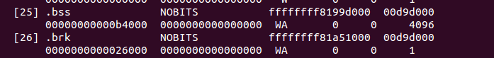

Kernel initialization. Part 6.
================================================================================

Architecture-specific initialization, again...
================================================================================

In the previous [part](https://0xax.gitbook.io/linux-insides/summary/initialization/linux-initialization-5) we saw architecture-specific (`x86_64` in our case) initialization stuff from the [arch/x86/kernel/setup.c](https://github.com/torvalds/linux/blob/master/arch/x86/kernel/setup.c) and finished on `x86_configure_nx` function which sets the `_PAGE_NX` flag depends on support of [NX bit](http://en.wikipedia.org/wiki/NX_bit). As I wrote before `setup_arch` function and `start_kernel` are very big, so in this and in the next part we will continue to learn about architecture-specific initialization process. The next function after `x86_configure_nx` is `parse_early_param`. This function is defined in the [init/main.c](https://github.com/torvalds/linux/blob/16f73eb02d7e1765ccab3d2018e0bd98eb93d973/init/main.c) and as you can understand from its name, this function parses kernel command line and setups different services depends on the given parameters (all kernel command line parameters you can find are in the [Documentation/kernel-parameters.txt](https://github.com/torvalds/linux/blob/master/Documentation/admin-guide/kernel-parameters.rst)). You may remember how we setup `earlyprintk` in the earliest [part](https://0xax.gitbook.io/linux-insides/summary/booting/linux-bootstrap-2). On the early stage we looked for kernel parameters and their value with the `cmdline_find_option` function and `__cmdline_find_option`, `__cmdline_find_option_bool` helpers from the [arch/x86/boot/cmdline.c](https://github.com/torvalds/linux/blob/16f73eb02d7e1765ccab3d2018e0bd98eb93d973/arch/x86/boot/cmdline.c). There we're in the generic kernel part which does not depend on architecture and here we use another approach. If you are reading linux kernel source code, you already note calls like this:

```C
early_param("gbpages", parse_direct_gbpages_on);
```

`early_param` macro takes two parameters:

* command line parameter name;
* function which will be called if given parameter is passed.

and defined as:

```C
#define early_param(str, fn) \
        __setup_param(str, fn, fn, 1)
```

in the [include/linux/init.h](https://github.com/torvalds/linux/blob/16f73eb02d7e1765ccab3d2018e0bd98eb93d973/include/linux/init.h). As you can see `early_param` macro just makes call of the `__setup_param` macro:

```C
#define __setup_param(str, unique_id, fn, early)                \
        static const char __setup_str_##unique_id[] __initconst \
                __aligned(1) = str; \
        static struct obs_kernel_param __setup_##unique_id      \
                __used __section(.init.setup)                   \
                __attribute__((aligned((sizeof(long)))))        \
                = { __setup_str_##unique_id, fn, early }
```

This macro defines `__setup_str_*_id` variable (where `*` depends on given function name) and assigns it to the given command line parameter name. In the next line we can see definition of the `__setup_*` variable which type is `obs_kernel_param` and its initialization. `obs_kernel_param` structure defined as:

```C
struct obs_kernel_param {
        const char *str;
        int (*setup_func)(char *);
        int early;
};
```

and contains three fields:

* name of the kernel parameter;
* function which setups something depend on parameter;
* field determines is parameter early (1) or not (0).

Note that `__set_param` macro defines with `__section(.init.setup)` attribute. It means that all `__setup_str_*` will be placed in the `.init.setup` section, moreover, as we can see in the [include/asm-generic/vmlinux.lds.h](https://github.com/torvalds/linux/blob/16f73eb02d7e1765ccab3d2018e0bd98eb93d973/include/asm-generic/vmlinux.lds.h), they will be placed between `__setup_start` and `__setup_end`:

```
#define INIT_SETUP(initsetup_align)                \
                . = ALIGN(initsetup_align);        \
                VMLINUX_SYMBOL(__setup_start) = .; \
                *(.init.setup)                     \
                VMLINUX_SYMBOL(__setup_end) = .;
```

Now we know how parameters are defined, let's back to the `parse_early_param` implementation:

```C
void __init parse_early_param(void)
{
        static int done __initdata;
        static char tmp_cmdline[COMMAND_LINE_SIZE] __initdata;

        if (done)
                return;

        /* All fall through to do_early_param. */
        strlcpy(tmp_cmdline, boot_command_line, COMMAND_LINE_SIZE);
        parse_early_options(tmp_cmdline);
        done = 1;
}
```

The `parse_early_param` function defines two static variables. First `done` check that `parse_early_param` already called and the second is temporary storage for kernel command line. After this we copy `boot_command_line` to the temporary command line which we just defined and call the `parse_early_options` function from the same source code `main.c` file. `parse_early_options` calls the `parse_args` function from the [kernel/params.c](https://github.com/torvalds/linux) where `parse_args` parses given command line and calls `do_early_param` function. This [function](https://github.com/torvalds/linux/blob/16f73eb02d7e1765ccab3d2018e0bd98eb93d973/init/main.c#L413) goes from the ` __setup_start` to `__setup_end`, and calls the function from the `obs_kernel_param` if a parameter is early. After this all services which are depend on early command line parameters were setup and the next call after the `parse_early_param` is `x86_report_nx`. As I wrote in the beginning of this part, we already set `NX-bit` with the `x86_configure_nx`. The next `x86_report_nx` function from the [arch/x86/mm/setup_nx.c](https://github.com/torvalds/linux/blob/16f73eb02d7e1765ccab3d2018e0bd98eb93d973/arch/x86/mm/setup_nx.c) just prints information about the `NX`. Note that we call `x86_report_nx` not right after the `x86_configure_nx`, but after the call of the `parse_early_param`. The answer is simple: we call it after the `parse_early_param` because the kernel support `noexec` parameter:

```
noexec		[X86]
			On X86-32 available only on PAE configured kernels.
			noexec=on: enable non-executable mappings (default)
			noexec=off: disable non-executable mappings
```

We can see it in the booting time:


After this we can see call of the:

```C
	memblock_x86_reserve_range_setup_data();
```

function. This function is defined in the same [arch/x86/kernel/setup.c](https://github.com/torvalds/linux/blob/master/arch/x86/kernel/setup.c) source code file and remaps memory for the `setup_data` and reserved memory block for the `setup_data` (more about `setup_data` you can read in the previous [part](https://0xax.gitbook.io/linux-insides/summary/initialization/linux-initialization-5) and about `ioremap` and `memblock` you can read in the [Linux kernel memory management](https://0xax.gitbook.io/linux-insides/summary/mm)).

In the next step we can see following conditional statement:

```C
	if (acpi_mps_check()) {
#ifdef CONFIG_X86_LOCAL_APIC
		disable_apic = 1;
#endif
		setup_clear_cpu_cap(X86_FEATURE_APIC);
	}
```

The first `acpi_mps_check` function from the [arch/x86/kernel/acpi/boot.c](https://github.com/torvalds/linux/blob/16f73eb02d7e1765ccab3d2018e0bd98eb93d973/arch/x86/kernel/acpi/boot.c) depends on `CONFIG_X86_LOCAL_APIC` and `CONFIG_x86_MPPARSE` configuration options:

```C
int __init acpi_mps_check(void)
{
#if defined(CONFIG_X86_LOCAL_APIC) && !defined(CONFIG_X86_MPPARSE)
        /* mptable code is not built-in*/
        if (acpi_disabled || acpi_noirq) {
                printk(KERN_WARNING "MPS support code is not built-in.\n"
                       "Using acpi=off or acpi=noirq or pci=noacpi "
                       "may have problem\n");
                 return 1;
        }
#endif
        return 0;
}
```

It checks the built-in `MPS` or [MultiProcessor Specification](http://en.wikipedia.org/wiki/MultiProcessor_Specification) table. If `CONFIG_X86_LOCAL_APIC` is set and `CONFIG_x86_MPPARSE` is not set, `acpi_mps_check` prints warning message if the one of the command line options: `acpi=off`, `acpi=noirq` or `pci=noacpi` passed to the kernel. If `acpi_mps_check` returns `1` it means that we disable local [APIC](http://en.wikipedia.org/wiki/Advanced_Programmable_Interrupt_Controller) and clear `X86_FEATURE_APIC` bit in the of the current CPU with the `setup_clear_cpu_cap` macro. (more about CPU mask you can read in the [CPU masks](https://0xax.gitbook.io/linux-insides/summary/concepts/linux-cpu-2)).

Early PCI dump
--------------------------------------------------------------------------------

In the next step we make a dump of the [PCI](http://en.wikipedia.org/wiki/Conventional_PCI) devices with the following code:

```C
#ifdef CONFIG_PCI
	if (pci_early_dump_regs)
		early_dump_pci_devices();
#endif
```

`pci_early_dump_regs` variable defined in the [arch/x86/pci/common.c](https://github.com/torvalds/linux/blob/16f73eb02d7e1765ccab3d2018e0bd98eb93d973/arch/x86/pci/common.c) and its value depends on the kernel command line parameter: `pci=earlydump`. We can find definition of this parameter in the [drivers/pci/pci.c](https://github.com/torvalds/linux/blob/16f73eb02d7e1765ccab3d2018e0bd98eb93d973/arch):

```C
early_param("pci", pci_setup);
```

`pci_setup` function gets the string after the `pci=` and analyzes it. This function calls `pcibios_setup` which defined as `__weak` in the [drivers/pci/pci.c](https://github.com/torvalds/linux/blob/16f73eb02d7e1765ccab3d2018e0bd98eb93d973/arch) and every architecture defines the same function which overrides `__weak` analog. For example `x86_64` architecture-dependent version is in the [arch/x86/pci/common.c](https://github.com/torvalds/linux/blob/16f73eb02d7e1765ccab3d2018e0bd98eb93d973/arch/x86/pci/common.c):

```C
char *__init pcibios_setup(char *str) {
        ...
		...
		...
		} else if (!strcmp(str, "earlydump")) {
                pci_early_dump_regs = 1;
                return NULL;
        }
		...
		...
		...
}
```

So, if `CONFIG_PCI` option is set and we passed `pci=earlydump` option to the kernel command line, next function which will be called - `early_dump_pci_devices` from the [arch/x86/pci/early.c](https://github.com/torvalds/linux/blob/16f73eb02d7e1765ccab3d2018e0bd98eb93d973/arch/x86/pci/early.c). This function checks `noearly` PCI parameter with:

```C
if (!early_pci_allowed())
        return;
```

and returns if it was passed. Each PCI domain can host up to `256` buses and each bus hosts up to 32 devices. So, we goes in a loop:

```C
for (bus = 0; bus < 256; bus++) {
                for (slot = 0; slot < 32; slot++) {
                        for (func = 0; func < 8; func++) {
						...
						...
						...
                        }
                }
}
```

and read the `pci` config with the `read_pci_config` function.

That's all. We will not go deep in the `pci` details, but will see more details in the special `Drivers/PCI` part.

Finish with memory parsing
--------------------------------------------------------------------------------

After the `early_dump_pci_devices`, there are a couple of function related with available memory and [e820](http://en.wikipedia.org/wiki/E820) which we collected in the [First steps in the kernel setup](https://0xax.gitbook.io/linux-insides/summary/booting/linux-bootstrap-2) part:

```C
	/* update the e820_saved too */
	e820_reserve_setup_data();
	finish_e820_parsing();
	...
	...
	...
	e820_add_kernel_range();
	trim_bios_range(void);
	max_pfn = e820_end_of_ram_pfn();
	early_reserve_e820_mpc_new();
```

Let's look at it. As you can see the first function is `e820_reserve_setup_data`. This function does almost the same as `memblock_x86_reserve_range_setup_data` which we saw above, but it also calls `e820_update_range` which adds new regions to the `e820map` with the given type which is `E820_RESERVED_KERN` in our case. The next function is `finish_e820_parsing` which sanitizes `e820map` with the `sanitize_e820_map` function. Besides this two functions we can see a couple of functions related to the [e820](http://en.wikipedia.org/wiki/E820). You can see it in the listing above. `e820_add_kernel_range` function takes the physical address of the kernel start and end:

```C
u64 start = __pa_symbol(_text);
u64 size = __pa_symbol(_end) - start;
```

checks that `.text` `.data` and `.bss` marked as `E820RAM` in the `e820map` and prints the warning message if not. The next function `trm_bios_range` update first 4096 bytes in `e820Map` as `E820_RESERVED` and sanitizes it again with the call of the `sanitize_e820_map`. After this we get the last page frame number with the call of the `e820_end_of_ram_pfn` function. Every memory page has a unique number - `Page frame number`  and `e820_end_of_ram_pfn` function returns the maximum with the call of the `e820_end_pfn`:

```C
unsigned long __init e820_end_of_ram_pfn(void)
{
	return e820_end_pfn(MAX_ARCH_PFN);
}
```

where `e820_end_pfn` takes maximum page frame number on the certain architecture (`MAX_ARCH_PFN` is `0x400000000` for `x86_64`). In the `e820_end_pfn` we go through the all `e820` slots and check that `e820` entry has `E820_RAM` or `E820_PRAM` type because we calculate page frame numbers only for these types, gets the base address and end address of the page frame number for the current `e820` entry and makes some checks for these addresses:

```C
for (i = 0; i < e820.nr_map; i++) {
		struct e820entry *ei = &e820.map[i];
		unsigned long start_pfn;
		unsigned long end_pfn;

		if (ei->type != E820_RAM && ei->type != E820_PRAM)
			continue;

		start_pfn = ei->addr >> PAGE_SHIFT;
		end_pfn = (ei->addr + ei->size) >> PAGE_SHIFT;

        if (start_pfn >= limit_pfn)
			continue;
		if (end_pfn > limit_pfn) {
			last_pfn = limit_pfn;
			break;
		}
		if (end_pfn > last_pfn)
			last_pfn = end_pfn;
}
```

```C
	if (last_pfn > max_arch_pfn)
		last_pfn = max_arch_pfn;

	printk(KERN_INFO "e820: last_pfn = %#lx max_arch_pfn = %#lx\n",
			 last_pfn, max_arch_pfn);
	return last_pfn;
```

After this we check that `last_pfn` which we got in the loop is not greater that maximum page frame number for the certain architecture (`x86_64` in our case), print information about last page frame number and return it. We can see the `last_pfn` in the `dmesg` output:

```
...
[    0.000000] e820: last_pfn = 0x41f000 max_arch_pfn = 0x400000000
...
```

After this, as we have calculated the biggest page frame number, we calculate `max_low_pfn` which is the biggest page frame number in the `low memory` or below first `4` gigabytes. If installed more than 4 gigabytes of RAM, `max_low_pfn` will be result of the `e820_end_of_low_ram_pfn` function which does the same `e820_end_of_ram_pfn` but with 4 gigabytes limit, in other way `max_low_pfn` will be the same as `max_pfn`:

```C
if (max_pfn > (1UL<<(32 - PAGE_SHIFT)))
	max_low_pfn = e820_end_of_low_ram_pfn();
else
	max_low_pfn = max_pfn;

high_memory = (void *)__va(max_pfn * PAGE_SIZE - 1) + 1;
```

Next we calculate `high_memory` (defines the upper bound on direct map memory) with `__va` macro which returns a virtual address by the given physical memory.

DMI scanning
-------------------------------------------------------------------------------

The next step after manipulations with different memory regions and `e820` slots is collecting information about computer. We will get all information with the [Desktop Management Interface](http://en.wikipedia.org/wiki/Desktop_Management_Interface) and following functions:

```C
dmi_scan_machine();
dmi_memdev_walk();
```

First is `dmi_scan_machine` defined in the [drivers/firmware/dmi_scan.c](https://github.com/torvalds/linux/blob/16f73eb02d7e1765ccab3d2018e0bd98eb93d973/drivers/firmware/dmi_scan.c). This function goes through the [System Management BIOS](http://en.wikipedia.org/wiki/System_Management_BIOS) structures and extracts information. There are two ways specified to gain access to the `SMBIOS` table: get the pointer to the `SMBIOS` table from the [EFI](http://en.wikipedia.org/wiki/Unified_Extensible_Firmware_Interface)'s configuration table and scanning the physical memory between `0xF0000` and `0xFFFFF` addresses, `0x10000` bytes totally. Let's look on the second approach. `dmi_scan_machine` function remaps memory addresses start from `0xF0000` to `0xFFFFF` with size of `0x10000` bytes with the `dmi_early_remap` which just expands to the `early_ioremap`:

```C
void __init dmi_scan_machine(void)
{
	char __iomem *p, *q;
	char buf[32];
	...
	...
	...
	p = dmi_early_remap(0xF0000, 0x10000);
	if (p == NULL)
			goto error;
```

and iterates over all `DMI` header address and find search `_SM_` string:

```C
memset(buf, 0, 16);
for (q = p; q < p + 0x10000; q += 16) {
		memcpy_fromio(buf + 16, q, 16);
		if (!dmi_smbios3_present(buf) || !dmi_present(buf)) {
			dmi_available = 1;
			dmi_early_unmap(p, 0x10000);
			goto out;
		}
		memcpy(buf, buf + 16, 16);
}
```

`_SM_` string must be between `000F0000h` and `0x000FFFFF`. Here we copy 16 bytes to the `buf` with `memcpy_fromio` which is the same `memcpy` and execute `dmi_smbios3_present` and `dmi_present` on the buffer. These functions check that first 4 bytes is `_SM_` string, get `SMBIOS` version and gets `_DMI_` attributes as `DMI` structure table length, table address and etc... After one of these functions finish, you will see the result of it in the `dmesg` output:

```
[    0.000000] SMBIOS 2.7 present.
[    0.000000] DMI: Gigabyte Technology Co., Ltd. Z97X-UD5H-BK/Z97X-UD5H-BK, BIOS F6 06/17/2014
```

In the end of the `dmi_scan_machine`, we unmap the previously remapped memory:

```C
dmi_early_unmap(p, 0x10000);
```

The second function is - `dmi_memdev_walk`. As you can understand it goes over memory devices. Let's look on it:

```C
void __init dmi_memdev_walk(void)
{
	if (!dmi_available)
		return;

	if (dmi_walk_early(count_mem_devices) == 0 && dmi_memdev_nr) {
		dmi_memdev = dmi_alloc(sizeof(*dmi_memdev) * dmi_memdev_nr);
		if (dmi_memdev)
			dmi_walk_early(save_mem_devices);
	}
}
```

It checks that `DMI` available (we got it in the previous function - `dmi_scan_machine`) and collects information about memory devices with `dmi_walk_early` and `dmi_alloc` which defined as:

```
#ifdef CONFIG_DMI
RESERVE_BRK(dmi_alloc, 65536);
#endif
```

`RESERVE_BRK` defined in the [arch/x86/include/asm/setup.h](http://github.com/torvalds/linux/blob/master/arch/x86/include/asm/setup.h) and reserves space with given size in the `brk` section.

-------------------------
	init_hypervisor_platform();
	x86_init.resources.probe_roms();
	insert_resource(&iomem_resource, &code_resource);
	insert_resource(&iomem_resource, &data_resource);
	insert_resource(&iomem_resource, &bss_resource);
	early_gart_iommu_check();


SMP config
--------------------------------------------------------------------------------

The next step is parsing of the [SMP](http://en.wikipedia.org/wiki/Symmetric_multiprocessing) configuration. We do it with the call of the `find_smp_config` function which just calls function:

```C
static inline void find_smp_config(void)
{
        x86_init.mpparse.find_smp_config();
}
```

inside. `x86_init.mpparse.find_smp_config` is the `default_find_smp_config` function from the [arch/x86/kernel/mpparse.c](https://github.com/torvalds/linux/blob/16f73eb02d7e1765ccab3d2018e0bd98eb93d973/arch/x86/kernel/mpparse.c). In the `default_find_smp_config` function we are scanning a couple of memory regions for `SMP` config and return if they are found:

```C
if (smp_scan_config(0x0, 0x400) ||
            smp_scan_config(639 * 0x400, 0x400) ||
            smp_scan_config(0xF0000, 0x10000))
            return;
```

First of all `smp_scan_config` function defines a couple of variables:

```C
unsigned int *bp = phys_to_virt(base);
struct mpf_intel *mpf;
```

First is virtual address of the memory region where we will scan `SMP` config, second is the pointer to the `mpf_intel` structure. Let's try to understand what is it `mpf_intel`. All information stores in the multiprocessor configuration data structure. `mpf_intel` presents this structure and looks:

```C
struct mpf_intel {
        char signature[4];
        unsigned int physptr;
        unsigned char length;
        unsigned char specification;
        unsigned char checksum;
        unsigned char feature1;
        unsigned char feature2;
        unsigned char feature3;
        unsigned char feature4;
        unsigned char feature5;
};
```

As we can read in the documentation - one of the main functions of the system BIOS is to construct the MP floating pointer structure and the MP configuration table. And operating system must have access to this information about the multiprocessor configuration and `mpf_intel` stores the physical address (look at second parameter) of the multiprocessor configuration table. So, `smp_scan_config` going in a loop through the given memory range and tries to find `MP floating pointer structure` there. It checks that current byte points to the `SMP` signature, checks checksum, checks if `mpf->specification` is 1 or 4(it must be `1` or `4` by specification) in the loop:

```C
while (length > 0) {
if ((*bp == SMP_MAGIC_IDENT) &&
    (mpf->length == 1) &&
    !mpf_checksum((unsigned char *)bp, 16) &&
    ((mpf->specification == 1)
    || (mpf->specification == 4))) {

        mem = virt_to_phys(mpf);
        memblock_reserve(mem, sizeof(*mpf));
        if (mpf->physptr)
            smp_reserve_memory(mpf);
	}
}
```

reserves given memory block if search is successful with `memblock_reserve` and reserves physical address of the multiprocessor configuration table. You can find documentation about this in the - [MultiProcessor Specification](http://www.intel.com/design/pentium/datashts/24201606.pdf). You can read More details in the special part about `SMP`.

Additional early memory initialization routines
--------------------------------------------------------------------------------

In the next step of the `setup_arch` we can see the call of the `early_alloc_pgt_buf` function which allocates the page table buffer for early stage. The page table buffer will be placed in the `brk` area. Let's look on its implementation:

```C
void  __init early_alloc_pgt_buf(void)
{
        unsigned long tables = INIT_PGT_BUF_SIZE;
        phys_addr_t base;

        base = __pa(extend_brk(tables, PAGE_SIZE));

        pgt_buf_start = base >> PAGE_SHIFT;
        pgt_buf_end = pgt_buf_start;
        pgt_buf_top = pgt_buf_start + (tables >> PAGE_SHIFT);
}
```

First of all it get the size of the page table buffer, it will be `INIT_PGT_BUF_SIZE` which is `(6 * PAGE_SIZE)` in the current linux kernel 4.0. As we got the size of the page table buffer, we call `extend_brk` function with two parameters: size and align. As you can understand from its name, this function extends the `brk` area. As we can see in the linux kernel linker script `brk` is in memory right after the [BSS](http://en.wikipedia.org/wiki/.bss):

```C
	. = ALIGN(PAGE_SIZE);
	.brk : AT(ADDR(.brk) - LOAD_OFFSET) {
		__brk_base = .;
		. += 64 * 1024;		/* 64k alignment slop space */
		*(.brk_reservation)	/* areas brk users have reserved */
		__brk_limit = .;
	}
```

Or we can find it with `readelf` util:



After that we got physical address of the new `brk` with the `__pa` macro, we calculate the base address and the end of the page table buffer. In the next step as we got page table buffer, we reserve memory block for the brk area with the `reserve_brk` function:

```C
static void __init reserve_brk(void)
{
	if (_brk_end > _brk_start)
		memblock_reserve(__pa_symbol(_brk_start),
				 _brk_end - _brk_start);

	_brk_start = 0;
}
```

Note that in the end of the `reserve_brk`, we set `brk_start` to zero, because after this we will not allocate it anymore. The next step after reserving memory block for the `brk`, we need to unmap out-of-range memory areas in the kernel mapping with the `cleanup_highmap` function. Remember that kernel mapping is `__START_KERNEL_map` and `_end - _text` or `level2_kernel_pgt` maps the kernel `_text`, `data` and `bss`. In the start of the `clean_high_map` we define these parameters:

```C
unsigned long vaddr = __START_KERNEL_map;
unsigned long end = roundup((unsigned long)_end, PMD_SIZE) - 1;
pmd_t *pmd = level2_kernel_pgt;
pmd_t *last_pmd = pmd + PTRS_PER_PMD;
```

Now, as we defined start and end of the kernel mapping, we go in the loop through the all kernel page middle directory entries and clean entries which are not between `_text` and `end`:

```C
for (; pmd < last_pmd; pmd++, vaddr += PMD_SIZE) {
        if (pmd_none(*pmd))
            continue;
        if (vaddr < (unsigned long) _text || vaddr > end)
            set_pmd(pmd, __pmd(0));
}
```

After this we set the limit for the `memblock` allocation with the `memblock_set_current_limit` function (read more about `memblock` you can in the [Linux kernel memory management Part 2](https://github.com/0xAX/linux-insides/blob/master/MM/linux-mm-2.md)), it will be `ISA_END_ADDRESS` or `0x100000` and fill the `memblock` information according to `e820` with the call of the `memblock_x86_fill` function. You can see the result of this function in the kernel initialization time:

```
MEMBLOCK configuration:
 memory size = 0x1fff7ec00 reserved size = 0x1e30000
 memory.cnt  = 0x3
 memory[0x0]	[0x00000000001000-0x0000000009efff], 0x9e000 bytes flags: 0x0
 memory[0x1]	[0x00000000100000-0x000000bffdffff], 0xbfee0000 bytes flags: 0x0
 memory[0x2]	[0x00000100000000-0x0000023fffffff], 0x140000000 bytes flags: 0x0
 reserved.cnt  = 0x3
 reserved[0x0]	[0x0000000009f000-0x000000000fffff], 0x61000 bytes flags: 0x0
 reserved[0x1]	[0x00000001000000-0x00000001a57fff], 0xa58000 bytes flags: 0x0
 reserved[0x2]	[0x0000007ec89000-0x0000007fffffff], 0x1377000 bytes flags: 0x0
```

The rest functions after the `memblock_x86_fill` are: `early_reserve_e820_mpc_new` allocates additional slots in the `e820map` for MultiProcessor Specification table, `reserve_real_mode` - reserves low memory from `0x0` to 1 megabyte for the trampoline to the real mode (for rebooting, etc.), `trim_platform_memory_ranges` - trims certain memory regions started from `0x20050000`, `0x20110000`, etc. these regions must be excluded because [Sandy Bridge](http://en.wikipedia.org/wiki/Sandy_Bridge) has problems with these regions, `trim_low_memory_range` reserves the first 4 kilobyte page in `memblock`, `init_mem_mapping` function reconstructs direct memory mapping and setups the direct mapping of the physical memory at `PAGE_OFFSET`, `early_trap_pf_init` setups `#PF` handler (we will look on it in the chapter about interrupts) and `setup_real_mode` function setups trampoline to the [real mode](http://en.wikipedia.org/wiki/Real_mode) code.

That's all. You can note that this part will not cover all functions which are in the `setup_arch` (like `early_gart_iommu_check`, [mtrr](http://en.wikipedia.org/wiki/Memory_type_range_register) initialization, etc.). As I already wrote many times, `setup_arch` is big, and linux kernel is big. That's why I can't cover every line in the linux kernel. I don't think that we missed something important, but you can say something like: each line of code is important. Yes, it's true, but I missed them anyway, because I think that it is not realistic to cover full linux kernel. Anyway we will often return to the idea that we have already seen, and if something is unfamiliar, we will cover this theme.

Conclusion
--------------------------------------------------------------------------------

It is the end of the sixth part about linux kernel initialization process. In this part we continued to dive in the `setup_arch` function again and it was long part, but we are not finished with it. Yes, `setup_arch` is big, hope that next part will be the last part about this function.

If you have any questions or suggestions write me a comment or ping me at [twitter](https://twitter.com/0xAX).

**Please note that English is not my first language, And I am really sorry for any inconvenience. If you find any mistakes please send me PR to [linux-insides](https://github.com/0xAX/linux-insides).**

Links
--------------------------------------------------------------------------------

* [MultiProcessor Specification](http://en.wikipedia.org/wiki/MultiProcessor_Specification)
* [NX bit](http://en.wikipedia.org/wiki/NX_bit)
* [Documentation/kernel-parameters.txt](https://github.com/torvalds/linux/blob/master/Documentation/admin-guide/kernel-parameters.rst)
* [APIC](http://en.wikipedia.org/wiki/Advanced_Programmable_Interrupt_Controller)
* [CPU masks](https://0xax.gitbook.io/linux-insides/summary/concepts/linux-cpu-2)
* [Linux kernel memory management](https://0xax.gitbook.io/linux-insides/summary/mm)
* [PCI](http://en.wikipedia.org/wiki/Conventional_PCI)
* [e820](http://en.wikipedia.org/wiki/E820)
* [System Management BIOS](http://en.wikipedia.org/wiki/System_Management_BIOS)
* [System Management BIOS](http://en.wikipedia.org/wiki/System_Management_BIOS)
* [EFI](http://en.wikipedia.org/wiki/Unified_Extensible_Firmware_Interface)
* [SMP](http://en.wikipedia.org/wiki/Symmetric_multiprocessing)
* [MultiProcessor Specification](http://www.intel.com/design/pentium/datashts/24201606.pdf)
* [BSS](http://en.wikipedia.org/wiki/.bss)
* [SMBIOS specification](http://www.dmtf.org/sites/default/files/standards/documents/DSP0134v2.5Final.pdf)
* [Previous part](https://0xax.gitbook.io/linux-insides/summary/initialization/linux-initialization-5)
