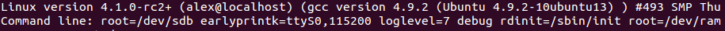

Kernel initialization. Part 8.
================================================================================

Scheduler initialization
================================================================================

This is the eighth [part](https://0xax.gitbook.io/linux-insides/summary/initialization) of the Linux kernel initialization process chapter and we stopped on the `setup_nr_cpu_ids` function in the [previous part](https://github.com/0xAX/linux-insides/blob/master/Initialization/linux-initialization-7.md).

The main point of this part is [scheduler](http://en.wikipedia.org/wiki/Scheduling_%28computing%29) initialization. But before we will start to learn initialization process of the scheduler, we need to do some stuff. The next step in the [init/main.c](https://github.com/torvalds/linux/blob/16f73eb02d7e1765ccab3d2018e0bd98eb93d973/init/main.c) is the `setup_per_cpu_areas` function. This function setups memory areas for the `percpu` variables, more about it you can read in the special part about the [Per-CPU variables](https://0xax.gitbook.io/linux-insides/summary/concepts/linux-cpu-1). After `percpu` areas is up and running, the next step is the `smp_prepare_boot_cpu` function.

This function does some preparations for [symmetric multiprocessing](http://en.wikipedia.org/wiki/Symmetric_multiprocessing). Since this function is architecture specific, it is located in the [arch/x86/include/asm/smp.h](https://github.com/torvalds/linux/blob/16f73eb02d7e1765ccab3d2018e0bd98eb93d973/arch/x86/include/asm/smp.h#L78) Linux kernel header file. Let's look at the definition of this function:

```C
static inline void smp_prepare_boot_cpu(void)
{
         smp_ops.smp_prepare_boot_cpu();
}
```

We may see here that it just calls the `smp_prepare_boot_cpu` callback of the `smp_ops` structure. If we look at the definition of instance of this structure from the [arch/x86/kernel/smp.c](https://github.com/torvalds/linux/blob/16f73eb02d7e1765ccab3d2018e0bd98eb93d973/arch/x86/kernel/smp.c) source code file, we will see that the `smp_prepare_boot_cpu` expands to the call of the `native_smp_prepare_boot_cpu` function:

```C
struct smp_ops smp_ops = {
    ...
    ...
    ...
    smp_prepare_boot_cpu = native_smp_prepare_boot_cpu,
    ...
    ...
    ...
}
EXPORT_SYMBOL_GPL(smp_ops);
```

The `native_smp_prepare_boot_cpu` function looks:

```C
void __init native_smp_prepare_boot_cpu(void)
{
        int me = smp_processor_id();
        switch_to_new_gdt(me);
        cpumask_set_cpu(me, cpu_callout_mask);
        per_cpu(cpu_state, me) = CPU_ONLINE;
}
```

and executes following things: first of all it gets the `id` of the current CPU (which is Bootstrap processor and its `id` is zero for this moment) with the `smp_processor_id` function. I will not explain how the `smp_processor_id` works, because we already saw it in the [Kernel entry point](https://0xax.gitbook.io/linux-insides/summary/initialization/linux-initialization-4) part. After we've got processor `id` number we reload [Global Descriptor Table](http://en.wikipedia.org/wiki/Global_Descriptor_Table) for the given CPU with the `switch_to_new_gdt` function:

```C
void switch_to_new_gdt(int cpu)
{
        struct desc_ptr gdt_descr;

        gdt_descr.address = (long)get_cpu_gdt_table(cpu);
        gdt_descr.size = GDT_SIZE - 1;
        load_gdt(&gdt_descr);
        load_percpu_segment(cpu);
}
```

The `gdt_descr` variable represents pointer to the `GDT` descriptor here (we already saw definition of a `desc_ptr` structure in the [Early interrupt and exception handling](https://0xax.gitbook.io/linux-insides/summary/initialization/linux-initialization-2) part). We get the address and the size of the `GDT` descriptor for the `CPU` with the given `id`. The `GDT_SIZE` is `256` or:

```C
#define GDT_SIZE (GDT_ENTRIES * 8)
```

and the address of the descriptor we will get with the `get_cpu_gdt_table`:

```C
static inline struct desc_struct *get_cpu_gdt_table(unsigned int cpu)
{
        return per_cpu(gdt_page, cpu).gdt;
}
```

The `get_cpu_gdt_table` uses `per_cpu` macro for getting value of a `gdt_page` percpu variable for the given CPU number (bootstrap processor with `id` - 0 in our case).

You may ask the following question: so, if we can access `gdt_page` percpu variable, where it was defined? Actually we already saw it in this book. If you have read the first [part](https://0xax.gitbook.io/linux-insides/summary/initialization/linux-initialization-1) of this chapter, you can remember that we saw definition of the `gdt_page` in the [arch/x86/kernel/head_64.S](https://github.com/0xAX/linux/blob/0a07b238e5f488b459b6113a62e06b6aab017f71/arch/x86/kernel/head_64.S):

```assembly
early_gdt_descr:
	.word	GDT_ENTRIES*8-1
early_gdt_descr_base:
	.quad	INIT_PER_CPU_VAR(gdt_page)
```

and if we will look on the [linker](https://github.com/0xAX/linux/blob/0a07b238e5f488b459b6113a62e06b6aab017f71/arch/x86/kernel/vmlinux.lds.S) file we can see that it locates after the `__per_cpu_load` symbol:

```C
#define INIT_PER_CPU(x) init_per_cpu__##x = x + __per_cpu_load
INIT_PER_CPU(gdt_page);
```

and filled `gdt_page` in the [arch/x86/kernel/cpu/common.c](https://github.com/torvalds/linux/blob/16f73eb02d7e1765ccab3d2018e0bd98eb93d973/arch/x86/kernel/cpu/common.c#L94):

```C
DEFINE_PER_CPU_PAGE_ALIGNED(struct gdt_page, gdt_page) = { .gdt = {
#ifdef CONFIG_X86_64
	[GDT_ENTRY_KERNEL32_CS]		= GDT_ENTRY_INIT(0xc09b, 0, 0xfffff),
	[GDT_ENTRY_KERNEL_CS]		= GDT_ENTRY_INIT(0xa09b, 0, 0xfffff),
	[GDT_ENTRY_KERNEL_DS]		= GDT_ENTRY_INIT(0xc093, 0, 0xfffff),
	[GDT_ENTRY_DEFAULT_USER32_CS]	= GDT_ENTRY_INIT(0xc0fb, 0, 0xfffff),
	[GDT_ENTRY_DEFAULT_USER_DS]	= GDT_ENTRY_INIT(0xc0f3, 0, 0xfffff),
	[GDT_ENTRY_DEFAULT_USER_CS]	= GDT_ENTRY_INIT(0xa0fb, 0, 0xfffff),
    ...
    ...
    ...
```

more about `percpu` variables you can read in the [Per-CPU variables](https://0xax.gitbook.io/linux-insides/summary/concepts/linux-cpu-1) part. As we got address and size of the `GDT` descriptor we reload `GDT` with the `load_gdt` which just execute `lgdt` instruct and load `percpu_segment` with the following function:

```C
void load_percpu_segment(int cpu) {
    loadsegment(gs, 0);
    wrmsrl(MSR_GS_BASE, (unsigned long)per_cpu(irq_stack_union.gs_base, cpu));
    load_stack_canary_segment();
}
```

The base address of the `percpu` area must contain `gs` register (or `fs` register for `x86`), so we are using `loadsegment` macro and pass `gs`. In the next step we writes the base address if the [IRQ](http://en.wikipedia.org/wiki/Interrupt_request_%28PC_architecture%29) stack and setup stack [canary](http://en.wikipedia.org/wiki/Buffer_overflow_protection) (this is only for `x86_32`). After we load new `GDT`, we fill `cpu_callout_mask` bitmap with the current cpu and set cpu state as online with the setting `cpu_state` percpu variable for the current processor - `CPU_ONLINE`:

```C
cpumask_set_cpu(me, cpu_callout_mask);
per_cpu(cpu_state, me) = CPU_ONLINE;
```

So, what is `cpu_callout_mask` bitmap... As we initialized bootstrap processor (processor which is booted the first on `x86`) the other processors in a multiprocessor system are known as `secondary processors`. Linux kernel uses following two bitmasks:

* `cpu_callout_mask`
* `cpu_callin_mask`

After bootstrap processor initialized, it updates the `cpu_callout_mask` to indicate which secondary processor can be initialized next. All other or secondary processors can do some initialization stuff before and check the `cpu_callout_mask` on the bootstrap processor bit. Only after the bootstrap processor filled the `cpu_callout_mask` with this secondary processor, it will continue the rest of its initialization. After that the certain processor finish its initialization process, the processor sets bit in the `cpu_callin_mask`. Once the bootstrap processor finds the bit in the `cpu_callin_mask` for the current secondary processor, this processor repeats the same procedure for initialization of one of the remaining secondary processors. In a short words it works as i described, but we will see more details in the chapter about `SMP`.
        
That's all. We did all `SMP` boot preparation.

Build zonelists
-----------------------------------------------------------------------

In the next step we can see the call of the `build_all_zonelists` function. This function sets up the order of zones that allocations are preferred from. What are zones and what's order we will understand soon. For the start let's see how linux kernel considers physical memory. Physical memory is split into banks which are called - `nodes`. If you has no hardware support for `NUMA`, you will see only one node:

```
$ cat /sys/devices/system/node/node0/numastat 
numa_hit 72452442
numa_miss 0
numa_foreign 0
interleave_hit 12925
local_node 72452442
other_node 0
```

Every `node` is presented by the `struct pglist_data` in the linux kernel. Each node is divided into a number of special blocks which are called - `zones`. Every zone is presented by the `zone struct` in the linux kernel and has one of the type:

* `ZONE_DMA` - 0-16M;
* `ZONE_DMA32` - used for 32 bit devices that can only do DMA areas below 4G;
* `ZONE_NORMAL` - all RAM from the 4GB on the `x86_64`;
* `ZONE_HIGHMEM` - absent on the `x86_64`;
* `ZONE_MOVABLE` - zone which contains movable pages.

which are presented by the `zone_type` enum. We can get information about zones with the:

```
$ cat /proc/zoneinfo
Node 0, zone      DMA
  pages free     3975
        min      3
        low      3
        ...
        ...
Node 0, zone    DMA32
  pages free     694163
        min      875
        low      1093
        ...
        ...
Node 0, zone   Normal
  pages free     2529995
        min      3146
        low      3932
        ...
        ...
```

As I wrote above all nodes are described with the `pglist_data` or `pg_data_t` structure in memory. This structure is defined in the [include/linux/mmzone.h](https://github.com/torvalds/linux/blob/16f73eb02d7e1765ccab3d2018e0bd98eb93d973/include/linux/mmzone.h). The `build_all_zonelists` function from the [mm/page_alloc.c](https://github.com/torvalds/linux/blob/16f73eb02d7e1765ccab3d2018e0bd98eb93d973/mm/page_alloc.c) constructs an ordered `zonelist` (of different zones `DMA`, `DMA32`, `NORMAL`, `HIGH_MEMORY`, `MOVABLE`) which specifies the zones/nodes to visit when a selected `zone` or `node` cannot satisfy the allocation request. That's all. More about `NUMA` and multiprocessor systems will be in the special part.

The rest of the stuff before scheduler initialization
--------------------------------------------------------------------------------

Before we will start to dive into linux kernel scheduler initialization process we must do a couple of things. The first thing is the `page_alloc_init` function from the [mm/page_alloc.c](https://github.com/torvalds/linux/blob/16f73eb02d7e1765ccab3d2018e0bd98eb93d973/mm/page_alloc.c). This function looks pretty easy:

```C
void __init page_alloc_init(void)
{
    int ret;
 
    ret = cpuhp_setup_state_nocalls(CPUHP_PAGE_ALLOC_DEAD,
                                    "mm/page_alloc:dead", NULL,
                                    page_alloc_cpu_dead);
    WARN_ON(ret < 0);
}
```

It setups setup the `startup` and `teardown` callbacks (second and third parameters) for the `CPUHP_PAGE_ALLOC_DEAD` cpu [hotplug](https://www.kernel.org/doc/Documentation/cpu-hotplug.txt) state. Of course the implementation of this function depends on the `CONFIG_HOTPLUG_CPU` kernel configuration option and if this option is set, such callbacks will be set for all cpu(s) in the system depends on their `hotplug` states. [hotplug](https://www.kernel.org/doc/Documentation/cpu-hotplug.txt) mechanism is a big theme and it will not be described in this book.

After this function we can see the kernel command line in the initialization output:



And a couple of functions such as `parse_early_param` and `parse_args` which handles linux kernel command line. You may remember that we already saw the call of the `parse_early_param` function in the sixth [part](https://0xax.gitbook.io/linux-insides/summary/initialization/linux-initialization-6) of the kernel initialization chapter, so why we call it again? Answer is simple: we call this function in the architecture-specific code (`x86_64` in our case), but not all architecture calls this function. And we need to call the second function `parse_args` to parse and handle non-early command line arguments.

In the next step we can see the call of the `jump_label_init` from the [kernel/jump_label.c](https://github.com/torvalds/linux/blob/16f73eb02d7e1765ccab3d2018e0bd98eb93d973/kernel/jump_label.c). and initializes [jump label](https://lwn.net/Articles/412072/).

After this we can see the call of the `setup_log_buf` function which setups the [printk](http://www.makelinux.net/books/lkd2/ch18lev1sec3) log buffer. We already saw this function in the seventh [part](https://0xax.gitbook.io/linux-insides/summary/initialization/linux-initialization-7) of the linux kernel initialization process chapter.

PID hash initialization
--------------------------------------------------------------------------------

The next is `pidhash_init` function. As you know each process has assigned a unique number which called - `process identification number` or `PID`. Each process generated with fork or clone is automatically assigned a new unique `PID` value by the kernel. The management of `PIDs` centered around the two special data structures: `struct pid` and `struct upid`. First structure represents information about a `PID` in the kernel. The second structure represents the information that is visible in a specific namespace. All `PID` instances stored in the special hash table:

```C
static struct hlist_head *pid_hash;
```

This hash table is used to find the pid instance that belongs to a numeric `PID` value. So, `pidhash_init` initializes this hash table. In the start of the `pidhash_init` function we can see the call of the `alloc_large_system_hash`:

```C
pid_hash = alloc_large_system_hash("PID", sizeof(*pid_hash), 0, 18,
                                   HASH_EARLY | HASH_SMALL,
                                   &pidhash_shift, NULL,
                                   0, 4096);
```

The number of elements of the `pid_hash` depends on the `RAM` configuration, but it can be between `2^4` and `2^12`. The `pidhash_init` computes the size
and allocates the required storage (which is `hlist` in our case - the same as [doubly linked list](https://0xax.gitbook.io/linux-insides/summary/datastructures/linux-datastructures-1), but contains one pointer instead on the [struct hlist_head](https://github.com/torvalds/linux/blob/16f73eb02d7e1765ccab3d2018e0bd98eb93d973/include/linux/types.h)]. The `alloc_large_system_hash` function allocates a large system hash table with `memblock_virt_alloc_nopanic` if we pass `HASH_EARLY` flag (as it in our case) or with `__vmalloc` if we did no pass this flag.

The result we can see in the `dmesg` output:

```
$ dmesg | grep hash
[    0.000000] PID hash table entries: 4096 (order: 3, 32768 bytes)
...
...
...
```

That's all. The rest of the stuff before scheduler initialization is the following functions: `vfs_caches_init_early` does early initialization of the [virtual file system](http://en.wikipedia.org/wiki/Virtual_file_system) (more about it will be in the chapter which will describe virtual file system), `sort_main_extable` sorts the kernel's built-in exception table entries which are between `__start___ex_table` and `__stop___ex_table`, and `trap_init` initializes trap handlers (more about last two function we will know in the separate chapter about interrupts).

The last step before the scheduler initialization is initialization of the memory manager with the `mm_init` function from the [init/main.c](https://github.com/torvalds/linux/blob/16f73eb02d7e1765ccab3d2018e0bd98eb93d973/init/main.c). As we can see, the `mm_init` function initializes different parts of the linux kernel memory manager:

```C
page_ext_init_flatmem();
mem_init();
kmem_cache_init();
percpu_init_late();
pgtable_init();
vmalloc_init();
```

The first is `page_ext_init_flatmem` which depends on the `CONFIG_SPARSEMEM` kernel configuration option and initializes extended data per page handling. The `mem_init` releases all `bootmem`, the `kmem_cache_init` initializes kernel cache, the `percpu_init_late` - replaces `percpu` chunks with those allocated by [slub](http://en.wikipedia.org/wiki/SLUB_%28software%29), the `pgtable_init` - initializes the `page->ptl` kernel cache, the `vmalloc_init` - initializes `vmalloc`. Please, **NOTE** that we will not dive into details about all of these functions and concepts, but we will see all of they it in the [Linux kernel memory manager](https://0xax.gitbook.io/linux-insides/summary/mm) chapter.

That's all. Now we can look on the `scheduler`.

Scheduler initialization
--------------------------------------------------------------------------------

And now we come to the main purpose of this part - initialization of the task scheduler. I want to say again as I already did it many times, you will not see the full explanation of the scheduler here, there will be special separate chapter about this. Here will be described first initial scheduler mechanisms which are initialized first of all. So let's start.

Our current point is the `sched_init` function from the [kernel/sched/core.c](https://github.com/torvalds/linux/blob/16f73eb02d7e1765ccab3d2018e0bd98eb93d973/kernel/sched/core.c) kernel source code file and as we can understand from the function's name, it initializes scheduler. Let's start to dive into this function and try to understand how the scheduler is initialized. At the start of the `sched_init` function we can see the following call:

```C
sched_clock_init();
```

The `sched_clock_init` is pretty easy function and as we may see it just sets `sched_clock_init` variable:

```C
void sched_clock_init(void)
{
	sched_clock_running = 1;
}
```

that will be used later. At the next step is initialization of the array of `waitqueues`:

```C
for (i = 0; i < WAIT_TABLE_SIZE; i++)
	init_waitqueue_head(bit_wait_table + i);
```

where `bit_wait_table` is defined as:

```C
#define WAIT_TABLE_BITS 8
#define WAIT_TABLE_SIZE (1 << WAIT_TABLE_BITS)
static wait_queue_head_t bit_wait_table[WAIT_TABLE_SIZE] __cacheline_aligned;
```

The `bit_wait_table` is array of wait queues that will be used for wait/wake up of processes depends on the value of a designated bit. The next step after initialization of `waitqueues` array is calculating size of memory to allocate for the `root_task_group`. As we may see this size depends on two following kernel configuration options:

```C
#ifdef CONFIG_FAIR_GROUP_SCHED
         alloc_size += 2 * nr_cpu_ids * sizeof(void **);
#endif
#ifdef CONFIG_RT_GROUP_SCHED
         alloc_size += 2 * nr_cpu_ids * sizeof(void **);
#endif
```

* `CONFIG_FAIR_GROUP_SCHED`;
* `CONFIG_RT_GROUP_SCHED`.

Both of these options provide two different planning models. As we can read from the [documentation](https://www.kernel.org/doc/Documentation/scheduler/sched-design-CFS.txt), the current scheduler - `CFS` or `Completely Fair Scheduler` use a simple concept. It models process scheduling as if the system has an ideal multitasking processor where each process would receive `1/n` processor time, where `n` is the number of the runnable processes. The scheduler uses the special set of rules. These rules determine when and how to select a new process to run and they are called `scheduling policy`.

The `Completely Fair Scheduler` supports following `normal` or in other words `non-real-time` scheduling policies:

* `SCHED_NORMAL`;
* `SCHED_BATCH`;
* `SCHED_IDLE`.

The `SCHED_NORMAL` is used for the most normal applications, the amount of cpu each process consumes is mostly determined by the [nice](http://en.wikipedia.org/wiki/Nice_%28Unix%29) value, the `SCHED_BATCH` used for the 100% non-interactive tasks and the `SCHED_IDLE` runs tasks only when the processor has no task to run besides this task.

The `real-time` policies are also supported for the time-critical applications: `SCHED_FIFO` and `SCHED_RR`. If you've read something about the Linux kernel scheduler, you can know that it is modular. That means it supports different algorithms to schedule different types of processes. Usually this modularity is called `scheduler classes`. These modules encapsulate scheduling policy details and are handled by the scheduler core without knowing too much about them. 

Now let's get back to the our code and look on the two configuration options: `CONFIG_FAIR_GROUP_SCHED` and `CONFIG_RT_GROUP_SCHED`. The smallest unit that the scheduler works with is an individual task or thread. However, a process is not the only type of entity that the scheduler can operate with. Both of these options provide support for group scheduling. The first option provides support for group scheduling with the `completely fair scheduler` policies and the second with the `real-time` policies respectively.

In simple words, group scheduling is a feature that allows us to schedule a set of tasks as if they were a single task. For example, if you create a group with two tasks on the group, then this group is just like one normal task, from the kernel perspective. After a group is scheduled, the scheduler will pick a task from this group and it will be scheduled inside the group. So, such mechanism allows us to build hierarchies and manage their resources. Although a minimal unit of scheduling is a process, the Linux kernel scheduler does not use `task_struct` structure under the hood. There is special `sched_entity` structure that is used by the Linux kernel scheduler as scheduling unit.

So, the current goal is to calculate a space to allocate for a `sched_entity(ies)` of the root task group and we do it two times with:

```C
#ifdef CONFIG_FAIR_GROUP_SCHED
         alloc_size += 2 * nr_cpu_ids * sizeof(void **);
#endif
#ifdef CONFIG_RT_GROUP_SCHED
         alloc_size += 2 * nr_cpu_ids * sizeof(void **);
#endif
```

The first is for case when scheduling of task groups is enabled with `completely fair` scheduler and the second is for the same purpose by in a case of `real-time` scheduler. So here we calculate size which is equal to size of a pointer multiplied on amount of CPUs in the system and multiplied to `2`. We need to multiply this on `2` as we will need to allocate a space for two things:

* scheduler entity structure;
* `runqueue`.

After we have calculated size, we allocate a space with the `kzalloc` function and set pointers of `sched_entity` and `runquques` there:

```C
ptr = (unsigned long)kzalloc(alloc_size, GFP_NOWAIT);
 
#ifdef CONFIG_FAIR_GROUP_SCHED
        root_task_group.se = (struct sched_entity **)ptr;
        ptr += nr_cpu_ids * sizeof(void **);

        root_task_group.cfs_rq = (struct cfs_rq **)ptr;
        ptr += nr_cpu_ids * sizeof(void **);
#endif
#ifdef CONFIG_RT_GROUP_SCHED
		root_task_group.rt_se = (struct sched_rt_entity **)ptr;
		ptr += nr_cpu_ids * sizeof(void **);

		root_task_group.rt_rq = (struct rt_rq **)ptr;
		ptr += nr_cpu_ids * sizeof(void **);

#endif
```

As I already mentioned, the Linux group scheduling mechanism allows to specify a hierarchy. The root of such hierarchies is the `root_runqueuetask_group` task group structure. This structure contains many fields, but we are interested in `se`, `rt_se`, `cfs_rq` and `rt_rq` for this moment:

The first two are instances of `sched_entity` structure. It is defined in the [include/linux/sched.h](https://github.com/torvalds/linux/blob/16f73eb02d7e1765ccab3d2018e0bd98eb93d973/include/linux/sched.h) kernel header filed and used by the scheduler as a unit of scheduling.

```C
struct task_group {
    ...
    ...
    struct sched_entity **se;
    struct cfs_rq **cfs_rq;
    ...
    ...
}
```

The `cfs_rq` and `rt_rq` present `run queues`. A `run queue` is a special `per-cpu` structure that is used by the Linux kernel scheduler to store `active` threads or in other words set of threads which potentially will be picked up by the scheduler to run.

The space is allocated and the next step is to initialize a `bandwidth` of CPU for `real-time` and `deadline` tasks:

```C
init_rt_bandwidth(&def_rt_bandwidth,
                  global_rt_period(), global_rt_runtime());
init_dl_bandwidth(&def_dl_bandwidth,
                  global_rt_period(), global_rt_runtime());
```

All groups have to be able to rely on the amount of CPU time. The two following structures: `def_rt_bandwidth` and `def_dl_bandwidth` represent default values of bandwidths for `real-time` and `deadline` tasks. We will not look at definition of these structures as it is not so important for now, but we are interested in two following values:

* `sched_rt_period_us`;
* `sched_rt_runtime_us`.

The first represents a period and the second represents quantum that is allocated for `real-time` tasks during `sched_rt_period_us`. You may see global values of these parameters in the:

```
$ cat /proc/sys/kernel/sched_rt_period_us 
1000000

$ cat /proc/sys/kernel/sched_rt_runtime_us 
950000
```

The values related to a group can be configured in `<cgroup>/cpu.rt_period_us` and `<cgroup>/cpu.rt_runtime_us`. Due no one filesystem is not mounted yet, the `def_rt_bandwidth` and the `def_dl_bandwidth` will be initialized with default values which will be returned by the `global_rt_period` and `global_rt_runtime` functions.

That's all with the bandwiths of `real-time` and `deadline` tasks and in the next step, depends on enable of [SMP](http://en.wikipedia.org/wiki/Symmetric_multiprocessing), we make initialization of the `root domain`:

```C
#ifdef CONFIG_SMP
	init_defrootdomain();
#endif
```

The real-time scheduler requires global resources to make scheduling decision. But unfortunately scalability bottlenecks appear as the number of CPUs increase. The concept of `root domains` was introduced for improving scalability and avoid such bottlenecks. Instead of bypassing over all `run queues`, the scheduler gets information about a CPU where/from to push/pull a `real-time` task from the `root_domain` structure. This structure is defined in the [kernel/sched/sched.h](https://github.com/torvalds/linux/blob/16f73eb02d7e1765ccab3d2018e0bd98eb93d973/kernel/sched/sched.h) kernel header file and just keeps track of CPUs that can be used to push or pull a process.

After `root domain` initialization, we make initialization of the `bandwidth` for the `real-time` tasks of the `root task group` as we did the same above: 
```C
#ifdef CONFIG_RT_GROUP_SCHED
	init_rt_bandwidth(&root_task_group.rt_bandwidth,
			global_rt_period(), global_rt_runtime());
#endif
```

with the same default values.

In the next step, depends on the `CONFIG_CGROUP_SCHED` kernel configuration option we allocate `slab` cache for `task_group(s)` and initialize the `siblings` and `children` lists of the root task group. As we can read from the documentation, the `CONFIG_CGROUP_SCHED` is:

```
This option allows you to create arbitrary task groups using the "cgroup" pseudo
filesystem and control the cpu bandwidth allocated to each such task group.
```

As we finished with the lists initialization, we can see the call of the `autogroup_init` function:

```C
#ifdef CONFIG_CGROUP_SCHED
         list_add(&root_task_group.list, &task_groups);
         INIT_LIST_HEAD(&root_task_group.children);
         INIT_LIST_HEAD(&root_task_group.siblings);
         autogroup_init(&init_task);
#endif
```

which initializes automatic process group scheduling. The `autogroup` feature is about automatic creation and population of a new task group during creation of a new session via [setsid](https://linux.die.net/man/2/setsid) call.

After this we are going through the all `possible` CPUs (you can remember that `possible` CPUs are stored in the `cpu_possible_mask` bitmap that can ever be available in the system) and initialize a `runqueue` for each `possible` cpu:

```C
for_each_possible_cpu(i) {
    struct rq *rq;
    ...
    ...
    ...
```

The `rq` structure in the Linux kernel is defined in the [kernel/sched/sched.h](https://github.com/torvalds/linux/blob/16f73eb02d7e1765ccab3d2018e0bd98eb93d973/kernel/sched/sched.h#L625). As I already mentioned this above, a `run queue` is a fundamental data structure in a scheduling process. The scheduler uses it to determine who will be ran next. As you may see, this structure has many different fields and we will not cover all of them here, but we will look on them when they will be directly used.

After initialization of `per-cpu` run queues with default values, we need to setup `load weight` of the first task in the system:

```C
set_load_weight(&init_task);
```

First of all let's try to understand what is it `load weight` of a process. If you will look at the definition of the `sched_entity` structure, you will see that it starts from the `load` field:

```C
struct sched_entity {
	struct load_weight		load;
    ...
    ...
    ...
}
```

represented by the `load_weight` structure which just contains two fields that represent actual load weight of a scheduler entity and its invariant value:

```C
struct load_weight {
	unsigned long	weight;
	u32				inv_weight;
};
```

You already may know that each process in the system has `priority`. The higher priority allows to get more time to run. A `load weight` of a process is a relation between priority of this process and timeslices of this process. Each process has three following fields related to priority:

```C
struct task_struct {
...
...
...
	int				prio;
	int				static_prio;
	int				normal_prio;
...
...
...
}
```

The first one is `dynamic priority` which can't be changed during lifetime of a process based on its static priority and interactivity of the process. The `static_prio` contains initial priority most likely well-known to you `nice value`. This value does not changed by the kernel if a user will not change it. The last one is `normal_priority` based on the value of the `static_prio` too, but also it depends on the scheduling policy of a process.

So the main goal of the `set_load_weight` function is to initialize `load_weight` fields for the `init` task:

```C
static void set_load_weight(struct task_struct *p)
{
	int prio = p->static_prio - MAX_RT_PRIO;
	struct load_weight *load = &p->se.load;

	if (idle_policy(p->policy)) {
		load->weight = scale_load(WEIGHT_IDLEPRIO);
		load->inv_weight = WMULT_IDLEPRIO;
		return;
	}

	load->weight = scale_load(sched_prio_to_weight[prio]);
	load->inv_weight = sched_prio_to_wmult[prio];
}
```

As you may see we calculate initial `prio` from the initial value of the `static_prio` of the `init` task and use it as index of `sched_prio_to_weight` and `sched_prio_to_wmult` arrays to set `weight` and `inv_weight` values. These two arrays contain a `load weight` depends on priority value. In a case of when a process is `idle` process, we set minimal load weight.

For this moment we came to the end of initialization process of the Linux kernel scheduler. The last steps are: to make current process (it will be the first `init` process) `idle` that will be ran when a cpu has no other process to run. Calculating next time period of the next calculation of CPU load and initialization of the `fair` class:

```C
__init void init_sched_fair_class(void)
{
#ifdef CONFIG_SMP
	open_softirq(SCHED_SOFTIRQ, run_rebalance_domains);
#endif
}
```

Here we register a [soft irq](https://0xax.gitbook.io/linux-insides/summary/interrupts/linux-interrupts-9) that will call the `run_rebalance_domains` handler. After the `SCHED_SOFTIRQ` will be triggered, the `run_rebalance` will be called to rebalance a run queue on the current CPU.

The last two steps of the `sched_init` function is to initialization of scheduler statistics and setting `scheeduler_running` variable:

```C
scheduler_running = 1;
```

That's all. Linux kernel scheduler is initialized. Of course, we have skipped many different details and explanations here, because we need to know and understand how different concepts (like process and process groups, runqueue, rcu, etc.) works in the linux kernel , but we took a short look on the scheduler initialization process. We will look all other details in the separate part which will be fully dedicated to the scheduler.

Conclusion
--------------------------------------------------------------------------------

It is the end of the eighth part about the linux kernel initialization process. In this part, we looked on the initialization process of the scheduler and we will continue in the next part to dive in the linux kernel initialization process and will see initialization of the [RCU](http://en.wikipedia.org/wiki/Read-copy-update) and many other initialization stuff in the next part.

If you have any questions or suggestions write me a comment or ping me at [twitter](https://twitter.com/0xAX).

**Please note that English is not my first language, And I am really sorry for any inconvenience. If you find any mistakes please send me PR to [linux-insides](https://github.com/0xAX/linux-insides).**

Links
--------------------------------------------------------------------------------

* [CPU masks](https://0xax.gitbook.io/linux-insides/summary/concepts/linux-cpu-2)
* [high-resolution kernel timer](https://www.kernel.org/doc/Documentation/timers/hrtimers.txt)
* [spinlock](http://en.wikipedia.org/wiki/Spinlock)
* [Run queue](http://en.wikipedia.org/wiki/Run_queue)
* [Linux kernel memory manager](https://0xax.gitbook.io/linux-insides/summary/mm)
* [slub](http://en.wikipedia.org/wiki/SLUB_%28software%29)
* [virtual file system](http://en.wikipedia.org/wiki/Virtual_file_system)
* [Linux kernel hotplug documentation](https://www.kernel.org/doc/Documentation/cpu-hotplug.txt)
* [IRQ](http://en.wikipedia.org/wiki/Interrupt_request_%28PC_architecture%29)
* [Global Descriptor Table](http://en.wikipedia.org/wiki/Global_Descriptor_Table)
* [Per-CPU variables](https://0xax.gitbook.io/linux-insides/summary/concepts/linux-cpu-1)
* [SMP](http://en.wikipedia.org/wiki/Symmetric_multiprocessing)
* [RCU](http://en.wikipedia.org/wiki/Read-copy-update)
* [CFS Scheduler documentation](https://www.kernel.org/doc/Documentation/scheduler/sched-design-CFS.txt)
* [Real-Time group scheduling](https://www.kernel.org/doc/Documentation/scheduler/sched-rt-group.txt)
* [Previous part](https://0xax.gitbook.io/linux-insides/summary/initialization/linux-initialization-7)
