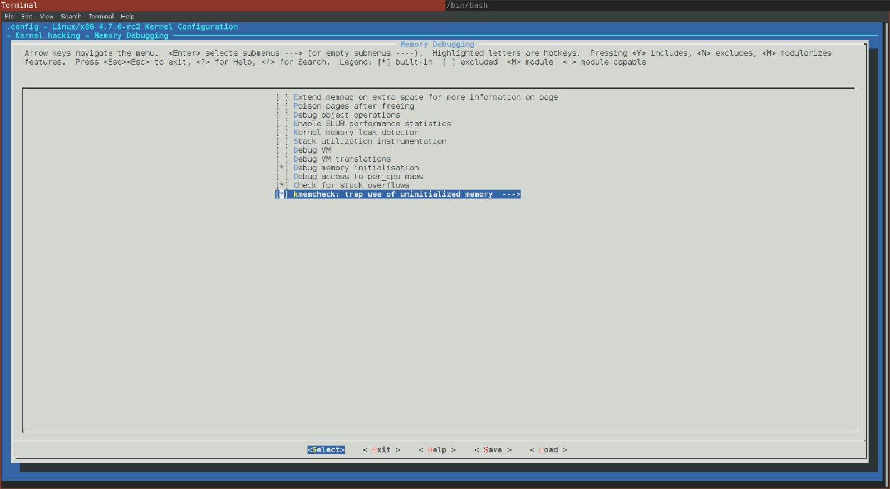
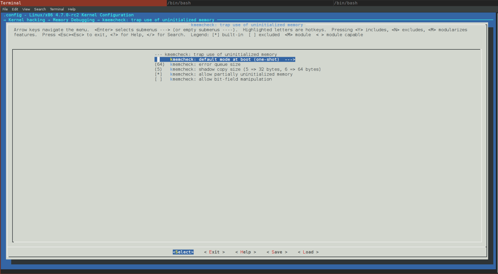

Linux kernel memory management Part 3.
================================================================================

Introduction to the kmemcheck in the Linux kernel
--------------------------------------------------------------------------------

This is the third part of the [chapter](https://0xax.gitbook.io/linux-insides/summary/mm) which describes [memory management](https://en.wikipedia.org/wiki/Memory_management) in the Linux kernel and in the previous [part](https://0xax.gitbook.io/linux-insides/summary/mm/linux-mm-2) of this chapter we met two memory management related concepts:

* `Fix-Mapped Addresses`;
* `ioremap`.

The first concept represents special area in [virtual memory](https://en.wikipedia.org/wiki/Virtual_memory), whose corresponding physical mapping is calculated in [compile-time](https://en.wikipedia.org/wiki/Compile_time). The second concept provides ability to map input/output related memory to virtual memory.

For example if you will look at the output of the `/proc/iomem`:

```
$ sudo cat /proc/iomem

00000000-00000fff : reserved
00001000-0009d7ff : System RAM
0009d800-0009ffff : reserved
000a0000-000bffff : PCI Bus 0000:00
000c0000-000cffff : Video ROM
000d0000-000d3fff : PCI Bus 0000:00
000d4000-000d7fff : PCI Bus 0000:00
000d8000-000dbfff : PCI Bus 0000:00
000dc000-000dffff : PCI Bus 0000:00
000e0000-000fffff : reserved
...
...
...
```

you will see map of the system's memory for each physical device. Here the first column displays the memory registers used by each of the different types of memory. The second column lists the kind of memory located within those registers. Or for example:

```
$ sudo cat /proc/ioports

0000-0cf7 : PCI Bus 0000:00
  0000-001f : dma1
  0020-0021 : pic1
  0040-0043 : timer0
  0050-0053 : timer1
  0060-0060 : keyboard
  0064-0064 : keyboard
  0070-0077 : rtc0
  0080-008f : dma page reg
  00a0-00a1 : pic2
  00c0-00df : dma2
  00f0-00ff : fpu
    00f0-00f0 : PNP0C04:00
  03c0-03df : vga+
  03f8-03ff : serial
  04d0-04d1 : pnp 00:06
  0800-087f : pnp 00:01
  0a00-0a0f : pnp 00:04
  0a20-0a2f : pnp 00:04
  0a30-0a3f : pnp 00:04
...
...
...
```

can show us lists of currently registered port regions used for input or output communication with a device. All memory-mapped I/O addresses are not used by the kernel directly. So, before the Linux kernel can use such memory, it must map it to the virtual memory space which is the main purpose of the `ioremap` mechanism. Note that we saw only early `ioremap` in the previous [part](https://0xax.gitbook.io/linux-insides/summary/mm/linux-mm-2). Soon we will look at the implementation of the non-early `ioremap` function. But before this we must learn other things, like a different types of memory allocators and etc., because in other way it will be very difficult to understand it.

So, before we will move on to the non-early [memory management](https://en.wikipedia.org/wiki/Memory_management) of the Linux kernel, we will see some mechanisms which provide special abilities for [debugging](https://en.wikipedia.org/wiki/Debugging), check of [memory leaks](https://en.wikipedia.org/wiki/Memory_leak), memory control and etc. It will be easier to understand how memory management arranged in the Linux kernel after learning of all of these things.

As you already may guess from the title of this part, we will start to consider memory mechanisms from the [kmemcheck](https://www.kernel.org/doc/Documentation/kmemcheck.txt). As we always did in other [chapters](https://github.com/0xAX/linux-insides/blob/master/SUMMARY.md), we will start to consider from theoretical side and will learn what is `kmemcheck` mechanism in general and only after this, we will see how it is implemented in the Linux kernel.

So let's start. What is it `kmemcheck` in the Linux kernel? As you may guess from the name of this mechanism, the `kmemcheck` checks memory. That's true. Main point of the `kmemcheck` mechanism is to check that some kernel code accesses `uninitialized memory`. Let's take following simple [C](https://en.wikipedia.org/wiki/C_%28programming_language%29) program:

```C
#include <stdlib.h>
#include <stdio.h>

struct A {
        int a;
};

int main(int argc, char **argv) {
        struct A *a = malloc(sizeof(struct A));
        printf("a->a = %d\n", a->a);
        return 0;
}
```

Here we allocate memory for the `A` structure and tries to print value of the `a` field. If we will compile this program without additional options:

```
gcc test.c -o test
```

The [compiler](https://en.wikipedia.org/wiki/GNU_Compiler_Collection) will not show us warning that `a` filed is not uninitialized. But if we will run this program with [valgrind](https://en.wikipedia.org/wiki/Valgrind) tool, we will see the following output:

```
~$   valgrind --leak-check=yes ./test
==28469== Memcheck, a memory error detector
==28469== Copyright (C) 2002-2015, and GNU GPL'd, by Julian Seward et al.
==28469== Using Valgrind-3.11.0 and LibVEX; rerun with -h for copyright info
==28469== Command: ./test
==28469== 
==28469== Conditional jump or move depends on uninitialised value(s)
==28469==    at 0x4E820EA: vfprintf (in /usr/lib64/libc-2.22.so)
==28469==    by 0x4E88D48: printf (in /usr/lib64/libc-2.22.so)
==28469==    by 0x4005B9: main (in /home/alex/test)
==28469== 
==28469== Use of uninitialised value of size 8
==28469==    at 0x4E7E0BB: _itoa_word (in /usr/lib64/libc-2.22.so)
==28469==    by 0x4E8262F: vfprintf (in /usr/lib64/libc-2.22.so)
==28469==    by 0x4E88D48: printf (in /usr/lib64/libc-2.22.so)
==28469==    by 0x4005B9: main (in /home/alex/test)
...
...
...
```

Actually the `kmemcheck` mechanism does the same for the kernel, what the `valgrind` does for userspace programs. It check uninitialized memory.

To enable this mechanism in the Linux kernel, you need to enable the `CONFIG_KMEMCHECK` kernel configuration option in the:

```
Kernel hacking
  -> Memory Debugging
```
  
menu of the Linux kernel configuration:



We may not only enable support of the `kmemcheck` mechanism in the Linux kernel, but it also provides some configuration options for us. We will see all of these options in the next paragraph of this part. Last note before we will consider how does the `kmemcheck` check memory. Now this mechanism is implemented only for the [x86_64](https://en.wikipedia.org/wiki/X86-64) architecture. You can be sure if you will look in the [arch/x86/Kconfig](https://github.com/torvalds/linux/blob/16f73eb02d7e1765ccab3d2018e0bd98eb93d973/arch/x86/Kconfig) `x86` related kernel configuration file, you will see following lines:

```
config X86
  ...
  ...
  ...
  select HAVE_ARCH_KMEMCHECK
  ...
  ...
  ...
```

So, there is no anything which is specific for other architectures.

Ok, so we know that `kmemcheck` provides mechanism to check usage of `uninitialized memory` in the Linux kernel and how to enable it. How it does these checks? When the Linux kernel tries to allocate some memory i.e. something is called like this:

```C
struct my_struct *my_struct = kmalloc(sizeof(struct my_struct), GFP_KERNEL);
```

or in other words somebody wants to access a [page](https://en.wikipedia.org/wiki/Page_%28computer_memory%29), a [page fault](https://en.wikipedia.org/wiki/Page_fault) exception is generated. This is achieved by the fact that the `kmemcheck` marks memory pages as `non-present` (more about this you can read in the special part which is devoted to [Paging](https://0xax.gitbook.io/linux-insides/summary/theory/linux-theory-1)). If a `page fault` exception is occurred, the exception handler knows about it and in a case when the `kmemcheck` is enabled it transfers control to it. After the `kmemcheck` will finish its checks, the page will be marked as `present` and the interrupted code will be able to continue execution. There is little subtlety in this chain. When the first instruction of interrupted code will be executed, the `kmemcheck` will mark the page as `non-present` again. In this way next access to memory will be caught again.

We just considered the `kmemcheck` mechanism from theoretical side. Now let's consider how it is implemented in the Linux kernel.

Implementation of the `kmemcheck` mechanism in the Linux kernel
--------------------------------------------------------------------------------

So, now we know what is it `kmemcheck` and what it does in the Linux kernel. Time to see at its implementation in the Linux kernel. Implementation of the `kmemcheck` is split in two parts. The first is generic part is located in the [mm/kmemcheck.c](https://github.com/torvalds/linux/blob/16f73eb02d7e1765ccab3d2018e0bd98eb93d973/mm/kmemcheck.c) source code file and the second [x86_64](https://en.wikipedia.org/wiki/X86-64) architecture-specific part is located in the [arch/x86/mm/kmemcheck](https://github.com/torvalds/linux/tree/master/arch/x86/mm/kmemcheck) directory.

Let's start from the initialization of this mechanism. We already know that to enable the `kmemcheck` mechanism in the Linux kernel, we must enable the `CONFIG_KMEMCHECK` kernel configuration option. But besides this, we need to pass one of following parameters:

 * kmemcheck=0 (disabled)
 * kmemcheck=1 (enabled)
 * kmemcheck=2 (one-shot mode)

to the Linux kernel command line. The first two are clear, but the last needs a little explanation. This option switches the `kmemcheck` in a special mode when it will be turned off after detecting the first use of uninitialized memory. Actually this mode is enabled by default in the Linux kernel:



We know from the seventh [part](https://0xax.gitbook.io/linux-insides/summary/initialization/linux-initialization-7) of the chapter which describes initialization of the Linux kernel that the kernel command line is parsed during initialization of the Linux kernel in `do_initcall_level`, `do_early_param` functions. Actually the `kmemcheck` subsystem consists from two stages. The first stage is early. If we will look at the [mm/kmemcheck.c](https://github.com/torvalds/linux/blob/16f73eb02d7e1765ccab3d2018e0bd98eb93d973/mm/kmemcheck.c) source code file, we will see the `param_kmemcheck` function which is will be called during early command line parsing:

```C
static int __init param_kmemcheck(char *str)
{
	int val;
	int ret;

	if (!str)
		return -EINVAL;

	ret = kstrtoint(str, 0, &val);
	if (ret)
		return ret;
	kmemcheck_enabled = val;
	return 0;
}

early_param("kmemcheck", param_kmemcheck);
```

As we already saw, the `param_kmemcheck` may have one of the following values: `0` (enabled), `1` (disabled) or `2` (one-shot). The implementation of the `param_kmemcheck` is pretty simple. We just convert string value of the `kmemcheck` command line option to integer representation and set it to the `kmemcheck_enabled` variable.

The second stage will be executed during initialization of the Linux kernel, rather during initialization of early [initcalls](https://0xax.gitbook.io/linux-insides/summary/concepts/linux-cpu-3). The second stage is represented by the `kmemcheck_init`:

```C
int __init kmemcheck_init(void)
{
    ...
    ...
    ...
}

early_initcall(kmemcheck_init);
```

Main goal of the `kmemcheck_init` function is to call the `kmemcheck_selftest` function and check its result:

```C
if (!kmemcheck_selftest()) {
	printk(KERN_INFO "kmemcheck: self-tests failed; disabling\n");
	kmemcheck_enabled = 0;
	return -EINVAL;
}

printk(KERN_INFO "kmemcheck: Initialized\n");
```

and return with the `EINVAL` if this check is failed. The `kmemcheck_selftest` function checks sizes of different memory access related [opcodes](https://en.wikipedia.org/wiki/Opcode) like `rep movsb`, `movzwq` and etc. If sizes of opcodes are equal to expected sizes, the `kmemcheck_selftest` will return `true` and `false` in other way.

So when the somebody will call:

```C
struct my_struct *my_struct = kmalloc(sizeof(struct my_struct), GFP_KERNEL);
```

through a series of different function calls the `kmem_getpages` function will be called. This function is defined in the [mm/slab.c](https://github.com/torvalds/linux/blob/16f73eb02d7e1765ccab3d2018e0bd98eb93d973/mm/slab.c) source code file and main goal of this function tries to allocate [pages](https://en.wikipedia.org/wiki/Paging) with the given flags. In the end of this function we can see following code:

```C
if (kmemcheck_enabled && !(cachep->flags & SLAB_NOTRACK)) {
	kmemcheck_alloc_shadow(page, cachep->gfporder, flags, nodeid);

    if (cachep->ctor)
		kmemcheck_mark_uninitialized_pages(page, nr_pages);
	else
		kmemcheck_mark_unallocated_pages(page, nr_pages);
}
```

So, here we check that the if `kmemcheck` is enabled and the `SLAB_NOTRACK` bit is not set in flags we set `non-present` bit for the just allocated page. The `SLAB_NOTRACK` bit tell us to not track uninitialized memory. Additionally we check if a cache object has constructor (details will be considered in next parts) we mark allocated page as uninitialized or unallocated in other way. The `kmemcheck_alloc_shadow` function is defined in the [mm/kmemcheck.c](https://github.com/torvalds/linux/blob/16f73eb02d7e1765ccab3d2018e0bd98eb93d973/mm/kmemcheck.c) source code file and does following things:

```C
void kmemcheck_alloc_shadow(struct page *page, int order, gfp_t flags, int node)
{
    struct page *shadow;

   	shadow = alloc_pages_node(node, flags | __GFP_NOTRACK, order);

   	for(i = 0; i < pages; ++i)
		page[i].shadow = page_address(&shadow[i]);

   	kmemcheck_hide_pages(page, pages);
}
```

First of all it allocates memory space for the shadow bits. If this bit is set in a page, this means that this page is tracked by the `kmemcheck`. After we allocated space for the shadow bit, we fill all allocated pages with this bit. In the end we just call the `kmemcheck_hide_pages` function with the pointer to the allocated page and number of these pages. The `kmemcheck_hide_pages` is architecture-specific function, so its implementation is located in the [arch/x86/mm/kmemcheck/kmemcheck.c](https://github.com/torvalds/linux/tree/master/arch/x86/mm/kmemcheck/kmemcheck.c) source code file. The main goal of this function is to set `non-present` bit in given pages. Let's look at the implementation of this function:

```C
void kmemcheck_hide_pages(struct page *p, unsigned int n)
{
	unsigned int i;

	for (i = 0; i < n; ++i) {
		unsigned long address;
		pte_t *pte;
		unsigned int level;

		address = (unsigned long) page_address(&p[i]);
		pte = lookup_address(address, &level);
		BUG_ON(!pte);
		BUG_ON(level != PG_LEVEL_4K);

		set_pte(pte, __pte(pte_val(*pte) & ~_PAGE_PRESENT));
		set_pte(pte, __pte(pte_val(*pte) | _PAGE_HIDDEN));
		__flush_tlb_one(address);
	}
}
```

Here we go through all pages and and tries to get `page table entry` for each page. If this operation was successful, we unset present bit and set hidden bit in each page. In the end we flush [translation lookaside buffer](https://en.wikipedia.org/wiki/Translation_lookaside_buffer), because some pages was changed. From this point allocated pages are tracked by the `kmemcheck`. Now, as `present` bit is unset, the [page fault](https://en.wikipedia.org/wiki/Page_fault) execution will be occurred right after the `kmalloc` will return pointer to allocated space and a code will try to access this memory.

As you may remember from the [second part](https://0xax.gitbook.io/linux-insides/summary/initialization/linux-initialization-2) of the Linux kernel initialization chapter, the `page fault` handler is located in the [arch/x86/mm/fault.c](https://github.com/torvalds/linux/blob/16f73eb02d7e1765ccab3d2018e0bd98eb93d973/arch/x86/mm/fault.c) source code file and represented by the `do_page_fault` function. We can see following check from the beginning of the `do_page_fault` function:

```C
static noinline void
__do_page_fault(struct pt_regs *regs, unsigned long error_code,
		unsigned long address)
{
    ...
    ...
    ...
	if (kmemcheck_active(regs))
		kmemcheck_hide(regs);
    ...
    ...
    ...
}
```

The `kmemcheck_active` gets `kmemcheck_context` [per-cpu](https://0xax.gitbook.io/linux-insides/summary/concepts/linux-cpu-1) structure and return the result of comparison of the `balance` field of this structure with zero:

```
bool kmemcheck_active(struct pt_regs *regs)
{
	struct kmemcheck_context *data = this_cpu_ptr(&kmemcheck_context);

	return data->balance > 0;
}
```

The `kmemcheck_context` is structure which describes current state of the `kmemcheck` mechanism. It stored uninitialized addresses, number of such addresses and etc. The `balance` field of this structure represents current state of the `kmemcheck` or in other words it can tell us did `kmemcheck` already hid pages or not yet. If the `data->balance` is greater than zero, the `kmemcheck_hide` function will be called. This means than `kmemecheck` already set `present` bit for given pages and now we need to hide pages again to cause next step to page fault. This function will hide addresses of pages again by unsetting of `present` bit. This means that one session of `kmemcheck` already finished and new page fault occurred. At the first step the `kmemcheck_active` will return false as the `data->balance` is zero for the start and the `kmemcheck_hide` will not be called. Next, we may see following line of code in the `do_page_fault`:

```C
if (kmemcheck_fault(regs, address, error_code))
		return;
```

First of all the `kmemcheck_fault` function checks that the fault was occurred by the correct reason. At first we check the [flags register](https://en.wikipedia.org/wiki/FLAGS_register) and check that we are in normal kernel mode:

```C
if (regs->flags & X86_VM_MASK)
		return false;
if (regs->cs != __KERNEL_CS)
		return false;
```

If these checks wasn't successful we return from the `kmemcheck_fault` function as it was not `kmemcheck` related page fault. After this we try to lookup a `page table entry` related to the faulted address and if we can't find it we return:

```C
pte = kmemcheck_pte_lookup(address);
if (!pte)
	return false;
```

Last two steps of the `kmemcheck_fault` function is to call the `kmemcheck_access` function which check access to the given page and show addresses again by setting present bit in the given page. The `kmemcheck_access` function does all main job. It check current instruction which caused a page fault. If it will find an error, the context of this error will be saved by `kmemcheck` to the ring queue:

```C
static struct kmemcheck_error error_fifo[CONFIG_KMEMCHECK_QUEUE_SIZE];
```

The `kmemcheck` mechanism declares special [tasklet](https://0xax.gitbook.io/linux-insides/summary/interrupts/linux-interrupts-9):

```C
static DECLARE_TASKLET(kmemcheck_tasklet, &do_wakeup, 0);
```

which runs the `do_wakeup` function from the [arch/x86/mm/kmemcheck/error.c](https://github.com/torvalds/linux/blob/16f73eb02d7e1765ccab3d2018e0bd98eb93d973/arch/x86/mm/kmemcheck/error.c) source code file when it will be scheduled to run.

The `do_wakeup` function will call the `kmemcheck_error_recall` function which will print errors collected by `kmemcheck`. As we already saw the:

```C
kmemcheck_show(regs);
```

function will be called in the end of the `kmemcheck_fault` function. This function will set present bit for the given pages again:

```C
if (unlikely(data->balance != 0)) {
	kmemcheck_show_all();
	kmemcheck_error_save_bug(regs);
	data->balance = 0;
	return;
}
```

Where the `kmemcheck_show_all` function calls the `kmemcheck_show_addr` for each address:

```C
static unsigned int kmemcheck_show_all(void)
{
	struct kmemcheck_context *data = this_cpu_ptr(&kmemcheck_context);
	unsigned int i;
	unsigned int n;

	n = 0;
	for (i = 0; i < data->n_addrs; ++i)
		n += kmemcheck_show_addr(data->addr[i]);

	return n;
}
```

by the call of the `kmemcheck_show_addr`:

```C
int kmemcheck_show_addr(unsigned long address)
{
	pte_t *pte;

	pte = kmemcheck_pte_lookup(address);
	if (!pte)
		return 0;

	set_pte(pte, __pte(pte_val(*pte) | _PAGE_PRESENT));
	__flush_tlb_one(address);
	return 1;
}
```

In the end of the `kmemcheck_show` function we set the [TF](https://en.wikipedia.org/wiki/Trap_flag) flag if it wasn't set:

```C
if (!(regs->flags & X86_EFLAGS_TF))
	data->flags = regs->flags;
```

We need to do it because we need to hide pages again after first executed instruction after a page fault will be handled. In a case when the `TF` flag, so the processor will switch into single-step mode after the first instruction will be executed. In this case `debug` exception will occurred. From this moment pages will be hidden again and execution will be continued. As pages hidden from this moment, page fault exception will occur again and `kmemcheck` continue to check/collect errors again and print them from time to time.

That's all.

Conclusion
--------------------------------------------------------------------------------

This is the end of the third part about linux kernel [memory management](https://en.wikipedia.org/wiki/Memory_management). If you have questions or suggestions, ping me on twitter [0xAX](https://twitter.com/0xAX), drop me an [email](mailto:anotherworldofworld@gmail.com) or just create an [issue](https://github.com/0xAX/linux-insides/issues/new). In the next part we will see yet another memory debugging related tool - `kmemleak`.

**Please note that English is not my first language and I am really sorry for any inconvenience. If you found any mistakes please send me a PR to [linux-insides](https://github.com/0xAX/linux-insides).**

Links
--------------------------------------------------------------------------------

* [memory management](https://en.wikipedia.org/wiki/Memory_management)
* [debugging](https://en.wikipedia.org/wiki/Debugging)
* [memory leaks](https://en.wikipedia.org/wiki/Memory_leak)
* [kmemcheck documentation](https://www.kernel.org/doc/Documentation/kmemcheck.txt)
* [valgrind](https://en.wikipedia.org/wiki/Valgrind)
* [Paging](https://0xax.gitbook.io/linux-insides/summary/theory/linux-theory-1)
* [page fault](https://en.wikipedia.org/wiki/Page_fault)
* [initcalls](https://0xax.gitbook.io/linux-insides/summary/concepts/linux-cpu-3)
* [opcode](https://en.wikipedia.org/wiki/Opcode)
* [translation lookaside buffer](https://en.wikipedia.org/wiki/Translation_lookaside_buffer)
* [per-cpu variables](https://0xax.gitbook.io/linux-insides/summary/concepts/linux-cpu-1)
* [flags register](https://en.wikipedia.org/wiki/FLAGS_register)
* [tasklet](https://0xax.gitbook.io/linux-insides/summary/interrupts/linux-interrupts-9)
* [Previous part](https://0xax.gitbook.io/linux-insides/summary/mm/linux-mm-2)
