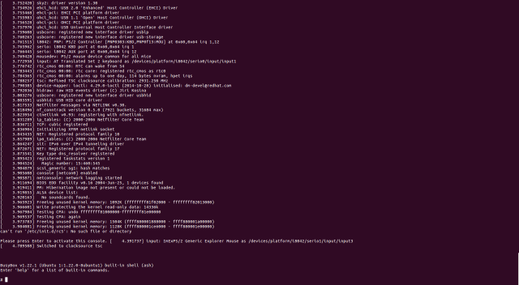

linux-insides
===============

A book-in-progress about the linux kernel and its insides.

**The goal is simple** - to share my modest knowledge about the insides of the linux kernel and help people who are interested in linux kernel insides, and other low-level subject matter. Feel free to go through the book [Start here](https://github.com/0xAX/linux-insides/blob/master/SUMMARY.md)

**Questions/Suggestions**: Feel free about any questions or suggestions by pinging me at twitter [@0xAX](https://twitter.com/0xAX), adding an [issue](https://github.com/0xAX/linux-insides/issues/new) or just drop me an [email](mailto:anotherworldofworld@gmail.com).

Generating eBooks and PDFs - [documentation](https://github.com/GitbookIO/gitbook/blob/master/docs/ebook.md)

# Mailing List

We have a Google Group mailing list for learning the kernel source code. Here are some instructions about how to use it.

#### Join

Send an email with any subject/content to `kernelhacking+subscribe@googlegroups.com`. Then you will receive a confirmation email. Reply it with any content and then you are done.

> If you have Google account, you can also open the [archive page](https://groups.google.com/forum/#!forum/kernelhacking) and click **Apply to join group**. You will be approved automatically.

#### Send emails to mailing list

Just send emails to `kernelhacking@googlegroups.com`. The basic usage is the same as other mailing lists powered by mailman.

#### Archives

https://groups.google.com/forum/#!forum/kernelhacking

On other languages
-------------------

  * [Brazilian Portuguese](https://github.com/mauri870/linux-insides)
  * [Chinese](https://github.com/MintCN/linux-insides-zh)
  * [Japanese](https://github.com/tkmru/linux-insides-ja)
  * [Korean](https://github.com/junsooo/linux-insides-ko)
  * [Russian](https://github.com/proninyaroslav/linux-insides-ru)
  * [Spanish](https://github.com/leolas95/linux-insides)
  * [Turkish](https://github.com/ayyucedemirbas/linux-insides_Turkish)

Docker
------

In order to run your own copy of the book with gitbook within a local container:

1. Enable Docker experimental features with vim or another text editor
   ```bash
    sudo vim /usr/lib/systemd/system/docker.service
   ```

   Then add --experimental=true to the end of the ExecStart=/usr/bin/dockerd -H fd:// line and save.

   Eg: *ExecStart=/usr/bin/dockerd -H fd:// --experimental=true*

   Then, you need to reload and restart the Docker daemon:
   ```bash
    systemctl daemon-reload
    systemctl restart docker.service
   ```

2. Run docker image
   ```bash
   make run
   ```

3. Open your local copy of linux insides book under this url
   http://localhost:4000 or run `make browse`


Contributions 
--------------

Feel free to create issues or pull-requests if you have any problems.

**Please read [CONTRIBUTING.md](https://github.com/0xAX/linux-insides/blob/master/CONTRIBUTING.md) before pushing any changes.**



Author
---------------

[@0xAX](https://twitter.com/0xAX)

LICENSE
-------------

Licensed [BY-NC-SA Creative Commons](http://creativecommons.org/licenses/by-nc-sa/4.0/).
